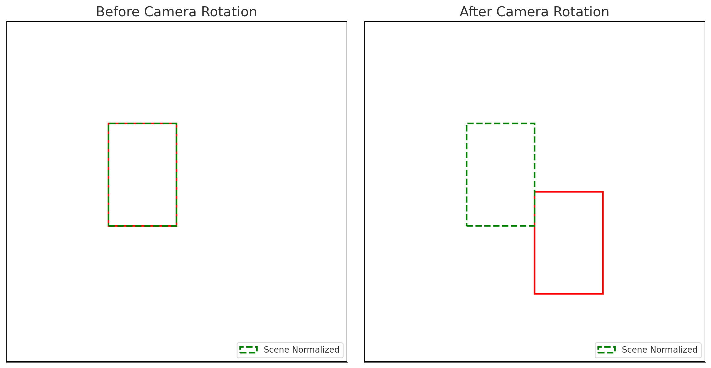

# Bonding Box 

This library allows you to draw burnt-in bounding boxes on selected video sources/channels. The aim of this API is to solve one common use-case, supporting all new chips in Axis products and utilizing the most optimized drawing mechanism available for each chip. Meanwhile, the Axoverlay API which is show-cased in the axoverlay example exposes advanced ARTPEC specific overlay functionality.

It allows to specify the channel or view area the bounding boxes with be redered and to choose between normalizing by frame or by scene coordinates.

## Scene coordinates

Scene coordinate system is normalized to [0,0]-[1,1] and follows the filmed scene, i.e. static objects in the world have the same coordinates regardless of global rotation.

## Frame coordinates

Frame coordinate system is normalized and aligned with the camera frame, i.e. top-left is [0,0] and bottom-right is [1,1].

## Here's a side-by-side comparison:



Red box = frame_normalized() — moves with the camera.

- On the left, the camera is in its original position. The red box marks an object (like a car).

- On the right, the camera rotated, and the object appears in a different part of the frame, so the red box moved — even though the object didn’t move in the real world.

```c
bbox_coordinates_frame_normalized(bbox);

```
Green dashed box = scene_normalized() — stays fixed in the real-world position.

- The green bounding box stays in the same position in both views, even though the camera "rotates" (right image).

- This shows how scene-normalized coordinates are fixed to the real-world scene, not affected by camera motion.


```c
bbox_coordinates_scene_normalized(bbox);

```


### By default, the AI usually outputs bounding boxes in frame normalized coordinates


Object detection models work on input images (e.g. 416×416 or 640×640 pixels).

The bounding box is relative to the input frame.

So when the camera moves, the bounding box follows the object only within the current frame — i.e., it tracks visually, not spatially.

The AI will follow the object, but in frame-normalized coordinates, it looks like the object is moving within the image.

### When would you use scene normalized?


You switch to scene-normalized after detection if you want to understand real-world behavior:

Like: “Did this person walk from one side of the hallway to the other?”

Or: “Are multiple cameras seeing the same object in the same world-space location?”

You map or transform frame-based bounding boxes into the scene-space (if supported by your system).

### Summary:


| Question                                                                     | Answer                                           |
| ---------------------------------------------------------------------------- | ------------------------------------------------ |
| **Will object detection follow the object?**                                 | ✅ Yes, always — regardless of coordinate system. |
| **Which coordinate system does AI detection usually use?**                   | `bbox_coordinates_scene_normalized()` (aligned with image input). |
| **Which one shows object position in world space?**                          | `bbox_coordinates_frame_normalized()`                             |
| **Should you convert to scene-normalized for tracking across time/cameras?** | ✅ Yes, if your system supports it.               |


## Bbox flow:

### 1 - Select view to draw

#### single view (channel: 1)
---
```c
bbox_t* bbox = bbox_view_new(1u);

```
#### Multi view (channel 1 & 2)

```c
bbox_t* bbox = bbox_new(2u, 1u, 2u);

```
---
### 2 - Select normalization type
---
```c
bbox_coordinates_scene_normalized(bbox);

```
or

```c
bbox_coordinates_frame_normalized(bbox);

```
---

### 3 - Clear old bounding boxes

---

```c
bbox_clear(bbox);
```
---

### 4 - Configure/create colors
---

```c
const bbox_color_t red   = bbox_color_from_rgb(0xff, 0x00, 0x00);
const bbox_color_t blue  = bbox_color_from_rgb(0x00, 0x00, 0xff);
const bbox_color_t green = bbox_color_from_rgb(0x00, 0xff, 0x00);
```
---

### 5 - Draw with bbox

```c

    bbox_style_outline(bbox);                      // Switch to outline style
    bbox_thickness_thin(bbox);                     // Switch to thin lines
    bbox_color(bbox, red);                         // Switch to red [This operation is fast!]
    bbox_rectangle(bbox, 0.05, 0.05, 0.95, 0.95);  // Draw a thin red outline rectangle

    bbox_commit(bbox, 0u)

```

or all bboxes together

```c

    bbox_style_corners(bbox);                      // Switch to corners style
    bbox_thickness_thick(bbox);                    // Switch to thick lines
    bbox_color(bbox, blue);                        // Switch to blue [This operation is fast!]
    bbox_rectangle(bbox, 0.40, 0.40, 0.60, 0.60);  // Draw thick blue corners

    bbox_style_corners(bbox);                      // Switch to corners style
    bbox_thickness_medium(bbox);                   // Switch to medium lines
    bbox_color(bbox, blue);                        // Switch to blue [This operation is fast!]
    bbox_rectangle(bbox, 0.30, 0.30, 0.50, 0.50);  // Draw medium blue corners

    bbox_style_outline(bbox);   // Switch to outline style
    bbox_thickness_thin(bbox);  // Switch to thin lines
    bbox_color(bbox, red);      // Switch to red [This operation is fast!]

    // Draw a thin red quadrilateral
    bbox_quad(bbox, 0.10, 0.10, 0.30, 0.12, 0.28, 0.28, 0.11, 0.30);

    // Draw a green polyline
    bbox_color(bbox, green);  // Switch to green [This operation is fast!]
    bbox_move_to(bbox, 0.2, 0.2);
    bbox_line_to(bbox, 0.5, 0.5);
    bbox_line_to(bbox, 0.8, 0.4);
    bbox_draw_path(bbox);

    // Draw all queued geometry simultaneously
    bbox_commit(bbox, 0u)
```
### 6 - Destroy

```c

    bbox_destroy(bbox);

```