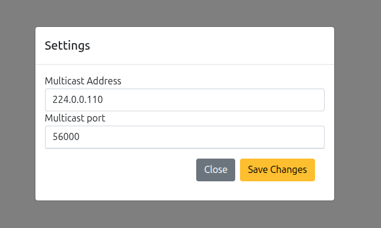
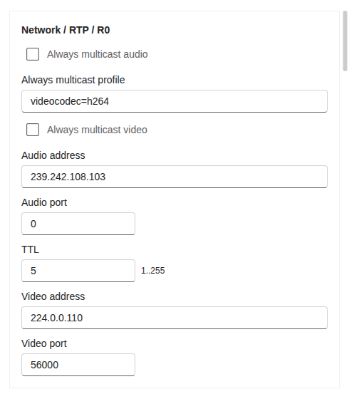
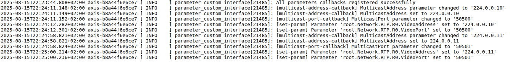

# AXIS Parameter API demo - parameter_custom_interface

Drive RTP Multicast Settings from ACAP Parameters + Web UI 

## Goal

- Expose app parameters (MulticastAddress, MulticastPort) in a simple Bootstrap modal.
- When the user saves the form, update the ACAP parameters.
- The app’s parameter callbacks propagate values to the device RTP settings:
    - root.Network.RTP.R0.VideoAddress
    - root.Network.RTP.R0.VideoPort

- Use a short deferred write (1s) to avoid racing the parameter system.

## html settup:

Manifest file

```c
"configuration": {
            "settingPage": "index.html",
            "paramConfig": [
                {
                    "name": "MulticastAddress",
                    "default": "224.0.0.1",
                    "type": "string:maxlen=64"
                },
                {
                    "name": "MulticastPort",
                    "default": "1024",
                    "type": "int:maxlen=5;min=1024;max=65535"
                }
            ]
        }
```

## What the app does (timeline)

1. User opens your app page (/local/parameter_custom_interface/index.html):
    - UI fetches current values via param.cgi?action=list.

2. User edits and saves:
    - UI updates root.Parameter_custom_interface.MulticastAddress, root.Parameter_custom_interface.MulticastPort

3. The C app sees parameter changes:
    - Callback schedules ax_parameter_set → writes RTP parameters after 1s.

4. Camera RTP config now matches app params.

## Lab: Test the callback


1. As sooon as you start the app, o to app http://192.168.0.90/camera/index.html#/apps > Parameter custom interface > open. It should look like this:



2. Change values and save.
3. Check the values under http://192.168.0.90/camera/index.html#/system/plainConfig/group/Network > Network / RTP / R0

4. Refresh the UI, it should look like this:




3. Check the logs, under app logs or http://192.168.0.90/axis-cgi/admin/systemlog.cgi?appname=parameter_custom_interface





4. Use VAPIX param.cgi to list parameter.

```bash
curl --anyauth -u root:pass "http://192.168.0.90/axis-cgi/param.cgi?action=list&group=root.parameter_custom_interface"

```
5. Update the parameter (triggers callback)

```bash
curl --anyauth -u root:pass "http://192.168.0.90/axis-cgi/param.cgi?action=update&root.parameter_custom_interface.MulticastAddress=224.0.0.101&root.parameter_custom_interface.MulticastPort=56000"

```
6. check logs again


## Build

```bash
docker build --tag parameter-custom-interface --build-arg ARCH=aarch64 .
```
```bash
docker cp $(docker create parameter-custom-interface):/opt/app ./build
```

