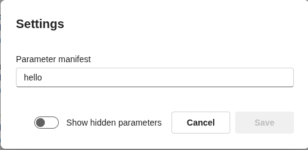
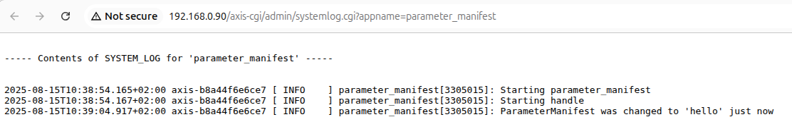

# AXIS Parameter API demo - parameter_manifest

A tiny ACAP app that shows how to watch and react to parameter changes using the AXIS Parameter API (axsdk/axparameter.h).
It registers a callback, runs a GMainLoop, and logs every time the parameter changes.

## What it does

- Creates an AXParameter* handle for the app namespace:
root.parameter_manifest.*
- Registers a change callback for a parameter key (here called ParameterManifest).
- Runs a GLib main loop and listens for changes.
- Cleanly exits on SIGINT/SIGTERM.
- Prints changes to syslog (and stdout via the LOG macro)

## Lab: Test the callback

1. Go to app http://192.168.0.90/camera/index.html#/apps > Parameter manifest > settings
2. Set a string value in the input box, i.e. "hello"





3. Check the logs, under app logs or http://192.168.0.90/axis-cgi/admin/systemlog.cgi?appname=parameter_manifest





4. Use VAPIX param.cgi to list and update parameters.

```bash
curl --anyauth -u root:pass "http://192.168.0.90/axis-cgi/param.cgi?action=list&group=root.parameter_manifest"

```
5. Update the parameter (triggers callback)

```bash
curl --anyauth -u root:pass "http://192.168.0.90/axis-cgi/param.cgi?action=update&root.parameter_manifest=world"

```
6. check logs again


## Build

```bash
docker build --tag parameter-manifest --build-arg ARCH=aarch64 .
```
```bash
docker cp $(docker create parameter-manifest):/opt/app ./build
```

