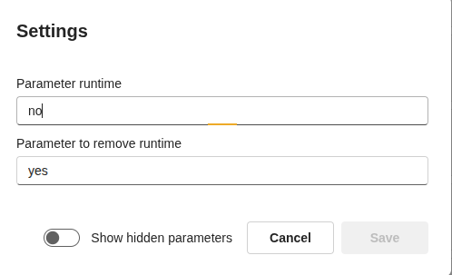
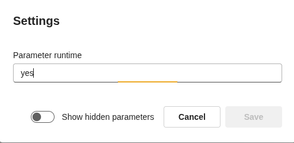
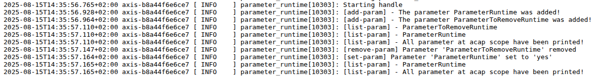

# AXIS Parameter API demo - parameter_runtime

Manage parameters at runtime using the AXParameter API: add/remove parameters, set values, list them, and react to changes via callbacks.

## Objectives

- Create and scope an AXParameter handle to your app.
- Add parameters dynamically (with default & type of variable - meta).
- List parameters in your app namespace.
- Remove parameters at runtime.
- Set parameter values and trigger callbacks.
- Keep a GLib main loop running and handle SIGINT/SIGTERM.

## What the app does (timeline)

1. Creates a parameter handle bound to root.parameter_runtime.
2. Adds:
    - ParameterRuntime = "no"
    - ParameterToRemoveRuntime = "yes"

3. Lists all parameters in the app scope.
4. Removes ParameterToRemoveRuntime.
5. Sets ParameterRuntime = "yes" (and triggers callback).
6. Lists the remaining parameters.
7. Registers callbacks:
    - ParameterRuntime
    - (also registers for ParameterToRemoveRuntime, which is already removed — harmless)

8. Enters GMainLoop and waits for changes/signals.

## Lab: Test the callback


1. As sooon as you start the app, o to app http://192.168.0.90/camera/index.html#/apps > Parameter runtime > settings. It should look like this:



2. Refresh the UI and go again to the settings page, it should look like this:




3. Check the logs, under app logs or http://192.168.0.90/axis-cgi/admin/systemlog.cgi?appname=parameter_runtime





4. Use VAPIX param.cgi to list parameter.

```bash
curl --anyauth -u root:pass "http://192.168.0.90/axis-cgi/param.cgi?action=list&group=root.parameter_runtime"

```
5. Update the parameter (triggers callback)

```bash
curl --anyauth -u root:pass "http://192.168.0.90/axis-cgi/param.cgi?action=update&root.parameter_runtime.ParameterRuntime=anyvalue"

```
6. check logs again


## Build

```bash
docker build --tag parameter-runtime --build-arg ARCH=aarch64 .
```
```bash
docker cp $(docker create parameter-runtime):/opt/app ./build
```

