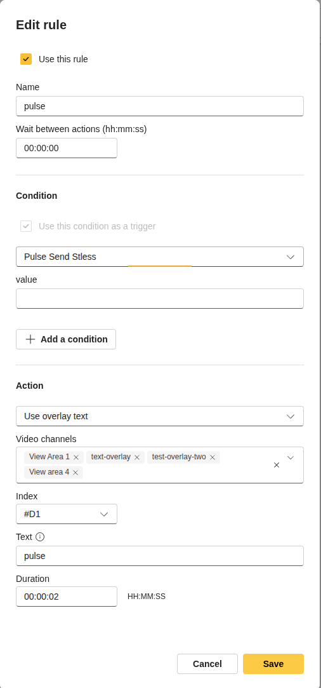
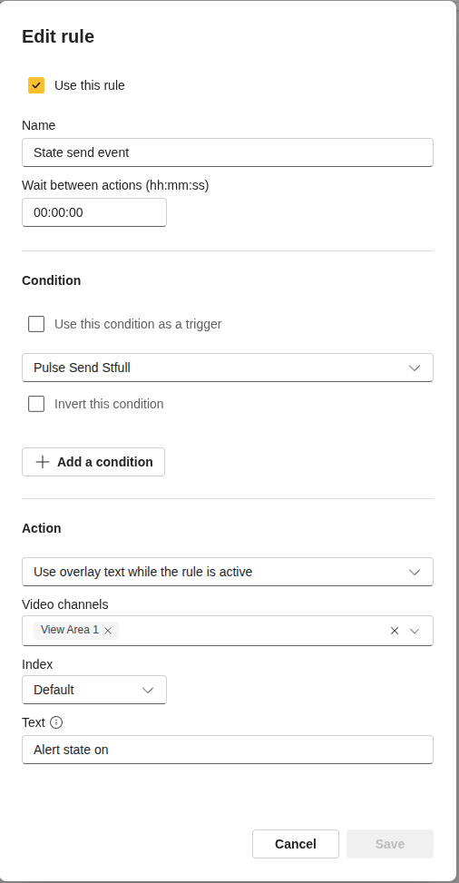

# Send Event Types workshorp

There are six ACAP source code packages accompanying this document. The source code provides ACAP
developers with examples of how to declare events in different ways. The binary ACAP add-ons can be
used by VMS developers to see how each event will be displayed in their clients. These ACAP services
produce their events upon a recurring timer.

## Considerations

When declaring an event in an ACAP service, there are a number of things to take into consideration.

1. What is the primary purpose of the event and how is it intended to be consumed?
2. ACAP SDK limitations and quirks
3. How will VMS/applications present the event declarations to the user?
4. Where should the event be placed in the event topic tree?


## Event types
There are three types of event, and it is important to understand their purposes.

- **Stateless** (aka Pulse) – An event that indicates that something has occurred. Typically used to
trigger action rules.
- **Stateful** (aka State) – An event with an active and inactive state. Typically used in action rules
such as “record while active”.
- **Data** (aka Application Data) – An event that includes application specific data that needs to be
processed by the consuming application. A data event is normally not used to trigger generic
action rules.

## Event declarations
The XML event declaration includes two sections, called SourceInstance and DataInstance. The idea
behind this structure is that the SourceInstance defines the source of the event such as video channel or
a digital input port. The DataInstance may include additional data that an event consumer may want to
use or filter on. Parsing of the data in the Source- or Data –instance may work well when applications
have hard-coded support for that specific event. However, applications/clients that support Dynamic
Event Integration may be challenged to display this information in a proper and user-friendly way. The
examples described in this document, using the camera’s event/action dialog and Axis Camera Station
examples, highlight some of these challenges.

Topic Tree placement

Xis namespace uses the Topic level 0 “CameraApplicationPlatform”. In ACAP
SDK it is possible to place the events anywhere, even create a new Topic level 0. However, it is highly
recommended to place ACAP service events under “CameraApplicationPlatform”, as some clients will
only query and display events under this topic.

```xml
<wstop:TopicSet>
    . . .
        <tnsaxis:CameraApplicationPlatform>                             Topic level 0
            <service_tag aev:NiceName="My Service Name">                Topic Level 1
                <event_tag topic="true" NiceName="My Service Event">    Topic level 2
                    <aev:SourceInstance/>
                    <aev:DataInstance/>
                </event_tag>
            </service_tag>
        </CameraApplicationPlatform >
    . . .
<wstop:TopicSet>

```
## Namespaces

It is mandatory to set a namespace when declaring events. Even though it is possible to create new
namespaces, an ACAP service should always use the Axis namespace “tnsaxis”. You can also use ONVIF name space “tns1”.

## Special Attributes

There are special attributes a declaration tag may have.

**isPropertyState=”true”** tells applications that the event is stateful. The event has a bool property in
DataInstance that defines the active/inactive state.

**isApplicationData=”true”** tells applications that the event or its data is intended for a specific
application/service. The event is not intended to trigger generic action rules and the data is not intended
to be used as an action rule filter. A well-behaved client should not display these events or data to the
user.

**isDeprecated=”true”** tells applications that the event (although still functional) may be removed in
future versions. Existing action rules will continue to work, but it is not a good idea to add new action
rules. The service may offer alternative events that should be used instead. A well-behaved client should
not display the event to users.

## Pulse event (Source Code Example #1)
Pulse (a.k.a. stateless) events are typically used to trigger an action, either in the camera or in a VMS.
The example #1 describes the standard way to declare and fire these events.

Example 1 declaration:                  Note: Namespaces and unnecessary tags removed for readability

```xml
<TopicSet>
    <CameraApplicationPlatform>
        <PulseSendStless NiceName="Pulse Send Stless">
            <PulseID topic="true" NiceName="Pulse Send Stless">
                <MessageInstance>
                    <DataInstance>
                        <SimpleItemInstance Type="int" Name="value"/>
                    </DataInstance>
                </MessageInstance>
            </PulseID>
        </PulseSendStless>
    </CameraApplicationPlatform>
. . .
</TopicSet>
```

Note that the DataInstance Type=”int” Name=“value” could be omitted, as no value needs to be passed
to the consumer. However, clients such as the camera’s own action rule dialog expects content in the
DataInstance. If no data is present, the event will not be displayed in the camera action rule dialog. Other
applications may have similar behavior when displaying the event to users, so it is recommended to add
a “dummy” value in DataInstance.

Example of how the event will look when sent in the event stream (XML adjusted for readability)

```xml
<MetadataStream xmlns:tt="http://www.onvif.org/ver10/schema">
    <Event xmlns:tt="http://www.onvif.org/ver10/schema">
        <NotificationMessage xmlns:tnsaxis="http://www.axis.com/2009/event/topics">
            <Topic>tnsaxis:CameraApplicationPlatform/mypulseservice/myEventID</Topic>
            <ProducerReference/>
            <Message>
                <Message UtcTime="YYYY-MM-DDTHH:MM:SS.MSZ">
                    <Source/>
                    <Data>
                        <SimpleItem Name="value" Value="1"/>
                    </Data>
                </Message>
            </Message>
        </NotificationMessage>
    </Event>
</MetadataStream>

```

Example 1: How the pulse event is displayed



## State event (Source Code Example #2)

State (a.k.a. stateful) events have an active/inactive state, typically used to trigger actions such as
“record video while active”. Example #2 demonstrates the standard way to declare and fire stateful
events.

Example 2 declaration:          Note: Namespaces and unnecessary tags removed for readability

```xml

<TopicSet>
    <CameraApplicationPlatform>
        <mystatefulservice aev:NiceName="My State Service">
            <myEventID wstop:topic="true" aev:NiceName="My State Event">
                <aev:MessageInstance aev:isProperty="true">
                    <aev:DataInstance>
                        <aev:SimpleItemInstance Type="xsd:boolean" Name="active" isPropertyState="true">
                        </aev:SimpleItemInstance>
                    </aev:DataInstance>
                </aev:MessageInstance>
            </myEventID>
        </mystatefulservice>
    </CameraApplicationPlatform>
. . .
</TopicSet>

```

Example of how the event will look when sent in the event stream (XML adjusted for readability)

```xml

<MetadataStream xmlns:tt="http://www.onvif.org/ver10/schema">
    <Event xmlns:tt="http://www.onvif.org/ver10/schema">
        <NotificationMessage xmlns:tns1="http://www.onvif.org/ver10/topics">
            <Topic>tnsaxis:CameraApplicationPlatform/mystatefulevent/myEventID</Topic>
            <ProducerReference/>
            <Message>
                <Message UtcTime="YYYY-MM-DDTHH:MM:SS.MSZ" PropertyOperation="Changed">
                    <Source/>
                    <Key/>
                    <Data>
                        <SimpleItem Name="active" Value="1" />
                    </Data>
                </Message>
            </Message>
        </NotificationMessage>
    </Event>
</MetadataStream>

```

Examples of how the state event is displayed

