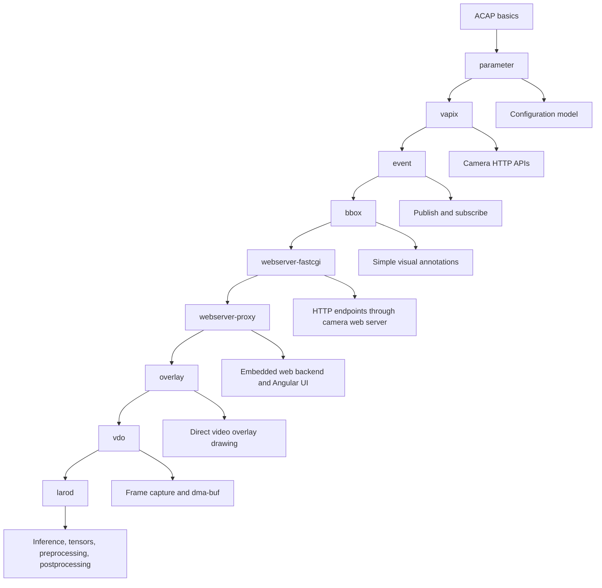
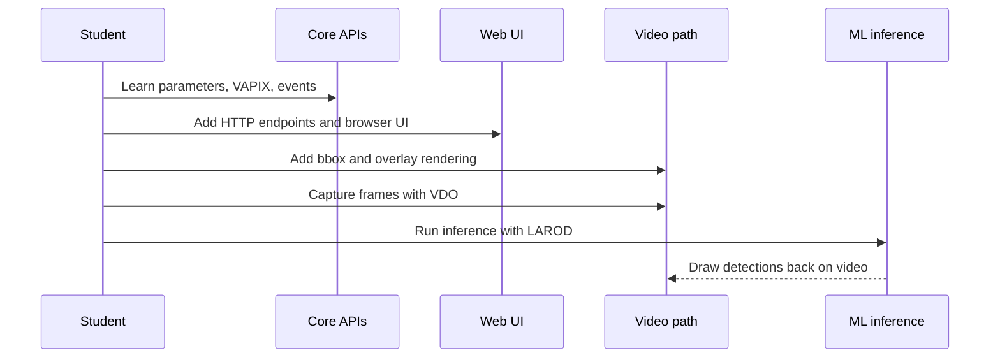
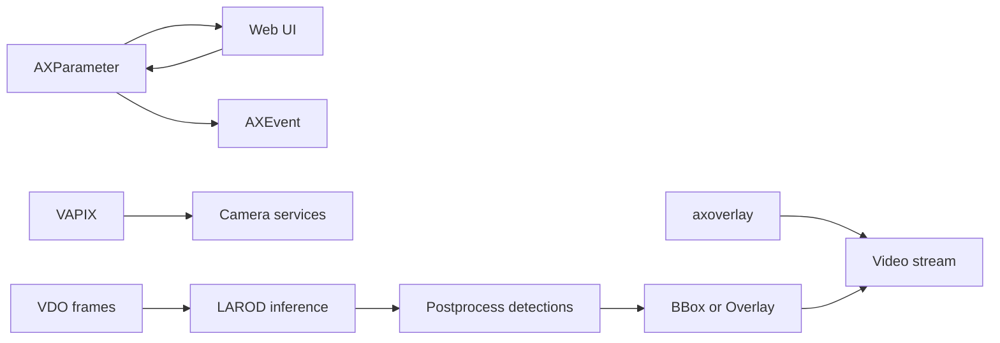

# AXIS ACAP TIP Workshop

This repository is a progressive workshop for learning ACAP application development. The examples are intentionally small and focused: each folder introduces one platform concept, then later folders combine those concepts into richer applications.

The recommended teaching order is:

1. Core/basic platform APIs: `parameter/`, `vapix/`, `event/`
2. Visual basics: `bbox/`
3. Intermediate web UI and APIs: `webserver-fastcgi/`, `webserver-proxy/`
4. Advanced visual rendering: `overlay/`
5. Advanced video frames and buffers: `vdo/`
6. Most advanced machine learning flow: `larod/`

## Curriculum Map



## Repository Map

| Folder | Level | What it teaches |
| --- | --- | --- |
| `parameter/` | Core/basic | Manifest parameters, runtime parameters, callbacks, and a custom parameter UI |
| `vapix/` | Core/basic | Calling camera HTTP APIs from inside ACAP with service-account credentials |
| `event/` | Core/basic | Declaring, sending, and subscribing to ACAP events |
| `bbox/` | Visual basics | Drawing bounding boxes and reasoning about visual annotations |
| `webserver-fastcgi/` | Intermediate | FastCGI endpoints served through the camera web server |
| `webserver-proxy/` | Intermediate | CivetWeb reverse-proxy backends and packaged Angular frontends |
| `overlay/` | Advanced visual | Drawing text, shapes, logos, and per-view overlays on video |
| `vdo/` | Advanced video | Capturing frames, reading formats, and understanding dma-buf ownership |
| `larod/` | Advanced ML | Running inference with LAROD, configuring tensors, and combining VDO plus postprocessing |

Each folder has its own README with diagrams, build instructions, code snippets, and classroom exercises.

## How The Examples Build On Each Other



The structure is designed for newcomers. Early examples avoid video frames and neural networks so students can first understand the ACAP process model, configuration, event system, and camera APIs. Later examples add memory management, rendering callbacks, dma-buf, tensors, and postprocessing.

## Build Quick Start

Most example folders follow the same Docker build pattern. From the example directory:

```sh
docker build --tag example-name --build-arg ARCH=aarch64 .
docker cp $(docker create example-name):/opt/app ./build
```

The generated `.eap` package is copied to `build/`. Upload that package in the camera web interface under Apps.

Some examples support other architectures:

```sh
docker build --tag example-name --build-arg ARCH=armv7hf .
```

Always check the example README for any specific runtime requirements, such as a camera model with MLPU support, a VAPIX service account, or a particular stream format.

## Recommended Class Flow

### 1. Core/basic

Start with `parameter/`. Parameters are the simplest persistent state mechanism for an ACAP app. Students learn the difference between manifest-defined configuration and runtime-created configuration.

Then use `vapix/`. VAPIX shows how an ACAP app can call local camera APIs through authenticated HTTP requests.

Then use `event/`. Events show how an app communicates state and occurrences to the camera event system and to other applications.

### 2. Visual basics

Use `bbox/` before `overlay/`. BBox examples introduce the idea of placing annotations on video without exposing the full overlay rendering lifecycle yet.

### 3. Intermediate web

Use `webserver-fastcgi/` first to show how the camera web server forwards requests to an application over a FastCGI socket.

Then use `webserver-proxy/` to show an embedded CivetWeb backend, JSON APIs, and packaged Angular frontends.

### 4. Advanced visual

Use `overlay/` after students understand parameters and web APIs. Overlay introduces callbacks, Cairo drawing, color spaces, stream resolution changes, rotation, and per-view rendering.

### 5. Advanced video

Use `vdo/` when students are ready to work with video frames directly. This section introduces blocking and non-blocking frame capture, pixel formats such as NV12 and RGB, and dma-buf based memory ownership.

### 6. Machine learning

Finish with `larod/`. LAROD examples combine the previous topics: model loading, tensor inputs and outputs, VDO frame sources, optional preprocessing, dma-buf transfer, inference execution, postprocessing, and visual output.

## Concept Map



## Teaching Guidance

This content is good for teaching newcomers because the examples are small and ordered by complexity. To make the most of it in a class:

- Start each folder by drawing the Mermaid flow and explaining where the code runs.
- Build and install one example at a time.
- Read the main loop and callback functions before reading helper functions.
- Ask students to make one small modification per example.
- Delay VDO and LAROD until students are comfortable with ACAP packaging, logging, parameters, and callbacks.

## Where To Start

Open `parameter/README.md` first. After that, follow the curriculum map above or jump directly to a folder if you already know the prerequisite concepts.
