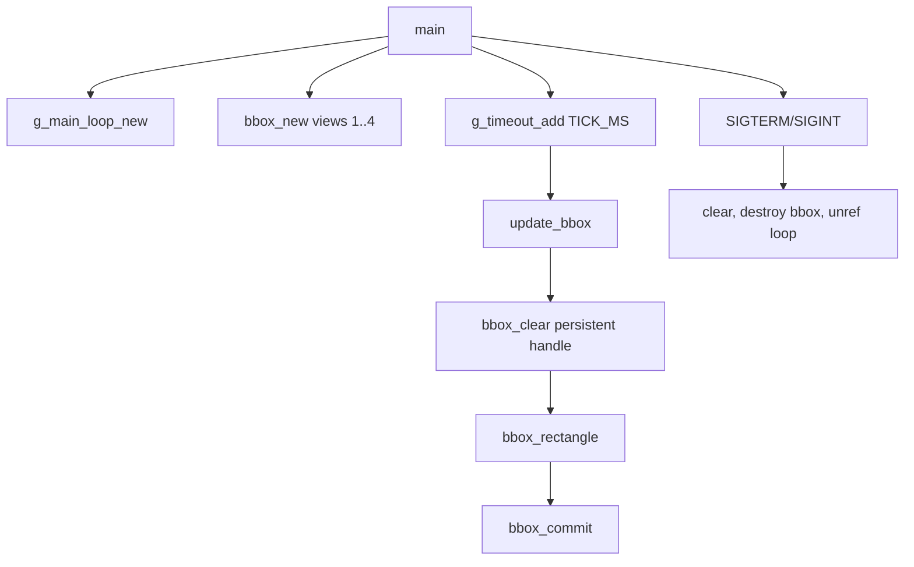

# bbox-multi-view-refactor-lab

This example refactors `bbox-multi-view` into a smoother and more reusable
animation pattern.

The main lesson is resource lifetime: create the BBox handle once, update it on
a timer, and destroy it on shutdown.

## What Changed From bbox-multi-view

| Topic | `bbox-multi-view` | This refactor |
| --- | --- | --- |
| BBox handle | created every frame | created once globally |
| Timing | timer plus blocking sleep | GLib timer controls FPS |
| Cleanup | recreates clear handle | clears with persistent handle |
| Teaching focus | multi-view concept | production structure |

## Architecture



## Key Code

Persistent global handle:

```c
static GMainLoop* loop = NULL;
static bbox_t* g_bbox = NULL;
```

Create it once:

```c
g_bbox = bbox_new(4u, 1u, 2u, 3u, 4u);
bbox_video_output(g_bbox, true);
```

Use a timer for frame cadence:

```c
#define TICK_MS 33
g_timeout_add(TICK_MS, update_bbox, NULL);
```

Update without blocking:

```c
bbox_clear(g_bbox);
bbox_rectangle(g_bbox, xpos, y, xpos + box_width, y + height);
bbox_commit(g_bbox, 0u);
return G_SOURCE_CONTINUE;
```

Clean shutdown:

```c
clear_all();
bbox_destroy(g_bbox);
g_main_loop_unref(loop);
```

## Why This Pattern Is Better

The overlay update loop should not sleep inside the drawing callback. A GLib
timer already controls cadence. Blocking inside the callback can make the app
less responsive and can delay shutdown.

Creating the handle once also avoids repeated setup costs.

## Build

```bash
docker build --tag bbox-multi-view-refactor-lab --build-arg ARCH=aarch64 .
docker cp $(docker create bbox-multi-view-refactor-lab):/opt/app ./build
```

## Exercises

1. Change `TICK_MS` from 33 to 100 and observe smoothness.
2. Target fewer views.
3. Add a second rectangle with a different y coordinate.
4. Move style setup outside the timer when style is constant.
