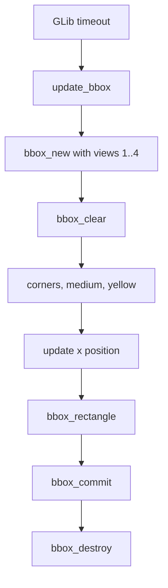

# bbox-multi-view

This example draws a moving box on several camera views. It introduces
multi-view BBox handles and simple animation.

## Learning Goal

Move from one static box on one view to one animated box shared across multiple
views.

## Architecture



## Key Code

Create one handle targeting four views:

```c
bbox_t* bbox = bbox_new(4u, 1u, 2u, 3u, 4u);
```

Enable video output:

```c
bbox_video_output(bbox, true);
```

Animate the x coordinate:

```c
xpos += dir * 0.02;

if (xpos + box_width >= 1.0) {
    xpos = 1.0 - box_width;
    dir = -1;
} else if (xpos <= 0.0) {
    xpos = 0.0;
    dir = 1;
}
```

Draw:

```c
bbox_rectangle(bbox, xpos, y, xpos + box_width, y + height);
bbox_commit(bbox, 0u);
```

## Teaching Note

This example intentionally shows the concept, but it recreates the BBox handle
inside each update. That makes it easy to read but less efficient.

The next example, `bbox-multi-view-refactor-lab`, improves this by creating one
persistent handle and reusing it.

## Build

```bash
docker build --tag bbox-multi-view --build-arg ARCH=aarch64 .
docker cp $(docker create bbox-multi-view):/opt/app ./build
```

## Exercises

1. Change the targeted views.
2. Increase the animation speed.
3. Change `bbox_style_corners` to outline or fill.
4. Remove the `sleep` and observe why timer-driven code should not block.
