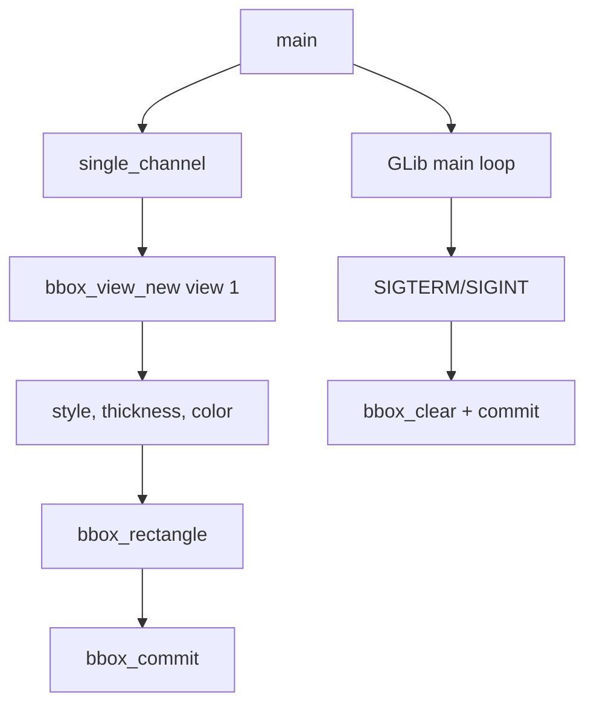

# bbox-view

This is the first BBox example. It draws one static rectangle on one camera
view and keeps the process alive with a GLib main loop.

## Learning Goal

Understand the minimum BBox lifecycle:

```text
create handle -> clear -> style -> draw rectangle -> commit -> clear on exit
```

## Architecture



## Key Code

Create a BBox handle for view 1:

```c
bbox_t* bbox = bbox_view_new(1u);
```

Set style:

```c
const bbox_color_t red = bbox_color_from_rgb(0xff, 0x00, 0x00);
bbox_style_outline(bbox);
bbox_thickness_thin(bbox);
bbox_color(bbox, red);
```

Draw and commit:

```c
bbox_clear(bbox);
bbox_rectangle(bbox, 0.05, 0.05, 0.95, 0.95);
bbox_commit(bbox, 0u);
```

Clear on shutdown:

```c
bbox_clear(bbox);
bbox_commit(bbox, 0u);
bbox_destroy(bbox);
```

## Coordinate Note

If you want values in the range `0.0..1.0`, enable normalized coordinates:

```c
bbox_coordinates_frame_normalized(bbox);
```

Without normalized coordinates, coordinates may be interpreted as pixels
depending on SDK behavior and selected mode.

## Build

```bash
docker build --tag bbox-view --build-arg ARCH=aarch64 .
docker cp $(docker create bbox-view):/opt/app ./build
```

## Exercises

1. Change the rectangle to cover only the center of the view.
2. Change color from red to green.
3. Enable normalized coordinates and compare behavior.
4. Draw two rectangles before one commit.
