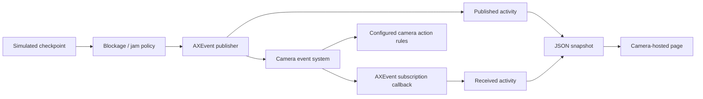

# Conveyor jam monitor

An industry scenario for the Event API: a factory conveyor reports prolonged
blockages so other applications or camera action rules can respond. A local
subscriber receives the events and a camera-hosted page shows both sides of the
publish/subscribe flow.

This is the practical companion to the existing [Event API walkthroughs](../).
The sensor input is simulated; publishing and subscribing use the real AXEvent
system on the camera. The application does not analyze video, connect to a PLC,
or control machinery.

## The operational problem

A package briefly passing a checkpoint is normal. A package blocking it for the configured threshold (ten seconds by default)
suggests a jam. An integration needs to know both when the condition
starts and when it clears, and which conveyor is involved. It may also need to
count individual package passages.

These are two different event semantics:

| Event | Semantics | Purpose |
| --- | --- | --- |
| `JamActive` | Stateful, with boolean property `active` | An ongoing condition: true while jammed, false after recovery. |
| `PackagePassed` | Stateless | One observed package passage; each occurrence is a separate event. |

There is no alert cooldown here. A jam stays active without repeatedly sending
true. The app sends an explicit initial false, then sends state changes, including
changes caused by live configuration. This is
what makes a stateful event useful to a consumer that needs the current condition.

## What the simulation does

The cycle begins only after **both event declaration callbacks complete**.
The timeline below assumes the defaults: monitoring enabled, threshold 10 seconds.

| Time in each 60-second cycle | Simulated condition | Event behavior |
| --- | --- | --- |
| 0–20 seconds | Normal flow | A package passes approximately every four seconds. |
| 20–30 seconds | Checkpoint blocked, below threshold | Package passages stop; jam stays false. |
| 30–40 seconds | Blockage has lasted at least ten seconds | Publish `JamActive=true` at the threshold. |
| 40–60 seconds | Blockage cleared; normal flow resumes | Publish `JamActive=false`; package passages resume. |

The first cycle normally has package events at about 4, 8, 12, 16, 40, 44, 48,
52, and 56 seconds. At startup, the app explicitly publishes `JamActive=false`.
Timing comes from a monotonic clock and a one-second GLib timer; scheduling may
shift actual delivery slightly. Delayed ticks do not fabricate a burst of missed
package events. A stall that skips a whole simulated phase can miss that phase.
This is a workshop simulator, not a lossless production counter.

## Persistent parameter controls

The Settings page includes two parameters stored through AXParameter:

| Parameter | Default | Allowed values | Effect |
| --- | --- | --- | --- |
| `Enabled` | `yes` | `yes`, `no` | Enable jam monitoring; package passages continue independently. |
| `JamThresholdSeconds` | `10` | Integer, 1–86400 | Monitored blockage duration before declaring a jam. |

Startup reads the saved values; it does not overwrite them with defaults.
Invalid saved values stop startup with a log message. Live callbacks reject
invalid values and retain the previous running setting. The callback handles
capitalized camera group names by dispatching on the final parameter name.

- **Disable:** clears monitoring time and publishes `JamActive=false` immediately
  if an active jam was published. Failed sends are logged and retried on ticks.
- **Re-enable:** starts a fresh monitoring timer on the next tick if blocked.
- **Change the threshold:** uses the existing monitored duration on the next
  tick. Lowering the threshold may activate a jam; raising it above elapsed
  monitored time clears an active jam even while physically blocked.
- **Physical recovery:** resets monitored duration; the next blockage starts fresh.
- **Restart:** retains settings, but resets simulation, counters, and event history.

The page distinguishes physical blockage age from monitored duration. The
progress bar uses monitored duration; event payload `BlockedSeconds` continues
to describe the physical blockage. The fixed simulation is unchanged: 20 seconds
of blockage per 60-second cycle. A threshold **20 seconds or greater** never
activates during that blockage, because recovery is evaluated at its end.

Save uses `POST /axis-cgi/param.cgi`. The page checks the VAPIX response and then
waits for the status endpoint to confirm applied values. Edits survive background
polling; Use current values discards them. Failed polling disables the form.
Settings update independently, so a request is not an atomic transaction.

The camera parameter group is `root.Event_conveyor_monitor` (capital `E`), while
the executable and page URL remain lowercase. For example:

```bash
curl --anyauth --user root https://CAMERA_IP/axis-cgi/param.cgi \
  --data-urlencode 'action=update' \
  --data-urlencode 'root.Event_conveyor_monitor.Enabled=yes' \
  --data-urlencode 'root.Event_conveyor_monitor.JamThresholdSeconds=5'
```

Curl prompts for the password; use a trusted camera HTTPS endpoint. Successful
callbacks log `Configuration: Enabled=yes` and `Configuration: JamThresholdSeconds=5`.
The existing `Published` and `Received` event logs remain separate.

## Event contract

The topic path is:

```text
tnsaxis:CameraApplicationPlatform / tnsaxis:ConveyorMonitor / tnsaxis:JamActive
tnsaxis:CameraApplicationPlatform / tnsaxis:ConveyorMonitor / tnsaxis:PackagePassed
```

Each level is declared as `topic0`, `topic1`, or `topic2` in namespace `tnsaxis`.
The payload keys below have no namespace.

| Field | Type | Role | Meaning |
| --- | --- | --- | --- |
| `ConveyorId` | Integer | Source, both events | `1`, identifying the single simulated line. |
| `active` | Boolean | Stateful property, `JamActive` only | Whether the jam condition is active. |
| `BlockedSeconds` | Integer | Data, `JamActive` only | Physical blockage age when state changes; completed duration (20) at physical recovery; 0 initially. |
| `PackageCount` | Integer | Data, both events | Cumulative simulated package count since startup. |

`ConveyorId` is marked as a source, separating event identity from its data.
This example declares one source value; it does not simulate multiple conveyors.
`PackageCount` is a cumulative count, not a unique event identifier and not a
count of notifications received. The counter resets on application restart.

The state declaration uses `ax_event_handler_declare2()` with `stateless=FALSE`
and property name `active`. The package declaration uses `stateless=TRUE`.
Both declarations supply readable topic names for event consumers.

## Publish and subscribe architecture



Two AXEvent handler instances run inside the same app: a publisher and a
subscriber. The subscriber registers exact topic and `ConveyorId=1` filters.
The subscription callback extracts the event payload and frees the received
event. No direct function call from the publisher fabricates a received entry.

The page distinguishes:

- **Published:** `ax_event_handler_send_event()` returned success.
- **Received:** the real subscription callback received and decoded an event.
- **Received JamActive property:** updated only by that callback, initially
  unknown until a state notification arrives.

Publishing does not prove that every external consumer received an event.
State initialization notifications and asynchronous delivery can also make the
published and received totals differ. Compare the actual topic/payload entries,
not just the counters. The local subscriber is a teaching aid, not delivery
acknowledgement from a VMS or a factory system.

Event declarations, simulation, and subscription callbacks use the GLib main
context. A FastCGI worker reads serialized status snapshots through a short
mutex; it never accesses the AXEvent handlers or simulator directly.

Send failures increment the error counter and are logged. A failed jam-state
publication is retried on subsequent ticks until the current state is published.
Stateless package sends are not retried, so the application does not invent
additional passage occurrences. Initialization errors stop the app; check its
log. Stopping frees both handlers and removes their declarations/subscriptions.
Stopping is not a simulated recovery event and does not publish a final false.

## Build and install

Prerequisites: Docker and an Axis device compatible with the selected SDK,
architecture, and manifest. This example follows the workshop's SDK 12.10.0
build and defaults to `aarch64`.

From this directory:

```bash
docker build --tag event-conveyor-monitor --build-arg ARCH=aarch64 .
container_id=$(docker create event-conveyor-monitor)
docker cp "$container_id":/opt/app ./build
docker rm "$container_id"
```

Use `--build-arg ARCH=armv7hf` for an appropriate 32-bit device. Upload the
`.eap` from `build/` in the device's Apps page, following its signing requirements,
and start it manually. The manifest uses `runMode: never`, like the walkthroughs.
No physical sensor, analytics model, or other workshop app is required.

## Open the visual companion

Select the app's **Settings** button, or open:

```text
https://CAMERA_IP/local/event_conveyor_monitor/index.html
```

Use a camera administrator account. The page and all assets ship inside the
package. The admin-only, read-only `status.cgi` endpoint provides the simulator
state, published/received counts, errors, latest received jam property, and the
last 30 activity entries. Entries are newest first and reset on restart.

The page polls once per second without overlapping requests. The conveyor
animation is illustrative; all conditions, counters, and activity come from C.
A failed request shows a stale-data banner and pauses the illustration. Reopening
or opening multiple tabs does not restart or duplicate the simulator.

Timestamps are recorded on the camera when sending or receiving, then displayed
in the browser's local timezone. This is a local teaching log, not an audit trail
or a network-latency measurement.

## Workshop exercise: react to a jam

Use Enabled=yes and JamThresholdSeconds=10 for this default timeline.

1. Start the app and open its Settings page. Watch an initial false state and
   several `PackagePassed` events reach the subscriber.
2. At about 20 seconds, observe that the checkpoint becomes blocked and package
   events stop. The jam state should still be false.
3. At about 30 seconds, compare the published and received `JamActive=true`
   entries. At about 40 seconds, compare their recovery (`false`) entries.
4. In the camera's event/action-rule interface, look for the **Conveyor Monitor**
   topic and **Conveyor jam active** condition. Select conveyor source `1` and
   the active/true condition where those selections are exposed.
5. Configure an available action, such as recording, with the required storage
   and action settings on that device. Observe it during the next jam cycle.

Exact rule labels, source selectors, and available actions depend on the device
and AXIS OS. The app publishes the condition; it does not create action rules,
recordings, or VMS integrations for you. Remove or disable the workshop rule
when finished. Do not connect this simulator to machinery controls.

For subscriber matching practice, change only the subscriber's `topic2` filter
to a different value, rebuild, and observe that published events continue but
matching received entries stop. Restore the matching filter afterwards.

## Verification checklist

| Check | Expected result |
| --- | --- |
| Startup | Both declaration completion messages precede simulated event sends. |
| Normal flow | `PackagePassed` entries contain increasing `PackageCount`. |
| Threshold | Jam stays false before ten blocked seconds, then becomes true. |
| Sustained jam | No repeated true publication every second. |
| Recovery | False state carries completed blockage duration 20; package events resume. |
| Subscription | Received entries originate in callbacks and decode the published fields. |
| Multiple tabs | Tabs show the same session state and event counts. |
| Stop/restart | Page disconnects; restart begins a new cycle with cleared history and counters. |
| Disable active jam | A false event is published and received; passage events continue when flow resumes. |
| Re-enable while blocked | Monitored duration starts fresh rather than inheriting physical blockage age. |
| Live threshold | Lowering below monitored time activates a jam; raising above it clears the jam. |
| Saved settings | Stop/start retains Enabled and JamThresholdSeconds. |
| Long threshold | Set 25 seconds: no jam during the simulated 20-second blockage. |
| Camera rule | The configured action responds to the jam condition on the target device. |

## Local tests

The simulation policy is separate from AXEvent so its timing can be checked
without a camera. From this directory, using a host C compiler:

```bash
cc -std=c11 -Wall -Wextra -Werror tests/conveyor_test.c app/conveyor.c -o /tmp/conveyor-test
/tmp/conveyor-test
node --test tests/dashboard.test.cjs
```

Policy checks cover passage timing, the jam boundary, recovery, cycle repeats,
and delayed ticks. Dashboard checks use a small DOM test double; they do not
replace visual browser inspection. The Docker build validates the manifest and
compiles the full application with warnings treated as errors. Actual event
routing, rule discovery, and authenticated FastCGI still require device testing.

## Extending toward a real installation

Replace the timer-generated checkpoint state with a sensor or analytics signal.
Define how short detection gaps, missing input, restarts, and event-send failures
should affect the jam state. Keep elapsed-time tracking monotonic. Deliver
external input onto the GLib main context before touching application state.

Additional lines would have their own source identities and jam state. A
production package counter would need explicit persistence and delivery
semantics. The two configuration controls connect this example to the
[Parameter API examples](../../parameter/): parameters configure the policy,
while events communicate its state changes.

## Source map and reference

- [`app/conveyor.c`](app/conveyor.c): deterministic simulated input and jam policy.
- [`app/event_conveyor_monitor.c`](app/event_conveyor_monitor.c): declarations, publishing, subscription, history, and lifecycle.
- [`app/status_server.c`](app/status_server.c): supporting read-only FastCGI infrastructure.
- [`app/html/`](app/html/): self-contained visual companion.
- [`app/manifest.json`](app/manifest.json): package, Settings page, and endpoint access.
- [AXEvent handler reference](https://developer.axis.com/acap/api/src/api/axevent/html/ax__event__handler_8h.html): declaration, subscription, send, and cleanup contracts.
