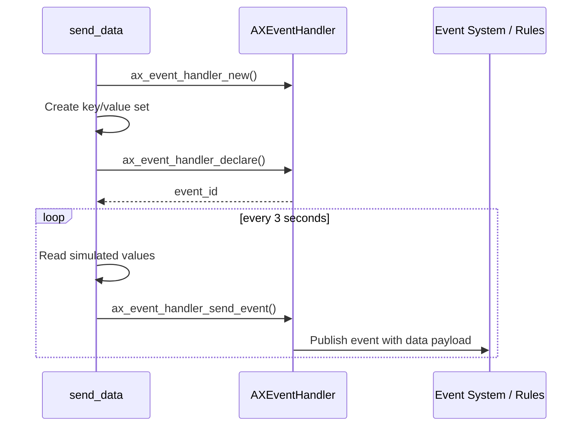

# Send Data Event

This example publishes a stateless event that carries data values. It is the best first Event API example because the event has no lasting state: every message is a new observation.

## What this example teaches

- How an ACAP application declares an event topic.
- How event fields are split into topic keys and data keys.
- How to publish a repeated event from a GLib timer.
- How subscribers receive structured values instead of parsing text.

## Code Flow


```mermaid
sequenceDiagram
    participant App as send_data
    participant Event as AXEventHandler
    participant Rule as Event System / Rules

    App->>Event: ax_event_handler_new()
    App->>App: Create key/value set
    App->>Event: ax_event_handler_declare()
    Event-->>App: event_id
    loop every 3 seconds
        App->>App: Read simulated values
        App->>Event: ax_event_handler_send_event()
        Event->>Rule: Publish event with data payload
    end
```

The application creates one event declaration and then reuses that declaration when sending data.

```c
ax_event_key_value_set_add_key_value(key_value_set, "topic0", "tnsaxis",
                                     TOPIC0_TAG, AX_VALUE_TYPE_STRING, NULL);
ax_event_key_value_set_add_key_value(key_value_set, "topic1", "tnsaxis",
                                     TOPIC1_TAG, AX_VALUE_TYPE_STRING, NULL);
ax_event_key_value_set_add_key_value(key_value_set, "topic2", "tnsaxis",
                                     EVENT_TAG, AX_VALUE_TYPE_STRING, NULL);
```

The topic fields identify the event. Data fields are values attached to each event instance.

```c
ax_event_key_value_set_add_key_value(key_value_set, "Temperature", NULL, &temperature,
                                     AX_VALUE_TYPE_DOUBLE, NULL);
ax_event_key_value_set_mark_as_data(key_value_set, "Temperature", NULL, NULL);
```

After declaration, the timer callback sends a new event instance.

```c
g_timeout_add_seconds(3, send_data, app_data);
```

## Build

From this directory:

```sh
docker build --tag send-data --build-arg ARCH=aarch64 .
docker cp $(docker create send-data):/opt/app ./build
```

Install the generated `.eap` file on the camera and start the application from the web UI or VAPIX.

## Classroom Exercises

1. Add one more data field, such as `"FrameRate"`.
2. Change the timer interval and observe the event rate.
3. Pair this example with `subcribe-event-data` and verify that the subscriber receives the new field.
