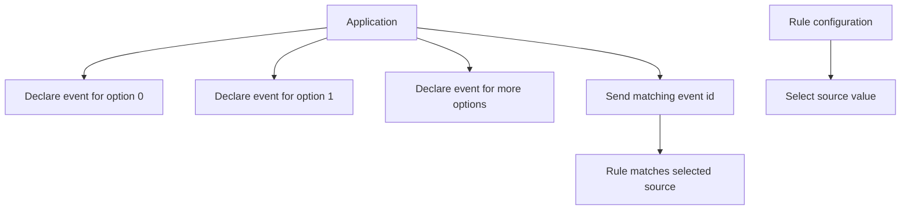

# Send Pulse Dropdown Event

This example extends the pulse event by declaring a source value. In the camera rule interface, that source can be shown as a selectable option, which is why this example is useful after the basic pulse example.

## Concept


```mermaid
flowchart TD
    App[Application] --> Declare0[Declare event for option 0]
    App --> Declare1[Declare event for option 1]
    App --> DeclareN[Declare event for more options]
    User[Rule configuration] --> Select[Select source value]
    App --> Send[Send matching event id]
    Send --> Rule[Rule matches selected source]
```

The source value is part of the event identity. It is not just extra payload.

## Key Code

The example creates several event declarations, one per selectable value.

```c
ax_event_key_value_set_add_key_value(key_value_set, "value", NULL, value,
                                     AX_VALUE_TYPE_INT, NULL);
ax_event_key_value_set_mark_as_source(key_value_set, "value", NULL, NULL);
```

Marking a key as source tells the event system that this value participates in selection and filtering.

```c
ax_event_handler_declare(event_handler, key_value_set, 1, &declaration,
                         (AXDeclarationCompleteCallback)declaration_complete,
                         value, NULL);
```

At runtime, the application sends the event id that corresponds to the current option.

```c
ax_event_handler_send_event(event_handler, declaration, key_value_set, NULL);
```

## Build

```sh
docker build --tag send-pulse-dropdown --build-arg ARCH=aarch64 .
docker cp $(docker create send-pulse-dropdown):/opt/app ./build
```

## Classroom Exercises

1. Reduce the number of options and inspect the rule UI.
2. Rename the source key from `"value"` to something domain specific.
3. Compare this example with `send-data` and discuss source keys versus data keys.
