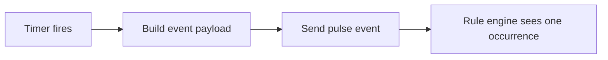

# Send Pulse Event

This example publishes a stateless pulse event. A pulse is useful for "something happened" signals, such as a detected object, a button press, or a threshold crossing.

## Concept

A pulse event does not represent a current condition. It represents an instant.


```mermaid
flowchart LR
    Timer[Timer fires] --> Build[Build event payload]
    Build --> Send[Send pulse event]
    Send --> Rule[Rule engine sees one occurrence]
```

The example still attaches a small value to make the event easy to inspect, but the important part is that each call to `ax_event_handler_send_event()` is an occurrence.

## Key Code

The topic names place the event under the application namespace:

```c
ax_event_key_value_set_add_key_value(key_value_set, "topic0", "tnsaxis",
                                     TOPIC0_TAG, AX_VALUE_TYPE_STRING, NULL);
ax_event_key_value_set_add_key_value(key_value_set, "topic1", "tnsaxis",
                                     TOPIC1_TAG, AX_VALUE_TYPE_STRING, NULL);
ax_event_key_value_set_add_key_value(key_value_set, "topic2", "tnsaxis",
                                     EVENT_TAG, AX_VALUE_TYPE_STRING, NULL);
```

The timer callback sends the pulse repeatedly:

```c
g_timeout_add_seconds(5, send_pulse, app_data);
```

The event is declared once and sent many times:

```c
ax_event_handler_declare(event_handler, key_value_set, 1, &declaration,
                         (AXDeclarationCompleteCallback)declaration_complete,
                         &start_value, NULL);
```

## Build

```sh
docker build --tag send-pulse --build-arg ARCH=aarch64 .
docker cp $(docker create send-pulse):/opt/app ./build
```

## Classroom Exercises

1. Change the event interval from 5 seconds to 1 second.
2. Remove the data value and make the event a pure pulse.
3. Create an event rule on the camera that reacts to this pulse.
