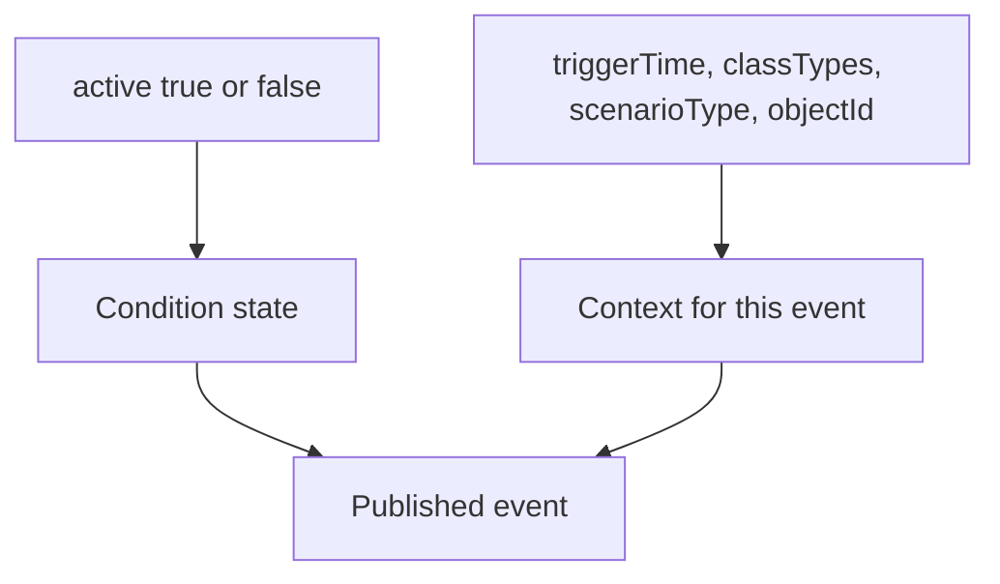

# Send State With Data Event

This example combines a stateful event with additional data. That pattern is common in analytics: the event tells whether a condition is active, while the payload explains what triggered it.

## Concept



State and data have different jobs. The state drives rule logic. The data helps the receiver understand the event.

## Key Code

The state key is declared separately from data fields.

```c
ax_event_key_value_set_add_key_value(key_value_set, "active", NULL, &start_value,
                                     AX_VALUE_TYPE_BOOL, NULL);
```

Additional keys are marked as data:

```c
ax_event_key_value_set_add_key_value(key_value_set, "objectId", NULL, "",
                                     AX_VALUE_TYPE_STRING, NULL);
ax_event_key_value_set_mark_as_data(key_value_set, "objectId", NULL, NULL);
```

The example uses the event declaration variant that identifies the state key.

```c
ax_event_handler_declare2(event_handler, key_value_set, FALSE, "active",
                          &declaration,
                          (AXDeclarationCompleteCallback)declaration_complete,
                          &start_value, NULL);
```

## Build

```sh
docker build --tag send-state-with-data --build-arg ARCH=aarch64 .
docker cp $(docker create send-state-with-data):/opt/app ./build
```

## Classroom Exercises

1. Add a new data field such as `"confidence"`.
2. Send different `objectId` values while the state is active.
3. Compare this example with `send-state` and identify which part changes rule behavior.
