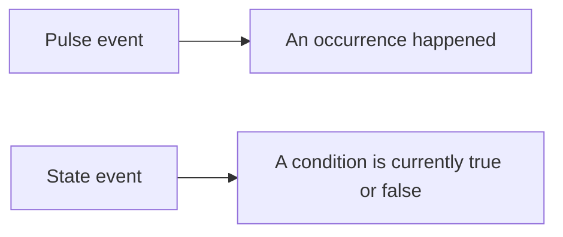
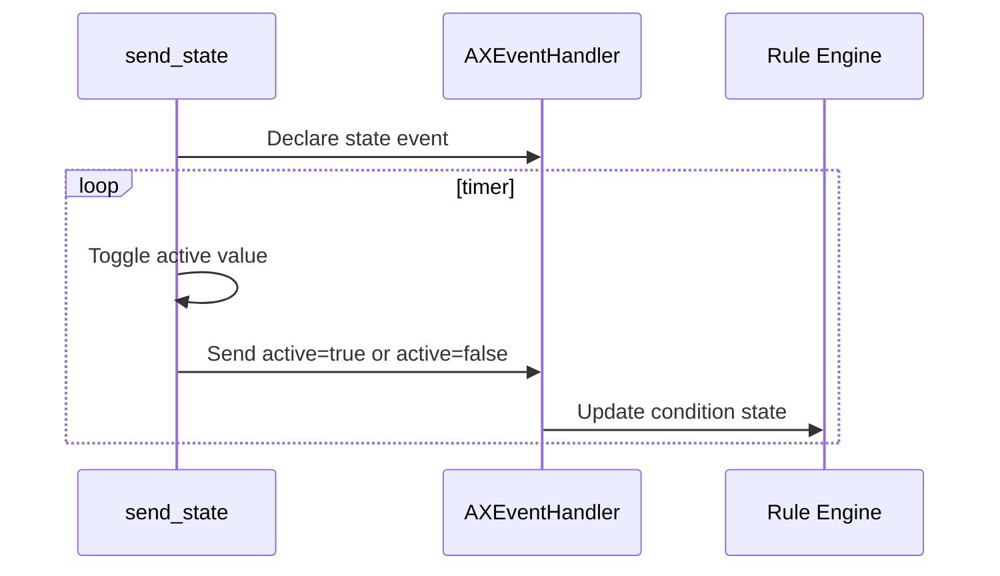

# Send State Event

This example publishes a stateful event. A state event represents a condition that can be active or inactive.

## Pulse Versus State



Use state events for conditions such as "motion active", "object present", or "temperature above threshold".

## Code Flow



## Key Code

The state key is normally named `active`.

```c
gboolean active = FALSE;
ax_event_key_value_set_add_key_value(key_value_set, "active", NULL, &start_value,
                                     AX_VALUE_TYPE_BOOL, NULL);
```

The event is declared as stateful by the declaration arguments used by the example.

```c
ax_event_handler_declare(event_handler, key_value_set, 0, &declaration,
                         (AXDeclarationCompleteCallback)declaration_complete,
                         &start_value, NULL);
```

The timer toggles and publishes the current state.

```c
start_value = !start_value;
ax_event_handler_send_event(event_handler, declaration, key_value_set, NULL);
```

## Build

```sh
docker build --tag send-state --build-arg ARCH=aarch64 .
docker cp $(docker create send-state):/opt/app ./build
```

## Classroom Exercises

1. Change the timing so the active state lasts longer than the inactive state.
2. Add logging that prints every state transition.
3. Discuss why a state event is easier for rules than a repeated pulse when representing a condition.
