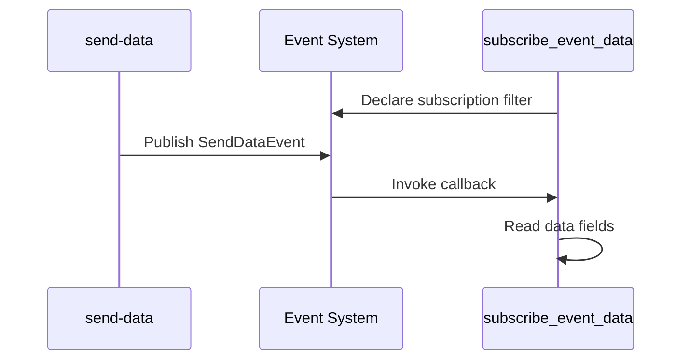

# Subscribe Event Data

This example subscribes to an event and reads its data fields. It is intentionally paired with `send-events-types/send-data`.

The folder name is `subcribe-event-data` in this repository, but the lesson is event subscription.

## Code Flow



## Key Code

The subscription filter matches the topic published by `send-data`.

```c
ax_event_key_value_set_add_key_value(key_value_set, "topic0", "tnsaxis",
                                     "CameraApplicationPlatform",
                                     AX_VALUE_TYPE_STRING, NULL);
ax_event_key_value_set_add_key_value(key_value_set, "topic1", "tnsaxis",
                                     "SendData", AX_VALUE_TYPE_STRING, NULL);
ax_event_key_value_set_add_key_value(key_value_set, "topic2", "tnsaxis",
                                     "SendDataEvent", AX_VALUE_TYPE_STRING, NULL);
```

The application subscribes with a callback.

```c
ax_event_handler_subscribe(event_handler,
                           key_value_set,
                           &subscription,
                           (AXSubscriptionCallback)subscription_callback,
                           NULL,
                           NULL);
```

Inside the callback, data fields are extracted by name.

```c
ax_event_key_value_set_get_double(key_value_set, "Temperature",
                                  NULL, &temperature, NULL);
```

## Build

```sh
docker build --tag subscribe-event-data --build-arg ARCH=aarch64 .
docker cp $(docker create subscribe-event-data):/opt/app ./build
```

## How To Test

1. Install and start `send-data`.
2. Install and start this subscriber.
3. Watch the application log and verify that values from the publisher are printed by the subscriber.

## Classroom Exercises

1. Subscribe to a different topic and observe that no events arrive.
2. Add a new data field in `send-data` and read it here.
3. Discuss why topic filtering belongs in the subscription instead of inside the callback.
