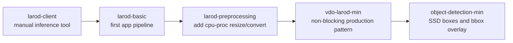
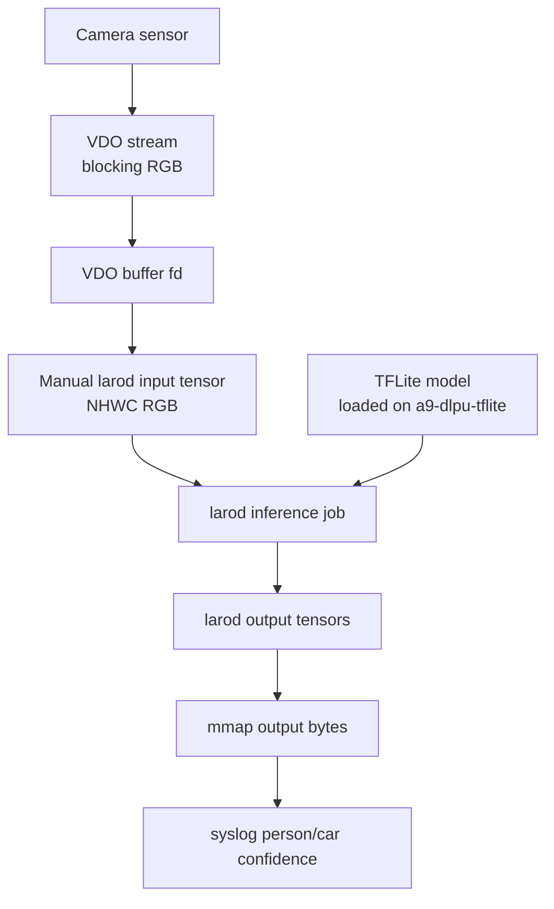
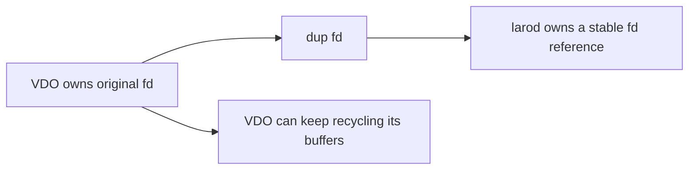
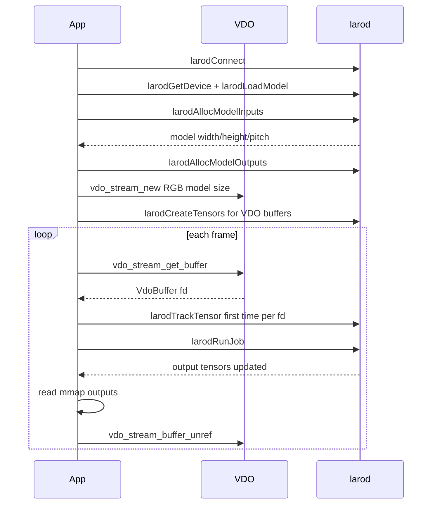

# larod-basic

This is the first full camera inference example in the larod sequence. It keeps
the path as simple as possible:

- one model
- one inference backend
- blocking VDO
- RGB frames only
- no preprocessing
- no `poll`
- no dynamic backend switching

The goal is to understand the minimum moving parts needed to feed camera frames
into larod and read inference results.

## Where This Fits In The Learning Path



`larod-basic` is intentionally narrow. It assumes the backend can consume RGB
directly and asks VDO to deliver frames at the exact model input size.

## Architecture



There is no image preprocessing stage in this example. If VDO cannot deliver RGB
at the model resolution, this app stops with an error. That limitation is useful
for teaching because it makes the data path easy to see.

## What larod Does Here

`larod` is the inference service. In this example the app asks larod to:

1. connect to the service
2. select an inference device
3. load a `.tflite` model
4. report the model input tensor shape
5. allocate output tensors
6. track external VDO frame buffers
7. create and run inference jobs

VDO owns the camera buffers. larod does not capture frames. The application
bridges VDO and larod by describing each VDO buffer as a larod tensor.

## Step 1: Connect To larod

```c
larodConnection* conn = NULL;
larodError* error = NULL;

if (!larodConnect(&conn, &error)) {
    PANIC("larodConnect: %s", error->msg);
}
```

The connection is required for every later larod API call.

## Step 2: Load The Model

```c
int model_fd = open(MODEL_PATH, O_RDONLY);

const larodDevice* device = larodGetDevice(conn, DEVICE_NAME, 0, &error);

larodModel* model = larodLoadModel(conn,
                                   model_fd,
                                   device,
                                   LAROD_ACCESS_PRIVATE,
                                   "",
                                   NULL,
                                   &error);
```

Important terms:

- `model_fd` is the packaged model file.
- `larodDevice` is the selected backend, for example `a9-dlpu-tflite`.
- `larodModel` is a loaded model handle. It is not a running job yet.
- `LAROD_ACCESS_PRIVATE` means the loaded model belongs to this application.

## Step 3: Read The Model Input Tensor

The model decides what size VDO should produce.

```c
size_t num_in = 0;
larodTensor** tmp_in = larodAllocModelInputs(conn, model, 0, &num_in, NULL, &error);
const larodTensorDims* dims = larodGetTensorDims(tmp_in[0], &error);

unsigned int h = dims->dims[1];
unsigned int w = dims->dims[2];
```

For an RGB image model the shape is normally NHWC:

```text
[batch, height, width, channels]
```

The app also reads the model pitch:

```c
const larodTensorPitches* pitches = larodGetTensorPitches(tmp_in[0], &error);
unsigned int model_pitch = pitches->pitches[2];
```

Pitch describes how memory is laid out. For RGB interleaved data, the pitch for
the width dimension is commonly 3 bytes per pixel.

## Step 4: Allocate Output Tensors And mmap Them

larod allocates output memory:

```c
larodTensor** out_tensors = larodAllocModelOutputs(conn,
    model,
    LAROD_FD_PROP_READWRITE | LAROD_FD_PROP_MAP,
    &num_out,
    NULL,
    &error);
```

The app maps each output tensor into CPU address space:

```c
int fd = larodGetTensorFd(out_tensors[i], &error);
larodGetTensorFdSize(out_tensors[i], &sz, &error);
out_data[i] = mmap(NULL, sz, PROT_READ, MAP_SHARED, fd, 0);
```

After `larodRunJob`, the CPU reads inference results directly from `out_data`.

## Step 5: Create A Blocking RGB VDO Stream

This example asks VDO for RGB frames at the exact model size:

```c
vdo_map_set_uint32(settings, "format", VDO_FORMAT_RGB);
vdo_map_set_uint32(settings, "buffer.count", 2);
vdo_map_set_double(settings, "framerate", 30.0);
vdo_map_set_string(settings, "image.fit", "scale");

VdoPair32u res = { .w = w, .h = h };
vdo_map_set_pair32u(settings, "resolution", res);
```

The stream is blocking. `vdo_stream_get_buffer` waits until a frame is ready.

After creating the stream, the app verifies that VDO actually gave the expected
format and size:

```c
if (vdo_fmt != VDO_FORMAT_RGB || vdo_w != w || vdo_h != h) {
    PANIC("VDO stream does not match model input");
}
```

This is the main simplification in `larod-basic`: no conversion path exists.

## Step 6: Create Input Tensor Descriptors

The input tensors describe VDO memory. They do not allocate image memory.

```c
larodTensor** t = larodCreateTensors(1, &error);

larodSetTensorDataType(t[0], LAROD_TENSOR_DATA_TYPE_UINT8, &error);
larodSetTensorLayout(t[0], LAROD_TENSOR_LAYOUT_NHWC, &error);
larodBuildTensorDims(t[0], LAROD_TENSOR_LAYOUT_NHWC, vdo_w, vdo_h, 3, &error);
larodBuildTensorPitches(t[0], LAROD_TENSOR_LAYOUT_NHWC, vdo_pitch, vdo_h, 3, &error);
larodSetTensorFdProps(t[0], LAROD_FD_PROP_MAP | LAROD_FD_PROP_DMABUF, &error);
```

Because this example only supports RGB interleaved frames, the layout is always
`LAROD_TENSOR_LAYOUT_NHWC`.

## Step 7: Track VDO Buffers

VDO reuses a small set of frame buffers. The app tracks each buffer the first
time its fd appears.

```c
int vdo_fd = vdo_buffer_get_fd(buf);
int64_t offset = vdo_buffer_get_offset(buf);
size_t cap = vdo_buffer_get_capacity(buf);
int duped = dup(vdo_fd);

larodSetTensorFd(t, duped, &error);
larodSetTensorFdOffset(t, offset, &error);
larodSetTensorFdSize(t, cap, &error);
larodTrackTensor(conn, t, &error);
```

Why duplicate the fd?



This avoids copying image bytes. larod reads the same memory VDO filled.

## Step 8: Run Inference

The job request connects one model, one input tensor array, and the output
tensors.

```c
job = larodCreateJobRequest(model,
                            in_tensors[slot],
                            1,
                            out_tensors,
                            num_out,
                            NULL,
                            &error);

larodRunJob(conn, job, &error);
```

When the same VDO buffer slot changes, the job input is updated:

```c
larodSetJobRequestInputs(job, in_tensors[slot], 1, &error);
```

## Step 9: Read Results

The model used in this example outputs two confidence bytes:

```c
uint8_t* person = (uint8_t*)out_data[0];
uint8_t* car = (uint8_t*)out_data[1];

syslog(LOG_INFO, "Person: %.1f%% - Car: %.1f%%",
       *person / 2.55f,
       *car / 2.55f);
```

The values are quantized from 0 to 255, so dividing by 2.55 converts them to a
percentage.

## Full Runtime Flow



## What This Example Teaches

- How to connect to larod.
- How to load a TFLite model on a backend.
- How to inspect model input dimensions.
- How to allocate and mmap output tensors.
- How to describe external VDO frame memory as a larod tensor.
- How DMA-BUF fd sharing avoids image copies.
- Why VDO buffers must be returned after use.

## Build

Build the ACAP package from this folder:

```bash
docker build --tag larod-basic --build-arg ARCH=aarch64 .
```

Copy the generated package out of the build container:

```bash
docker cp $(docker create larod-basic):/opt/app ./build
```

The Dockerfile downloads the person/car model and packages it as:

```text
/usr/local/packages/larod_basic/model/model.tflite
```

## What This Example Does Not Teach Yet

- non-blocking VDO with `poll`
- format conversion from NV12 to RGB
- resizing when VDO does not match model size
- backend-dependent stream selection
- SSD object-detection postprocessing
- bbox overlays

Those are introduced in the later examples.
