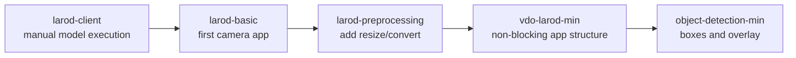
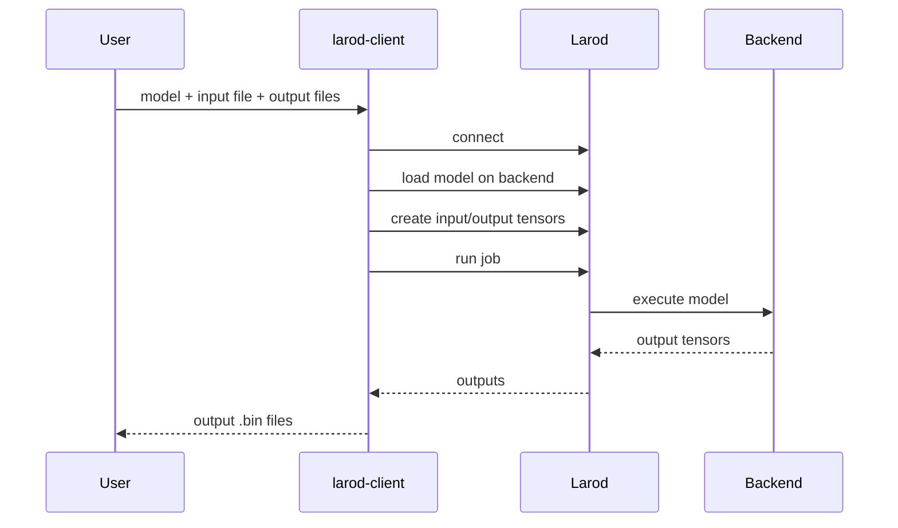

# larod-client

`larod-client` is the first lesson in the larod learning path. It lets you run
inference manually from the command line before writing a full ACAP application.

This is useful because it separates model execution from camera streaming. You
can first prove that:

- the model loads on the target backend
- the input tensor file has the expected format
- larod writes the expected output tensors
- the output order and shapes match your postprocessing assumptions

## Where This Fits



`larod-client` is not a camera pipeline example. It is a model and tensor
inspection tool.

## Concept

```mermaid
flowchart TD
    PC[Development PC] --> Image[JPG image]
    Image --> Convert[img_converter.py<br/>resize and RGB bytes]
    Convert --> Bin[input .bin]
    PC --> Model[TFLite model]
    Model --> Camera[/tmp on camera]
    Bin --> Camera
    Camera --> Client[larod-client command]
    Client --> Larod[larod service]
    Larod --> Backend[DLPU/TFLite backend]
    Backend --> Outputs[output .bin files]
    Outputs --> Decode[decode_larod_ssd_outputs.py]
```

## What larod-client Teaches

- A model input tensor is just bytes with the expected shape and layout.
- larod can run a model without VDO.
- Output tensors can be written to files.
- SSD object detection models usually produce multiple outputs.
- You should verify output order before writing C postprocessing code.

## Prerequisites

You need:

- an Axis camera with developer mode enabled
- SSH access to the ACAP user
- an ACAP SDK Docker build environment
- Python on your development machine for image conversion

Developer mode documentation:

<https://developer.axis.com/acap/get-started/set-up-developer-environment/set-up-device-advanced/>

## Build The ACAP Package

Build:

```bash
docker build --build-arg ARCH=aarch64 --tag larod-client .
```

Copy the generated package out of the container:

```bash
docker cp $(docker create larod-client):/opt/app ./build
```

Install the `.eap` package on the camera. The package provides the
`larod-client` tool in the ACAP environment.

## Prepare A Python Environment

Create an isolated environment on your PC:

```bash
mkdir -p ~/python-playground
cd ~/python-playground
python3 -m venv .venv
source .venv/bin/activate
pip install click Pillow numpy
```

When finished:

```bash
deactivate
```

## Download A Model

The tutorial uses a Coral SSD MobileNet model:

```bash
curl -L -o ssd_mobilenet_v1_coco_quant_postprocess.tflite \
  https://raw.githubusercontent.com/google-coral/test_data/master/ssd_mobilenet_v1_coco_quant_postprocess.tflite
```

This model expects an RGB image tensor and produces detection boxes, classes,
scores, and count.

## Create An Input Binary

Download a test image:

```bash
curl -L -o dog.jpg \
  "https://unsplash.com/photos/FFwNGYZK-2o/download?force=true&w=300"
```

Convert it to raw model input bytes:

```bash
python img_converter.py -i dog.jpg -w 300 -h 300
```

The output should be a `.bin` file, for example:

```text
dog.bin
```

The binary is not an image file anymore. It is raw RGB bytes laid out in the
order the model expects.

## Copy Files To The Camera

```bash
scp ssd_mobilenet_v1_coco_quant_postprocess.tflite dog.bin \
  acap-larod_client_tool@CAMERA_IP:/tmp/
```

Replace `CAMERA_IP` with the camera address.

## Run Inference With larod-client

SSH to the camera as the ACAP user, then prepare output files:

```bash
cd /tmp
touch test_out0.bin test_out1.bin test_out2.bin test_out3.bin
```

Run inference:

```bash
larod-client \
  -d \
  -c axis-a8-dlpu-tflite \
  -g ssd_mobilenet_v1_coco_quant_postprocess.tflite \
  -R 1 \
  -i dog.bin \
  -o test_out0.bin \
  -o test_out1.bin \
  -o test_out2.bin \
  -o test_out3.bin
```

The exact backend name depends on your device. Common examples are:

```text
a9-dlpu-tflite
axis-a8-dlpu-tflite
```

## What The Command Means

```text
-c  backend/device name
-g  model file
-i  raw input tensor file
-o  output tensor file, repeated once per output
-R  number of runs
-d  debug/verbose mode
```

`larod-client` performs the same basic larod operations that a C app performs:



## SSD MobileNet Outputs

The Coral SSD MobileNet postprocess model usually has four outputs:

| Output file | Meaning | Data |
| --- | --- | --- |
| `test_out0.bin` | detection boxes | `[ymin, xmin, ymax, xmax]`, normalized 0..1 |
| `test_out1.bin` | detection classes | class index |
| `test_out2.bin` | detection scores | confidence 0..1 |
| `test_out3.bin` | number of detections | count |

You should verify the output order for any new model. Do not assume all models
use the same order.

## Copy Outputs Back To The PC

```bash
scp acap-larod_client_tool@CAMERA_IP:/tmp/test_out*.bin .
scp acap-larod_client_tool@CAMERA_IP:/tmp/ssd_mobilenet_v1_coco_quant_postprocess.tflite .
```

## Decode Outputs

Use the included helper:

```bash
python decode_larod_ssd_outputs.py \
  --boxes test_out0.bin \
  --classes test_out1.bin \
  --scores test_out2.bin \
  --count test_out3.bin
```

If you need to inspect tensor shapes directly, use a TFLite inspection script or
Netron on the model. The important class habit is to verify model metadata
before hardcoding postprocessing.

## Relation To The Later C Examples

The later C examples do the same conceptual work, but with live camera frames:

| larod-client | C application |
| --- | --- |
| input `.bin` file | VDO frame buffer |
| output `.bin` files | mmap output tensors |
| command-line backend option | `DEVICE_NAME` constant |
| manual run | frame loop |
| manual decode script | C postprocess function |

## Common Problems

### Backend Not Found

Use a backend name supported by your camera. If the command fails at device
selection, the backend string is likely wrong for that model or hardware.

### Input File Has Wrong Size

The input file must match the model input tensor exactly. For RGB uint8:

```text
width * height * 3 bytes
```

For a 300 x 300 RGB image:

```text
300 * 300 * 3 = 270000 bytes
```

### Output Files Are Empty Or Unchanged

Check that the output files are writable by the ACAP user and that you provided
one `-o` argument per model output tensor.

### Detections Look Wrong

Check:

- input image size
- RGB vs BGR ordering
- quantized vs float model expectations
- output tensor order
- class label indexing

## Teaching Point

Start here before writing camera code. If the model cannot run from a known
input binary, a VDO application will be much harder to debug.
