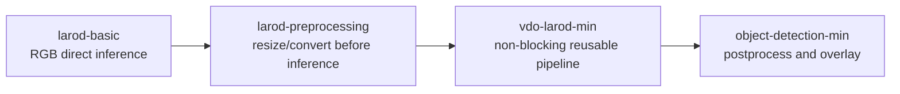
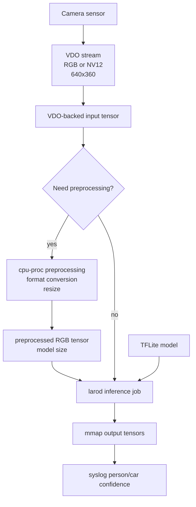
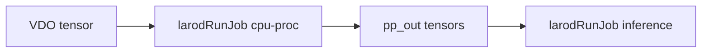
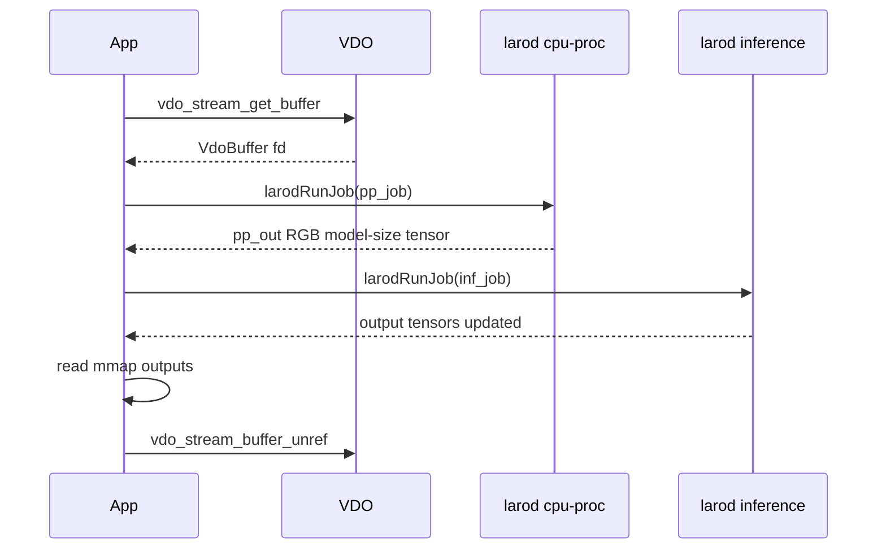
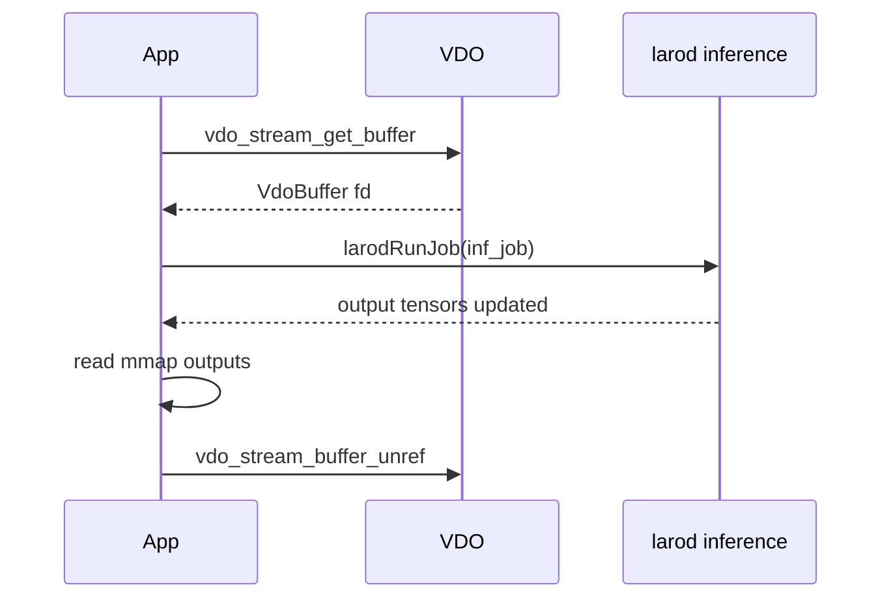

# larod-preprocessing

This example builds on `larod-basic` by adding a preprocessing stage. It still
uses one C file and blocking VDO, but it no longer requires VDO frames to match
the model input exactly.

The new concept is that preprocessing is also a larod job.

## Learning Goal

After `larod-basic`, you know how to run inference when VDO already produces the
right RGB model input. This example answers the next question:

What if the camera stream is the wrong size or format?

The answer is to load a preprocessing pipeline on `cpu-proc`.

## Progression



## Architecture



## What Is New Compared To larod-basic

`larod-basic` requires:

```text
VDO frame == model input
```

`larod-preprocessing` allows:

```text
VDO frame != model input
```

It does that by inserting:

```text
VDO tensor -> cpu-proc preprocessing -> inference tensor
```

## Configuration

The app requests a fixed VDO stream:

```c
#define VDO_WIDTH    640
#define VDO_HEIGHT   360
#define VDO_FMT      VDO_FORMAT_RGB    /* or VDO_FORMAT_YUV for NV12 */
#define IMAGE_FIT    "scale"
#define NUM_BUFFERS  2
#define VDO_CHANNEL  1
```

The model input size is still read from the model at runtime:

```c
const larodTensorDims* model_dims = larodGetTensorDims(tmp_in[0], &error);
unsigned int model_w = model_dims->dims[2];
unsigned int model_h = model_dims->dims[1];
```

## Step 1: Load The Inference Model

This part is the same as `larod-basic`:

```c
larodConnect(&conn, &error);

int model_fd = open(MODEL_PATH, O_RDONLY);
const larodDevice* device = larodGetDevice(conn, DEVICE_NAME, 0, &error);

larodModel* model = larodLoadModel(conn,
                                   model_fd,
                                   device,
                                   LAROD_ACCESS_PRIVATE,
                                   "",
                                   NULL,
                                   &error);
```

The loaded `larodModel` is used later for the inference job.

## Step 2: Read Model Metadata

The app uses temporary input tensors to discover what the model expects:

```c
larodTensor** tmp_in = larodAllocModelInputs(conn, model, 0, &tmp_num_in, NULL, &error);
const larodTensorDims* model_dims = larodGetTensorDims(tmp_in[0], &error);
const larodTensorPitches* model_pitches = larodGetTensorPitches(tmp_in[0], &error);

unsigned int model_w = model_dims->dims[2];
unsigned int model_h = model_dims->dims[1];
unsigned int model_pitch = model_pitches->pitches[2];
```

These values define the preprocessing output.

## Step 3: Allocate Inference Outputs

The final model outputs are still allocated and mapped exactly like in
`larod-basic`:

```c
larodTensor** out_tensors = larodAllocModelOutputs(conn,
    model,
    LAROD_FD_PROP_READWRITE | LAROD_FD_PROP_MAP,
    &num_out,
    NULL,
    &error);
```

These tensors receive the person/car confidence output.

## Step 4: Create VDO Stream

The stream is configured independently of the model:

```c
vdo_map_set_uint32(settings, "format", VDO_FMT);
vdo_map_set_uint32(settings, "buffer.count", NUM_BUFFERS);
vdo_map_set_string(settings, "image.fit", IMAGE_FIT);

VdoPair32u res = { .w = VDO_WIDTH, .h = VDO_HEIGHT };
vdo_map_set_pair32u(settings, "resolution", res);
```

Then the app reads back actual stream values:

```c
unsigned int vdo_w = vdo_map_get_uint32(info, "width", 0);
unsigned int vdo_h = vdo_map_get_uint32(info, "height", 0);
unsigned int vdo_pitch = vdo_map_get_uint32(info, "pitch", 0);
VdoFormat vdo_fmt = vdo_map_get_uint32(info, "format", 0);
```

The readback matters because VDO is allowed to adjust requested settings.

## Step 5: Decide If Preprocessing Is Needed

```c
bool need_pp = (vdo_fmt != VDO_FORMAT_RGB ||
                vdo_w != model_w ||
                vdo_h != model_h);
```

Preprocessing is needed if:

- VDO gives NV12/YUV instead of RGB
- VDO dimensions differ from the model dimensions

This example still keeps the decision simple: the model wants RGB.

## Step 6: Configure The Preprocessing Model

`cpu-proc` preprocessing is loaded through larod. It has no model file.

```c
larodMap* pp_map = larodCreateMap(&error);

larodMapSetStr(pp_map, "image.input.format", in_fmt, &error);
larodMapSetIntArr2(pp_map, "image.input.size", vdo_w, vdo_h, &error);
larodMapSetInt(pp_map, "image.input.row-pitch", vdo_pitch, &error);

larodMapSetStr(pp_map, "image.output.format", "rgb-interleaved", &error);
larodMapSetIntArr2(pp_map, "image.output.size", model_w, model_h, &error);
larodMapSetInt(pp_map, "image.output.row-pitch", model_pitch, &error);
```

Load the preprocessing model:

```c
const larodDevice* pp_dev = larodGetDevice(conn, "cpu-proc", 0, &error);

pp_model = larodLoadModel(conn,
                          -1,
                          pp_dev,
                          LAROD_ACCESS_PRIVATE,
                          "",
                          pp_map,
                          &error);
```

The `-1` fd means "use the built-in preprocessing pipeline described by this
map".

## Step 7: Allocate Preprocessing Outputs

The preprocessing output is the inference input:

```c
pp_out = larodAllocModelOutputs(conn,
                                pp_model,
                                LAROD_FD_PROP_READWRITE | LAROD_FD_PROP_MAP,
                                &pp_num_out,
                                NULL,
                                &error);
```

No CPU copy is needed between preprocessing and inference. `pp_out` is passed
directly into the inference job.



## Step 8: Create VDO Input Tensors

Input tensors still describe VDO-owned frame memory:

```c
larodTensor** vdo_tensors[NUM_BUFFERS];

vdo_tensors[i] = larodCreateTensors(1, &error);
larodSetTensorDataType(t, LAROD_TENSOR_DATA_TYPE_UINT8, &error);
larodSetTensorLayout(t, vdo_layout, &error);
larodBuildTensorDims(t, vdo_layout, vdo_w, vdo_h, 3, &error);
larodBuildTensorPitches(t, vdo_layout, vdo_pitch, vdo_h, 3, &error);
larodSetTensorFdProps(t, LAROD_FD_PROP_MAP | LAROD_FD_PROP_DMABUF, &error);
```

The layout is selected from the actual VDO format:

```c
switch (vdo_fmt) {
    case VDO_FORMAT_YUV:
        vdo_layout = LAROD_TENSOR_LAYOUT_420SP;
        break;
    case VDO_FORMAT_RGB:
        vdo_layout = LAROD_TENSOR_LAYOUT_NHWC;
        break;
    case VDO_FORMAT_PLANAR_RGB:
        vdo_layout = LAROD_TENSOR_LAYOUT_NCHW;
        break;
}
```

## Step 9: Track VDO Buffers

As in `larod-basic`, the first time a VDO fd appears, it is attached to one
larod tensor:

```c
int vdo_fd = vdo_buffer_get_fd(buf);
int64_t offset = vdo_buffer_get_offset(buf);
size_t cap = vdo_buffer_get_capacity(buf);
int duped = dup(vdo_fd);

larodSetTensorFd(t, duped, &error);
larodSetTensorFdOffset(t, offset, &error);
larodSetTensorFdSize(t, cap, &error);
larodTrackTensor(conn, t, &error);
```

This is still the zero-copy bridge from VDO to larod.

## Step 10: Run The Per-Frame Pipeline

With preprocessing:



Without preprocessing:



## What This Example Teaches

- Preprocessing can be represented as a larod model.
- `cpu-proc` uses a parameter map instead of a model file.
- VDO input tensors are still manually created.
- The preprocessing output tensor can be passed directly to inference.
- Format conversion and resizing can be hidden behind a larod job.

## Build

Build the ACAP package from this folder:

```bash
docker build --tag larod-preprocessing --build-arg ARCH=aarch64 .
```

Copy the generated package out of the build container:

```bash
docker cp $(docker create larod-preprocessing):/opt/app ./build
```

The Dockerfile downloads the person/car model and packages it as:

```text
/usr/local/packages/larod_preprocessing/model/model.tflite
```

## What Comes Next

`vdo-larod-min` keeps the same conceptual pipeline but makes it more realistic:

- non-blocking VDO
- `poll`
- backend-dependent RGB/NV12 request
- reusable helper functions
- clearer handling of the A9 direct-RGB path and the preprocessing path
