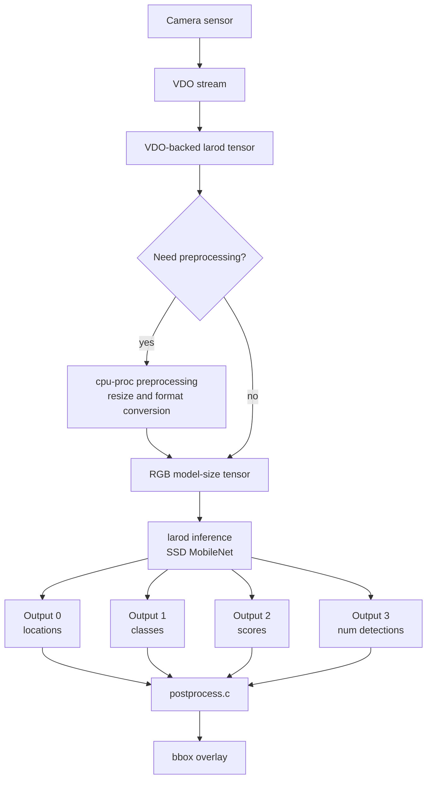
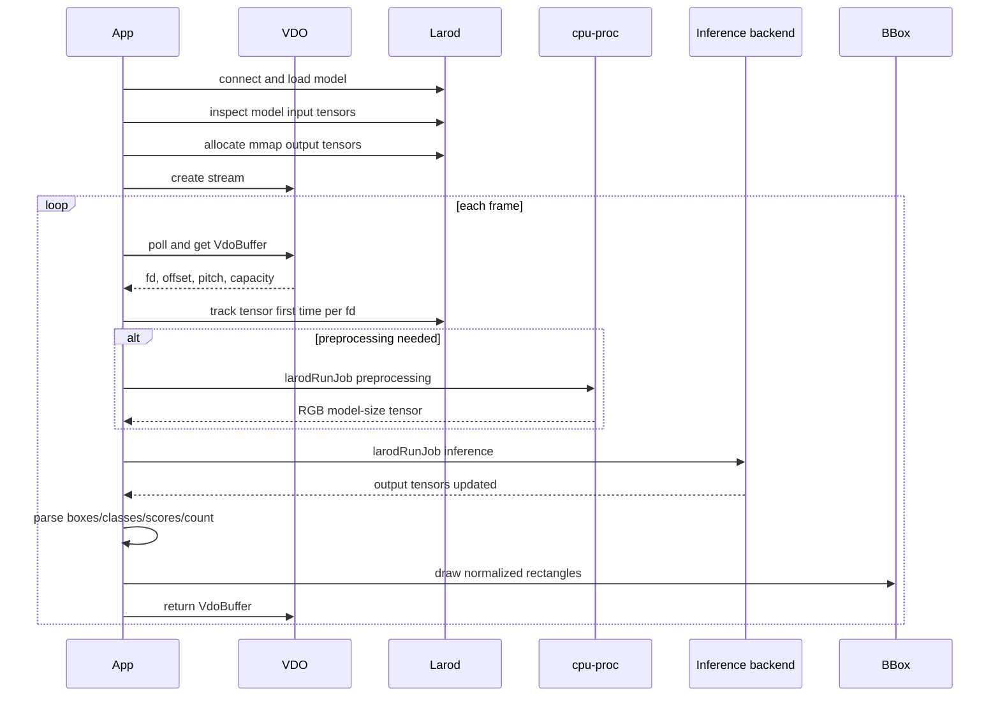

# Object Detection Min: VDO -> larod -> bbox

This example shows how to run an object-detection model on an Axis camera using
VDO for frames, larod for inference, optional larod preprocessing, and bbox for
visualizing detections.

The important idea is that the camera frame does not need to be copied into a
normal CPU buffer before inference. VDO provides a frame buffer, the application
describes that buffer as a larod tensor, larod runs the model on it, and the CPU
only reads the small output tensors for postprocessing.

## What This App Does

At runtime the app:

1. Connects to `larod`.
2. Loads `converted_model.tflite` on the configured inference backend.
3. Reads the model input tensor shape.
4. Allocates model output tensors and maps them into CPU address space.
5. Opens a VDO camera stream.
6. Creates a preprocessing model if VDO frames do not already match model input.
7. Creates larod tensor descriptors for VDO frame buffers.
8. Polls frames from VDO.
9. Tracks each VDO buffer file descriptor once.
10. Runs optional preprocessing.
11. Runs inference.
12. Parses SSD MobileNet output tensors.
13. Draws bounding boxes with `bbox`.
14. Returns the VDO buffer so it can be reused.

## Big Picture



```text
             camera image pipeline
                      |
                      v
               +-------------+
               |     VDO     |
               | frame pool  |
               +-------------+
                 | fd/offset/pitch
                 | no image copy
                 v
       +--------------------------+
       | app-created larod tensor |
       | describes VDO memory     |
       +--------------------------+
                 |
                 | optional, if format/size mismatch
                 v
       +--------------------------+
       | larod cpu-proc           |
       | NV12/RGB -> model RGB    |
       | resize/crop/scale        |
       +--------------------------+
                 |
                 v
       +--------------------------+
       | larod inference backend  |
       | a9-dlpu-tflite, etc.     |
       +--------------------------+
                 |
                 | small output tensors
                 v
       +--------------------------+
       | CPU postprocess          |
       | scores/classes/boxes     |
       +--------------------------+
                 |
                 v
       +--------------------------+
       | bbox overlay             |
       +--------------------------+
```

## What larod Does

`larod` is the Axis local inference service. Your application does not run the
accelerator directly. Instead, it asks larod to:

- list or select an inference device, such as `a9-dlpu-tflite`
- load a model on that device
- allocate model input or output tensors
- track externally owned frame buffers
- create job requests that connect inputs, outputs, and a model
- run jobs on the selected backend

In this app, larod runs two possible kinds of model:

- The real TensorFlow Lite object detection model on `DEVICE_NAME`.
- A preprocessing "model" on `cpu-proc` when frame conversion or resizing is needed.

The preprocessing model is configured with a `larodMap`, not a `.tflite` file.
That is why the code loads it with model fd `-1`.

## Main Data Flow



```text
startup:

  larodConnect
      |
      v
  larodGetDevice + larodLoadModel
      |
      v
  larodAllocModelInputs
      |
      v
  read model width/height/pitch
      |
      v
  larodAllocModelOutputs + mmap
      |
      v
  vdo_stream_new
      |
      v
  maybe load cpu-proc preprocessing
      |
      v
  create input tensor descriptors

per frame:

  poll VDO fd
      |
      v
  vdo_stream_get_buffer
      |
      v
  attach/track VDO fd as larod tensor
      |
      v
  run preprocessing if needed
      |
      v
  run inference
      |
      v
  parse mapped output tensors
      |
      v
  draw bbox rectangles
      |
      v
  vdo_stream_buffer_unref
```

## Configuration

The key constants are in `app/object_detection_min.c`:

```c
#define DEVICE_NAME "a9-dlpu-tflite"
#define PP_DEVICE_NAME "cpu-proc"
#define MODEL_PATH "/usr/local/packages/object_detection_min/model/converted_model.tflite"

#define VDO_CHANNEL 1u
#define VDO_NUM_BUFFERS 2u
#define VDO_FRAMERATE 30.0
#define IMAGE_FIT "crop"
#define VDO_WIDTH 640u
#define VDO_HEIGHT 360u
```

`DEVICE_NAME` selects the inference backend. In this example:

- `a9-dlpu-tflite` can consume RGB directly.
- Other backends commonly need VDO NV12 input converted to RGB with `cpu-proc`.

`MODEL_PATH` must match the package path created by the Dockerfile:

```dockerfile
RUN . /opt/axis/acapsdk/environment-setup* && \
    acap-build . -a 'label/labels.txt' -a 'model/converted_model.tflite';
```

`VDO_WIDTH` and `VDO_HEIGHT` are the requested camera stream size. VDO may return
different actual values, so the code reads back the final stream information.

## Step 1: Connect To larod

```c
larodConnection* conn = NULL;
larodError* error = NULL;

if (!larodConnect(&conn, &error)) {
    PANIC("larodConnect: %s", error ? error->msg : "unknown error");
}
```

This creates the control connection to larod. Every later larod call uses this
connection: model loading, tensor allocation, tensor tracking, and job execution.

## Step 2: Load The Inference Model

```c
int model_fd = open(MODEL_PATH, O_RDONLY);

const larodDevice* device = larodGetDevice(conn, DEVICE_NAME, 0, &error);

larodModel* model = larodLoadModel(conn,
                                   model_fd,
                                   device,
                                   LAROD_ACCESS_PRIVATE,
                                   "object detection model",
                                   NULL,
                                   &error);
```

The model is passed to larod as a file descriptor. `larodGetDevice` selects the
hardware/software backend. `larodLoadModel` returns a model handle. The model is
not executed yet; this only prepares it.

## Step 3: Read Model Input Shape

Before creating the video path, the app asks larod what input the model expects.

```c
larodTensor** tmp_inputs =
    larodAllocModelInputs(conn, model, 0, &num_inputs, NULL, &error);

const larodTensorDims* dims = larodGetTensorDims(tmp_inputs[0], &error);

MODEL_HEIGHT = dims->dims[1];
MODEL_WIDTH = dims->dims[2];
```

Most image models use NHWC layout:

```text
N = batch size
H = image height
W = image width
C = channels
```

For an RGB object detector this is usually:

```text
[1, model_height, model_width, 3]
```

The code also reads tensor pitches:

```c
const larodTensorPitches* pitches = larodGetTensorPitches(tmp_inputs[0], &error);
*pitch_out = pitches->pitches[2];
```

Pitch describes how memory is stepped through for a dimension. The preprocessing
output must use the row/pixel layout the model expects.

## Step 4: Allocate Output Tensors

The model outputs are allocated by larod:

```c
larodTensor** tensors =
    larodAllocModelOutputs(conn,
                           model,
                           LAROD_FD_PROP_READWRITE | LAROD_FD_PROP_MAP,
                           num_outputs,
                           NULL,
                           &error);
```

The flags matter:

- `LAROD_FD_PROP_READWRITE` means the backend can write output data.
- `LAROD_FD_PROP_MAP` asks for memory that this process can map with `mmap`.

Then each output fd is mapped:

```c
out_bufs[i].fd = larodGetTensorFd(tensors[i], &error);
larodGetTensorFdSize(tensors[i], &out_bufs[i].size, &error);

out_bufs[i].data = mmap(NULL,
                        out_bufs[i].size,
                        PROT_READ,
                        MAP_SHARED,
                        out_bufs[i].fd,
                        0);
```

After every inference job, `out_bufs[i].data` points to the latest result. No
extra read call is needed.

For the SSD MobileNet model used here, the expected outputs are:

| Output | Meaning | Shape concept |
| --- | --- | --- |
| 0 | locations | boxes as `[ymin, xmin, ymax, xmax]` |
| 1 | classes | class id per detection |
| 2 | scores | confidence per detection |
| 3 | count | number of detections |

## Step 5: Open A VDO Stream

VDO provides camera frames. The stream is configured through `VdoMap`:

```c
VdoMap* settings = vdo_map_new();

vdo_map_set_uint32(settings, "channel", VDO_CHANNEL);
vdo_map_set_uint32(settings, "buffer.count", VDO_NUM_BUFFERS);
vdo_map_set_double(settings, "framerate", VDO_FRAMERATE);
vdo_map_set_boolean(settings, "socket.blocking", false);
vdo_map_set_string(settings, "image.fit", IMAGE_FIT);
```

The requested format depends on backend capability:

```c
if (rgb_backend) {
    vdo_map_set_uint32(settings, "format", VDO_FORMAT_RGB);
} else {
    vdo_map_set_uint32(settings, "format", VDO_FORMAT_YUV);
}
```

Then the stream is created:

```c
VdoStream* stream = vdo_stream_new(settings, NULL, &error);
```

Always read back what VDO actually created:

```c
VdoMap* info = vdo_stream_get_info(stream, &error);

*out_format = vdo_map_get_uint32(info, "format", 0);
*out_w = vdo_map_get_uint32(info, "width", 0);
*out_h = vdo_map_get_uint32(info, "height", 0);
*out_pitch = vdo_map_get_uint32(info, "pitch", 0);
*out_nbr_bufs = vdo_map_get_uint32(info, "buffer.count", VDO_NUM_BUFFERS);
```

This is important because the camera may adjust unsupported stream settings.

## Step 6: Decide Whether Preprocessing Is Needed

The inference model expects a specific width, height, and RGB memory layout. VDO
may deliver a different size or format.

```c
bool need_pp = !rgb_backend || vdo_w != MODEL_WIDTH || vdo_h != MODEL_HEIGHT;
```

Preprocessing is needed when:

- VDO delivers NV12/YUV but the model expects RGB.
- VDO delivers a different resolution than the model expects.
- The selected backend cannot consume the VDO frame format directly.

## Step 7: Configure larod Preprocessing

Preprocessing uses `cpu-proc`. Instead of a neural network model file, larod gets
a parameter map that describes input and output images.

```c
larodMap* map = larodCreateMap(&error);

larodMapSetStr(map, "image.input.format", input_format_str, &error);
larodMapSetIntArr2(map, "image.input.size", vdo_w, vdo_h, &error);
larodMapSetInt(map, "image.input.row-pitch", vdo_pitch, &error);

larodMapSetStr(map, "image.output.format", "rgb-interleaved", &error);
larodMapSetIntArr2(map, "image.output.size", MODEL_WIDTH, MODEL_HEIGHT, &error);
larodMapSetInt(map, "image.output.row-pitch", model_pitch, &error);
```

Then load the preprocessing "model":

```c
const larodDevice* pp_device = larodGetDevice(conn, PP_DEVICE_NAME, 0, &error);

larodModel* pp_model = larodLoadModel(conn,
                                      -1,
                                      pp_device,
                                      LAROD_ACCESS_PRIVATE,
                                      "",
                                      map,
                                      &error);
```

The `-1` file descriptor means there is no model file. The map is the
configuration.

Preprocessing produces tensors that become inference inputs:

```c
*pp_outputs_out = larodAllocModelOutputs(conn,
                                         pp_model,
                                         LAROD_FD_PROP_READWRITE | LAROD_FD_PROP_MAP,
                                         pp_num_outputs,
                                         NULL,
                                         &error);
```

## Step 8: Describe VDO Buffers As larod Tensors

This is the key zero-copy idea. The application creates larod tensors that
describe external memory. They do not allocate image memory.

```c
tracked[i].tensors = larodCreateTensors(1, &error);

larodTensor* tensor = tracked[i].tensors[0];
larodSetTensorDataType(tensor, LAROD_TENSOR_DATA_TYPE_UINT8, &error);
larodSetTensorLayout(tensor, layout, &error);
larodBuildTensorDims(tensor, layout, vdo_w, vdo_h, 3, &error);
larodBuildTensorPitches(tensor, layout, vdo_pitch, vdo_h, 3, &error);
larodSetTensorFdProps(tensor, LAROD_FD_PROP_MAP | LAROD_FD_PROP_DMABUF, &error);
```

The tensor describes:

- data type: `UINT8`
- layout: `420SP` for NV12, `NHWC` for interleaved RGB, `NCHW` for planar RGB
- dimensions: width, height, channels
- pitch: how rows/planes are laid out in memory
- fd properties: this tensor will be backed by a file descriptor

The fd itself is not attached here. It is attached when a frame arrives.

## Step 9: DMA-BUF And Non-Copy Memory Management

VDO frame buffers are exposed as file descriptors. A DMA-BUF fd can be shared
between components without copying the image bytes through the CPU.

Conceptually:

```text
copy-based path:

  VDO frame -> CPU malloc buffer -> copy pixels -> inference input

zero-copy fd path:

  VDO frame fd -> larod tensor references same memory -> inference input
```

The app tracks buffers because VDO reuses a small buffer pool. The first time an
fd is seen, it is attached to a larod tensor:

```c
int vdo_fd = vdo_buffer_get_fd(vdo_buf);
int64_t vdo_offset = vdo_buffer_get_offset(vdo_buf);
size_t vdo_capacity = vdo_buffer_get_capacity(vdo_buf);
```

If VDO did not provide a native DMA-BUF, convert it:

```c
if (!is_dmabuf) {
    buf_fd = larodConvertVmemFdToDmabuf(vdo_fd, vdo_offset, &error);
    vdo_offset = 0;
}
```

Duplicate the fd:

```c
int duped = dup(buf_fd);
```

The duplicated fd gives larod its own reference. VDO can continue to own and
recycle the original buffer.

Attach fd metadata to the tensor:

```c
larodSetTensorFd(tensor, duped, &error);
larodSetTensorFdOffset(tensor, vdo_offset, &error);
larodSetTensorFdSize(tensor, vdo_capacity, &error);
larodTrackTensor(conn, tensor, &error);
```

After `larodTrackTensor`, larod knows how to access that external buffer.

## Buffer Lifetime

```text
first time a VDO fd appears:

  VDO buffer fd
      |
      v
  optional vmem -> dma-buf conversion
      |
      v
  dup(fd)
      |
      v
  larodSetTensorFd / offset / size
      |
      v
  larodTrackTensor

later frames with the same fd:

  find existing tracked slot
      |
      v
  reuse existing larod tensor
```

This avoids recreating and retracking tensor metadata every frame.

## Step 10: Poll Frames From VDO

The stream is non-blocking, so the app waits with `poll`:

```c
int poll_fd = vdo_stream_get_fd(vdo_stream, &vdo_error);
struct pollfd pfd = {.fd = poll_fd, .events = POLLIN};

ret = poll(&pfd, 1, -1);
```

When a frame is ready:

```c
VdoBuffer* vdo_buf = vdo_stream_get_buffer(vdo_stream, &vdo_error);
```

When the frame is no longer needed:

```c
vdo_stream_buffer_unref(vdo_stream, &vdo_buf, &vdo_error);
```

Returning the buffer is required. If buffers are not returned, VDO eventually
runs out of reusable frame buffers.

## Step 11: Run Preprocessing

If preprocessing is enabled, the input is the VDO-backed tensor and the output
is a larod-allocated RGB tensor:

```c
pp_job_request = larodCreateJobRequest(pp_model,
                                       input,
                                       1,
                                       pp_outputs,
                                       pp_num_outputs,
                                       NULL,
                                       &error);

larodRunJob(conn, pp_job_request, &error);
```

For later frames, the job request can be reused. Only the input tensor is
updated:

```c
larodSetJobRequestInputs(pp_job_request, input, 1, &error);
```

## Step 12: Run Inference

The inference input depends on whether preprocessing was used:

```c
larodTensor** inf_input = need_pp ? pp_outputs : input;
size_t inf_input_n = need_pp ? pp_num_outputs : 1;
```

Create the job request once:

```c
inf_job_request = larodCreateJobRequest(inf_model,
                                        inf_input,
                                        inf_input_n,
                                        inf_outputs,
                                        num_inf_outputs,
                                        NULL,
                                        &error);
```

Then run it for each frame:

```c
larodRunJob(conn, inf_job_request, &error);
```

The inference backend writes into `inf_outputs`, whose fds were already mapped
to `out_bufs[]`.

## Step 13: Parse SSD Outputs

The postprocess code reads the mapped output buffers:

```c
float* locations = (float*)tensor_outputs[0].data;
float* classes = (float*)tensor_outputs[1].data;
float* scores = (float*)tensor_outputs[2].data;
float* nbr_detections = (float*)tensor_outputs[3].data;
```

Each detection uses four normalized coordinates:

```c
boxes[i].y_min = locations[4 * i];
boxes[i].x_min = locations[4 * i + 1];
boxes[i].y_max = locations[4 * i + 2];
boxes[i].x_max = locations[4 * i + 3];
boxes[i].score = scores[i];
boxes[i].label = (int)classes[i];
```

The confidence threshold is configured in `main`:

```c
const int threshold = 50;
float confidence_threshold = (float)threshold / 100.0f;
```

Only detections above threshold are drawn.

## Step 14: Draw Bounding Boxes

The app creates a bbox overlay handle for the VDO channel:

```c
bbox_t* bbox = bbox_view_new(channel);
bbox_style_outline(bbox);
bbox_thickness_thin(bbox);
bbox_color(bbox, bbox_color_from_rgb(0xff, 0x00, 0x00));
```

The SSD model returns normalized frame coordinates, so the postprocess code
selects normalized coordinates:

```c
bbox_coordinates_frame_normalized(bbox);
bbox_rectangle(bbox, x_min, y_min, x_max, y_max);
bbox_commit(bbox, 0u);
```

`bbox_commit` applies the overlay update.

## Input And Output Configuration Summary

There are three different "input/output" layers in this app:

| Layer | Input | Output | Configured by |
| --- | --- | --- | --- |
| VDO | camera pipeline | VDO frame buffers | `VdoMap` stream settings |
| preprocessing | VDO tensor | RGB model-sized tensor | `larodMap` image keys |
| inference | RGB tensor | detection tensors | model metadata and larod tensors |

### VDO Configuration

```c
vdo_map_set_uint32(settings, "channel", VDO_CHANNEL);
vdo_map_set_uint32(settings, "buffer.count", VDO_NUM_BUFFERS);
vdo_map_set_uint32(settings, "format", VDO_FORMAT_RGB);
vdo_map_set_pair32u(settings, "resolution", resolution);
```

This asks the camera pipeline for a stream.

### Preprocessing Configuration

```c
larodMapSetStr(map, "image.input.format", "nv12", &error);
larodMapSetIntArr2(map, "image.input.size", vdo_w, vdo_h, &error);
larodMapSetInt(map, "image.input.row-pitch", vdo_pitch, &error);

larodMapSetStr(map, "image.output.format", "rgb-interleaved", &error);
larodMapSetIntArr2(map, "image.output.size", MODEL_WIDTH, MODEL_HEIGHT, &error);
larodMapSetInt(map, "image.output.row-pitch", model_pitch, &error);
```

This tells `cpu-proc` how to transform the image.

### Inference Tensor Configuration

```c
larodCreateJobRequest(inf_model,
                      inf_input,
                      inf_input_n,
                      inf_outputs,
                      num_inf_outputs,
                      NULL,
                      &error);
```

This connects a loaded model to concrete input and output tensor arrays.

## Why This Is Efficient

The expensive data is the image frame. This app avoids copying it.

```text
large data:

  640 x 360 x bytes_per_pixel image frame
  handled by VDO buffer fd and larod tensor metadata

small data:

  detection boxes/classes/scores/count
  read by CPU through mmap output tensors
```

The CPU does not need to touch the full image unless preprocessing requires CPU
work. Even then, preprocessing is represented as a larod job and writes into
larod-managed tensors.

## Concepts

- `larodModel` is a loaded model, not a running job.
- `larodTensor` is metadata plus memory backing, not necessarily an owned CPU
  array.
- `VdoBuffer` is owned by VDO and must be returned with
  `vdo_stream_buffer_unref`.
- `dma-buf` allows memory sharing by fd.
- `dup(fd)` gives larod a stable reference without stealing VDO ownership.
- `mmap` is used for small output tensors because postprocessing runs on CPU.
- preprocessing is optional and depends on model/backend/VDO compatibility.
- bbox uses normalized coordinates in this example because the SSD output is
  normalized.

## Cleanup Responsibilities

The app must release resources in the reverse direction:

```text
stop VDO stream
unmap output tensors
destroy job requests
destroy tracked input tensors
close duplicated fds
destroy output tensors
destroy models
disconnect larod
close model fd
destroy bbox handle
```

The code does this at shutdown:

```c
vdo_stream_stop(vdo_stream);
munmap(out_bufs[i].data, out_bufs[i].size);
larodDestroyJobRequest(&pp_job_request);
larodDestroyJobRequest(&inf_job_request);
larodDestroyTensors(conn, &tracked[i].tensors, 1, &cleanup_error);
close(tracked[i].duped_fd);
larodDestroyModel(&pp_model);
larodDestroyModel(&inf_model);
larodDisconnect(&conn, &cleanup_error);
bbox_destroy(bbox);
```

## Build

Build the ACAP package from this folder:

```bash
docker build --tag object-detection-min --build-arg ARCH=aarch64 .
```

Copy the generated package out of the build container:

```bash
docker cp $(docker create object-detection-min):/opt/app ./build
```

The Dockerfile downloads and packages:

```text
/usr/local/packages/object_detection_min/model/converted_model.tflite
/usr/local/packages/object_detection_min/label/labels.txt
```

## Troubleshooting

### `larodGetDevice` fails

Check that `DEVICE_NAME` matches a device available on the target camera. For a
different chip or backend, change:

```c
#define DEVICE_NAME "a9-dlpu-tflite"
```

### VDO format mismatch

If the backend cannot consume RGB directly, request YUV/NV12 from VDO and enable
preprocessing. This code does that through:

```c
bool need_pp = !rgb_backend || vdo_w != MODEL_WIDTH || vdo_h != MODEL_HEIGHT;
```

### No boxes appear

Check:

- `num_inf_outputs >= 4`
- the model output order matches `locations/classes/scores/count`
- `threshold` is not too high
- `bbox` is using the correct VDO channel
- the model actually detects objects in the scene

### VDO stops producing frames

Make sure every successful `vdo_stream_get_buffer` is followed by
`vdo_stream_buffer_unref`.

### Build fails outside Docker/SDK

This app needs ACAP SDK packages such as `bbox`, `liblarod`, and `vdostream`.
Build it inside the ACAP SDK environment or through the provided Dockerfile.
