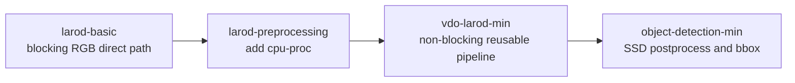
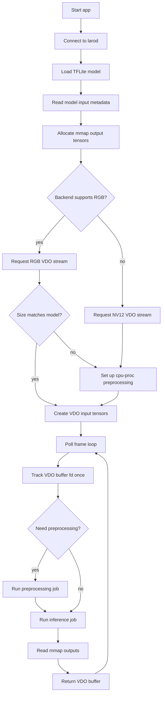
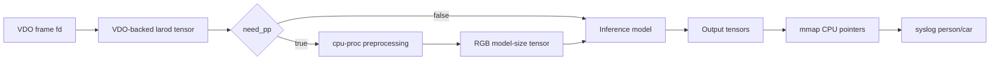
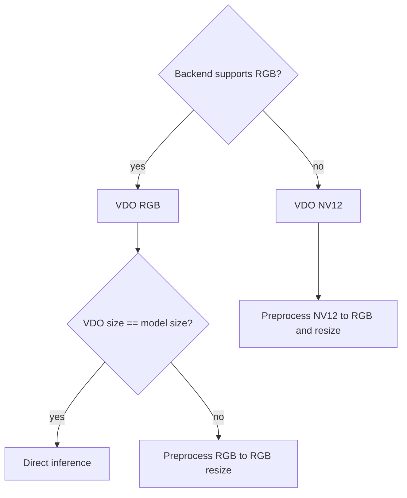

# vdo-larod-min

This example is the production-shaped version of the person/car classifier
pipeline. It keeps the model simple, but introduces the runtime structure used
by real camera applications:

- non-blocking VDO stream
- `poll` driven frame loop
- backend-dependent RGB/NV12 selection
- optional preprocessing
- reusable helper functions
- tracked DMA-BUF input tensors
- mmap output tensors

It is the bridge between the teaching examples and the object-detection example.

## Learning Progression



## What This Example Adds

Compared to `larod-preprocessing`, this example adds:

- `poll()` instead of blocking `vdo_stream_get_buffer`
- helper functions for connection, model loading, tensor allocation, VDO setup,
  preprocessing setup, input tensor creation, and buffer tracking
- backend capability logic through `backend_supports_rgb`
- a direct RGB path for `a9-dlpu-tflite`
- a preprocessing path for backends that need NV12 to RGB conversion

## Architecture



## Runtime Data Flow



## Step 1: Connect To larod

The connection function is unchanged from earlier examples:

```c
larodConnection* conn = NULL;
larodError* error = NULL;

if (!larodConnect(&conn, &error)) {
    PANIC("larodConnect: %s", error->msg);
}
```

All larod models, tensors, and jobs are created through this connection.

## Step 2: Load The Model On A Backend

```c
const larodDevice* device = larodGetDevice(conn, DEVICE_NAME, 0, &error);

larodModel* model = larodLoadModel(conn,
                                   model_fd,
                                   device,
                                   LAROD_ACCESS_PRIVATE,
                                   "person-car model",
                                   NULL,
                                   &error);
```

The default backend is:

```c
#define DEVICE_NAME "a9-dlpu-tflite"
```

For another device, change `DEVICE_NAME` and check whether that backend can
consume RGB directly.

## Step 3: Read Model Input Size

The app does not hardcode model size. It asks larod:

```c
larodTensor** tmp_inputs = larodAllocModelInputs(conn, model, 0, &num_inputs, NULL, &error);
const larodTensorDims* dims = larodGetTensorDims(tmp_inputs[0], &error);

MODEL_HEIGHT = dims->dims[1];
MODEL_WIDTH = dims->dims[2];
```

For NHWC image models:

```text
dims[0] = batch
dims[1] = height
dims[2] = width
dims[3] = channels
```

The model pitch is also read so preprocessing can write the expected layout.

## Step 4: Allocate And Map Output Tensors

The output tensors are larod-managed buffers:

```c
larodTensor** tensors = larodAllocModelOutputs(conn,
    model,
    LAROD_FD_PROP_READWRITE | LAROD_FD_PROP_MAP,
    num_outputs,
    NULL,
    &error);
```

Each tensor fd is mapped for CPU reads:

```c
out_bufs[i].fd = larodGetTensorFd(tensors[i], &error);
larodGetTensorFdSize(tensors[i], &out_bufs[i].size, &error);
out_bufs[i].data = mmap(NULL, out_bufs[i].size, PROT_READ, MAP_SHARED, out_bufs[i].fd, 0);
```

After inference, `out_bufs[0]` and `out_bufs[1]` are read as quantized
person/car confidence bytes.

## Step 5: Choose VDO Format From Backend Capability

This example introduces backend-aware stream setup:

```c
static bool backend_supports_rgb(const char* device_name) {
    return strcmp(device_name, "a9-dlpu-tflite") == 0;
}
```

If RGB is supported, VDO can be asked for RGB:

```c
vdo_map_set_uint32(settings, "format", VDO_FORMAT_RGB);
```

If not, VDO is asked for YUV/NV12:

```c
vdo_map_set_uint32(settings, "format", VDO_FORMAT_YUV);
```

This keeps each backend on a path it can handle.

## Step 6: Create A Non-Blocking VDO Stream

The important difference from earlier examples is:

```c
vdo_map_set_boolean(settings, "socket.blocking", false);
```

The app then uses `poll`:

```c
int poll_fd = vdo_stream_get_fd(vdo_stream, &vdo_error);
struct pollfd pfd = { .fd = poll_fd, .events = POLLIN };

poll(&pfd, 1, -1);
```

This pattern is better for real applications because it can be extended to wait
on several fds or timers in one event loop.

## Step 7: Decide Whether Preprocessing Is Needed

```c
if (rgb_backend) {
    need_pp = (vdo_w != MODEL_WIDTH || vdo_h != MODEL_HEIGHT);
} else {
    need_pp = true;
}
```

There are two paths:



## Step 8: Configure cpu-proc Preprocessing

Preprocessing is a larod model loaded on `cpu-proc` with fd `-1`.

```c
larodMapSetStr(map, "image.input.format", input_format_str, &error);
larodMapSetIntArr2(map, "image.input.size", vdo_w, vdo_h, &error);
larodMapSetInt(map, "image.input.row-pitch", vdo_pitch, &error);

larodMapSetStr(map, "image.output.format", "rgb-interleaved", &error);
larodMapSetIntArr2(map, "image.output.size", MODEL_WIDTH, MODEL_HEIGHT, &error);
larodMapSetInt(map, "image.output.row-pitch", model_pitch, &error);
```

Then:

```c
const larodDevice* pp_device = larodGetDevice(conn, PP_DEVICE_NAME, 0, &error);

larodModel* pp_model = larodLoadModel(conn,
                                      -1,
                                      pp_device,
                                      LAROD_ACCESS_PRIVATE,
                                      "",
                                      map,
                                      &error);
```

The preprocessing output tensors become the inference input.

## Step 9: Create VDO Input Tensors

Each VDO buffer gets one tensor descriptor:

```c
tracked[i].tensors = larodCreateTensors(1, &error);

larodSetTensorDataType(t, LAROD_TENSOR_DATA_TYPE_UINT8, &error);
larodSetTensorLayout(t, layout, &error);
larodBuildTensorDims(t, layout, vdo_w, vdo_h, 3, &error);
larodBuildTensorPitches(t, layout, vdo_pitch, vdo_h, 3, &error);
larodSetTensorFdProps(t, LAROD_FD_PROP_MAP | LAROD_FD_PROP_DMABUF, &error);
```

Layout depends on the VDO format:

| VDO format | larod layout | Meaning |
| --- | --- | --- |
| `VDO_FORMAT_YUV` | `LAROD_TENSOR_LAYOUT_420SP` | NV12 |
| `VDO_FORMAT_RGB` | `LAROD_TENSOR_LAYOUT_NHWC` | RGB interleaved |
| `VDO_FORMAT_PLANAR_RGB` | `LAROD_TENSOR_LAYOUT_NCHW` | RGB planar |

## Step 10: Track DMA-BUFs Once

The app keeps a small table:

```c
typedef struct {
    larodTensor** tensors;
    int duped_fd;
    int vdo_fd;
} tracked_input_t;
```

First time a VDO fd appears:

```c
int vdo_fd = vdo_buffer_get_fd(vdo_buf);
int64_t vdo_offset = vdo_buffer_get_offset(vdo_buf);
size_t vdo_capacity = vdo_buffer_get_capacity(vdo_buf);
int duped = dup(buf_fd);

larodSetTensorFd(t, duped, &error);
larodSetTensorFdOffset(t, vdo_offset, &error);
larodSetTensorFdSize(t, vdo_capacity, &error);
larodTrackTensor(conn, t, &error);
```

Later frames with the same fd reuse the same tracked tensor. This avoids
recreating tensor/fd metadata every frame.

## Step 11: Run Jobs Per Frame

With preprocessing:

```c
larodRunJob(conn, pp_job, &error);
larodRunJob(conn, inf_job, &error);
```

Without preprocessing:

```c
larodRunJob(conn, inf_job, &error);
```

The inference input is chosen once per frame:

```c
larodTensor** inf_input = need_pp ? pp_outputs : input;
size_t inf_input_n = need_pp ? pp_num_outputs : 1;
```

## Step 12: Read Quantized Outputs

```c
uint8_t* person = (uint8_t*)out_bufs[0].data;
uint8_t* car = (uint8_t*)out_bufs[1].data;

syslog(LOG_INFO, "Person: %.1f%% - Car: %.1f%%",
       (float)*person / 2.55f,
       (float)*car / 2.55f);
```

The CPU reads only the small output tensors. The image frame itself stayed in
shared fd-backed memory.

## Why This Example Matters

This is the best starting point for a reusable camera inference app:

- It supports more than one backend behavior.
- It separates setup functions from the frame loop.
- It uses non-blocking VDO.
- It keeps frame memory zero-copy through DMA-BUF tracking.
- It uses preprocessing only when needed.

## Build

This Dockerfile requires a `CHIP` argument because it selects a matching
manifest and model asset.

Build for ARTPEC-9:

```bash
docker build --tag vdo-larod-min --build-arg ARCH=aarch64 --build-arg CHIP=artpec9 .
```

Build for ARTPEC-8:

```bash
docker build --tag vdo-larod-min --build-arg ARCH=aarch64 --build-arg CHIP=artpec8 .
```

Copy the generated package out of the build container:

```bash
docker cp $(docker create vdo-larod-min):/opt/app ./build
```

The Dockerfile packages the person/car model as:

```text
/usr/local/packages/vdo_larod_min/model/model.tflite
```

## What Comes Next

`object-detection-min` uses the same frame/inference structure but changes the
model and postprocessing:

- four SSD output tensors
- detection box parsing
- confidence filtering
- `bbox` overlay drawing
