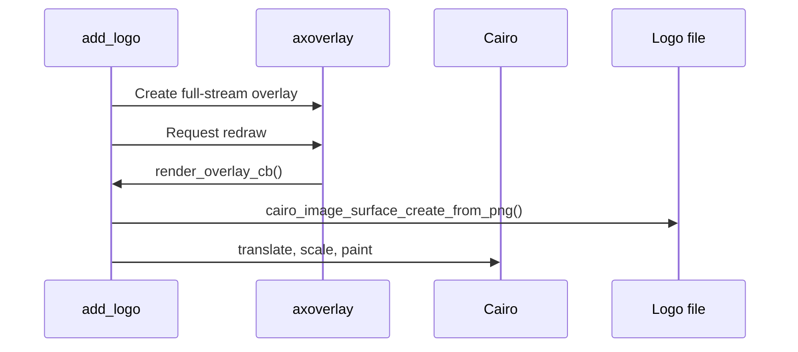

# Add Logo

This example draws a PNG image on top of the video stream. It teaches how to load an image into a Cairo surface, scale it, and place it using normalized dimensions.

## Code Flow



## Loading The Image

```c
cairo_surface_t *logo = cairo_image_surface_create_from_png(image_path);
cairo_status_t status = cairo_surface_status(logo);
```

The installed path is used at runtime:

```c
"/usr/local/packages/add_logo/axis_tip_logo.png"
```

## Positioning

The example calculates logo size from normalized width:

```c
gdouble max_draw_width = norm_width * overlay_width;
gdouble max_draw_height = max_draw_width * aspect;
```

Then it uses Cairo transforms:

```c
cairo_translate(context, draw_x, draw_y);
cairo_scale(context, max_draw_width / img_w, max_draw_height / img_h);
cairo_set_source_surface(context, logo, 0, 0);
cairo_paint(context);
```

## Build

```sh
docker build --tag add-logo --build-arg ARCH=aarch64 .
docker cp $(docker create add-logo):/opt/app ./build
```

## Classroom Exercises

1. Move the logo to the lower-left corner.
2. Change the normalized width.
3. Replace the PNG and verify the package installs the new asset.
