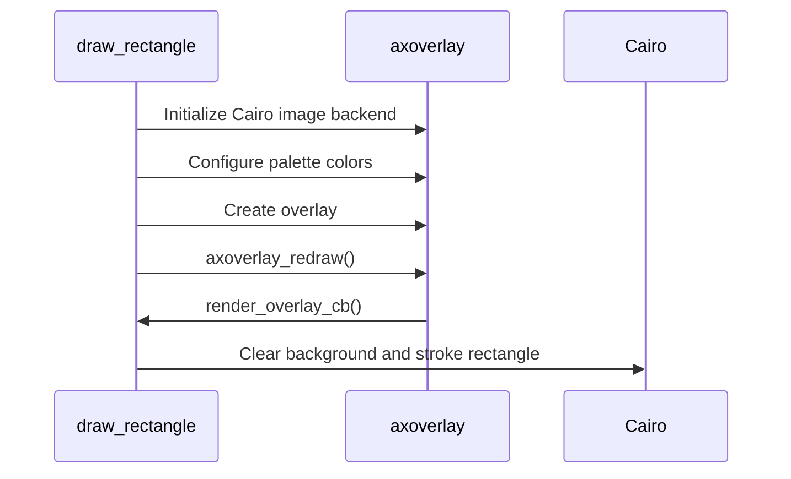

# Draw Rectangle

This is the minimal direct overlay example. It creates one full-stream overlay and draws a centered rectangle using Cairo and a 4-bit palette.

## Code Flow



## Palette Colors

The example sets palette entries before drawing:

```c
setup_palette_color(0, 0, 0, 0, 0);
setup_palette_color(4, 255, 255, 0, 255);
```

Palette indices are converted to Cairo values:

```c
static gdouble index2cairo(const gint color_index) {
    return ((color_index << 4) + color_index) / 255.0;
}
```

## Drawing

The render callback calculates a rectangle from the overlay size:

```c
gint rect_width = overlay_width / 4;
gint rect_height = overlay_height / 4;
gint center_x = overlay_width / 2;
gint center_y = overlay_height / 2;
```

Then it draws with Cairo:

```c
cairo_rectangle(context, left, top, right - left, bottom - top);
cairo_stroke(context);
```

## Build

```sh
docker build --tag draw-rectangle --build-arg ARCH=aarch64 .
docker cp $(docker create draw-rectangle):/opt/app ./build
```

## Classroom Exercises

1. Move the rectangle to a corner.
2. Change the line width and color.
3. Add a second rectangle with another palette index.
