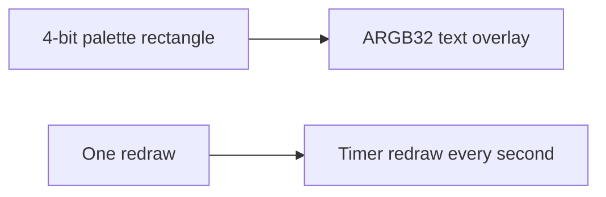

# Draw Text

This example draws dynamic text on the video stream. It uses ARGB32 instead of a palette so Cairo can render text with normal color values.

## What changes from `draw-rectangle`



## Text Drawing

The text is rendered in the Cairo callback:

```c
cairo_set_source_rgb(context, color.r, color.g, color.b);
cairo_select_font_face(context, "serif",
                       CAIRO_FONT_SLANT_NORMAL,
                       CAIRO_FONT_WEIGHT_BOLD);
cairo_set_font_size(context, 32.0);
cairo_show_text(context, str);
```

The overlay uses ARGB32:

```c
data_text.colorspace = AXOVERLAY_COLORSPACE_ARGB32;
```

## Animation Timer

A GLib timer updates the counter and triggers a redraw:

```c
animation_timer = g_timeout_add_seconds(1, update_overlay_cb, NULL);
```

The callback changes color based on the countdown:

```c
counter = counter < 1 ? 10 : counter - 1;
axoverlay_redraw(&error);
```

## Font Cache

The example sets `XDG_CACHE_HOME` so fontconfig can write cache data inside the application's local data area:

```c
setenv("XDG_CACHE_HOME", "/usr/local/packages/axoverlay/localdata", 1);
```

## Build

```sh
docker build --tag draw-text --build-arg ARCH=aarch64 .
docker cp $(docker create draw-text):/opt/app ./build
```

## Classroom Exercises

1. Change the countdown text and font size.
2. Make the timer update every 500 ms.
3. Add a background rectangle behind the text.
