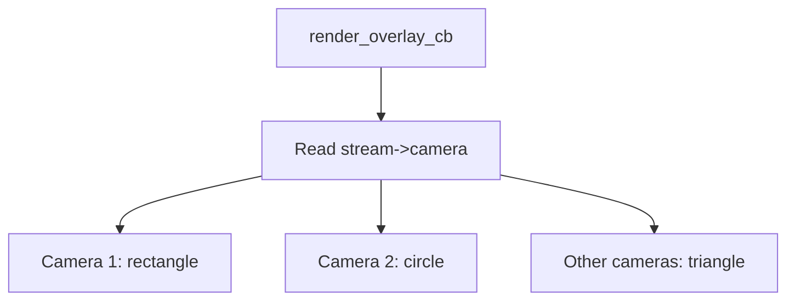

# Draw Views

This example draws different shapes depending on the camera/view that is being rendered. It is useful for multi-sensor cameras or any situation where the same application must render differently per video source.

## Per-View Logic



The channel is derived from the stream metadata:

```c
size_t channel = stream->camera - 1;
```

## Normalized Shapes

The drawing helpers accept normalized coordinates and convert them to pixels:

```c
gdouble pixel_width = width * overlay_width;
gdouble pixel_height = height * overlay_height;
gdouble left = (center_x * overlay_width) - (pixel_width / 2);
gdouble top = (center_y * overlay_height) - (pixel_height / 2);
```

The circle scales radius by the smallest dimension:

```c
gdouble r = radius * MIN(overlay_width, overlay_height);
```

## Rendering Decisions

```c
if (channel == 0) {
    draw_rectangle(rendering_context, 0.5, 0.5, 0.5, 0.25,
                   overlay_width, overlay_height, rectangle_color, 3.0);
} else if (channel == 1) {
    draw_circle(rendering_context, 0.5, 0.5, 0.25,
                overlay_width, overlay_height, circle_color, 3);
} else {
    draw_triangle(rendering_context, 0.5, 0.25, 0.3, 0.75, 0.7, 0.75,
                  overlay_width, overlay_height, triangle_color, 3);
}
```

## Build

```sh
docker build --tag draw-views --build-arg ARCH=aarch64 .
docker cp $(docker create draw-views):/opt/app ./build
```

## Classroom Exercises

1. Add a different shape for camera 4.
2. Change the normalized coordinates and observe behavior across resolutions.
3. Log `stream->id`, `stream->camera`, and `stream->rotation` while viewing different streams.
