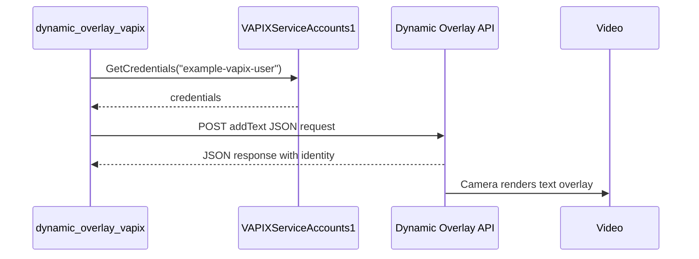

# Dynamic Overlay VAPIX

This example creates an overlay by calling the camera Dynamic Overlay VAPIX API from inside the ACAP application. It is included in the overlay track because the result appears as a video overlay, but the implementation is closer to the `vapix/` examples than to the Cairo examples.

## Architecture



## Request Body

The app builds a JSON request with Jansson:

```c
json_object_set_new(params, "camera", json_integer(1));
json_object_set_new(params, "text", json_string("AXIS TIP Paris workshop - Date: %c"));
json_object_set_new(params, "position", json_string("topLeft"));
json_object_set_new(params, "textColor", json_string("white"));
json_object_set_new(params, "fontSize", json_integer(60));

json_object_set_new(root, "method", json_string("addText"));
json_object_set_new(root, "params", params);
```

The endpoint is:

```c
const char* endpoint = "/axis-cgi/dynamicoverlay/dynamicoverlay.cgi";
```

## Direct Overlay Versus VAPIX Overlay

| Approach | Where drawing happens | Best for |
| --- | --- | --- |
| `axoverlay` + Cairo | In the ACAP render callback | Custom shapes, image composition, per-frame redraw |
| Dynamic Overlay VAPIX | In the camera overlay service | Simple text overlays configured by API |

## Build

```sh
docker build --tag dynamic-overlay-vapix-overlay --build-arg ARCH=aarch64 .
docker cp $(docker create dynamic-overlay-vapix-overlay):/opt/app ./build
```

## Classroom Exercises

1. Change the overlay position and font size.
2. Read and log the returned overlay `identity`.
3. Add a second VAPIX request to remove the overlay using that identity.
