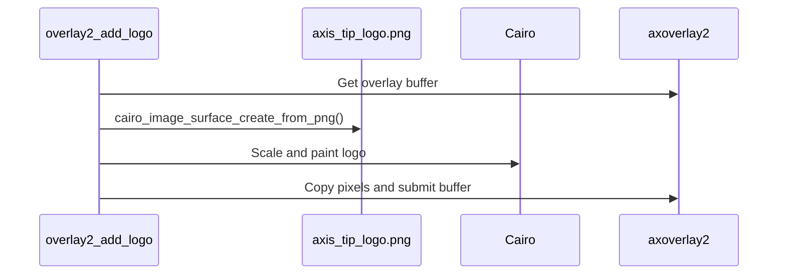

# Overlay2 Add Logo

This example draws a PNG logo into an `axoverlay2` buffer. It demonstrates asset packaging and image scaling with Cairo.

## Code Flow



## Runtime Asset Path

The logo is installed with the ACAP package and loaded from:

```c
const char* image_path = "/usr/local/packages/overlay2_add_logo/axis_tip_logo.png";
```

The draw size is calculated as a fraction of the current overlay dimensions:

```c
double draw_w = (double)overlay->used_width * 0.12;
double draw_h = draw_w * ((double)img_h / (double)img_w);
```

## Build

```sh
docker build --tag overlay2-add-logo --build-arg ARCH=aarch64 .
docker cp $(docker create overlay2-add-logo):/opt/app ./build
```

## Classroom Exercises

1. Replace `axis_tip_logo.png`.
2. Move the logo to another corner.
3. Cache the loaded PNG surface instead of loading it on each render.
