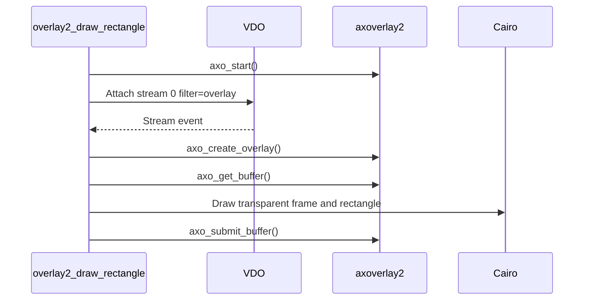

# Overlay2 Draw Rectangle

This is the minimal `axoverlay2` sample. It creates one ARGB32 overlay for every VDO stream that requests overlays and draws a centered rectangle.

## Code Flow



## Important Snippets

The app listens to VDO stream events:

```c
stream_filter = vdo_map_new();
vdo_map_set_string(stream_filter, "filter", "overlay");
vdo_stream_attach(vdo_event_stream, stream_filter, &error);
```

The overlay size is aligned before creation:

```c
axo_get_aligned_size(AXO_FORMAT_ARGB32,
                     used_width,
                     used_height,
                     &full_width,
                     &full_height,
                     &axo_error);
```

Each frame is submitted explicitly:

```c
axo_buffer* buffer = axo_get_buffer(overlay->overlay_id, NULL, &axo_error);
char* target_buffer = axo_buffer_get_data(buffer, &axo_error);
render_frame(overlay, target_buffer);
axo_submit_buffer(buffer, NULL, &axo_error);
```

## Build

```sh
docker build --tag overlay2-draw-rectangle --build-arg ARCH=aarch64 .
docker cp $(docker create overlay2-draw-rectangle):/opt/app ./build
```

## Classroom Exercises

1. Change the rectangle size and color.
2. Lower the timer frequency and observe update behavior.
3. Disable upscaling and discuss memory cost on high-resolution streams.
