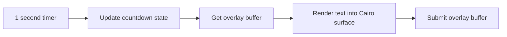

# Overlay2 Draw Text

This example uses the same `axoverlay2` stream and buffer lifecycle as `draw-rectangle`, but renders dynamic text into the submitted overlay buffer.

## Concept



## Text Rendering

The render function uses Cairo text APIs:

```c
cairo_select_font_face(cr, "serif",
                       CAIRO_FONT_SLANT_NORMAL,
                       CAIRO_FONT_WEIGHT_BOLD);
cairo_set_font_size(cr, (double)overlay->used_height * 0.06);
cairo_show_text(cr, text);
```

The application sets `XDG_CACHE_HOME` so fontconfig can write cache data inside the package local data area:

```c
setenv("XDG_CACHE_HOME", "/usr/local/packages/overlay2_draw_text/localdata", 1);
```

## Build

```sh
docker build --tag overlay2-draw-text --build-arg ARCH=aarch64 .
docker cp $(docker create overlay2-draw-text):/opt/app ./build
```

## Classroom Exercises

1. Change the countdown string.
2. Add a translucent background behind the text.
3. Render stream id or resolution as text.
