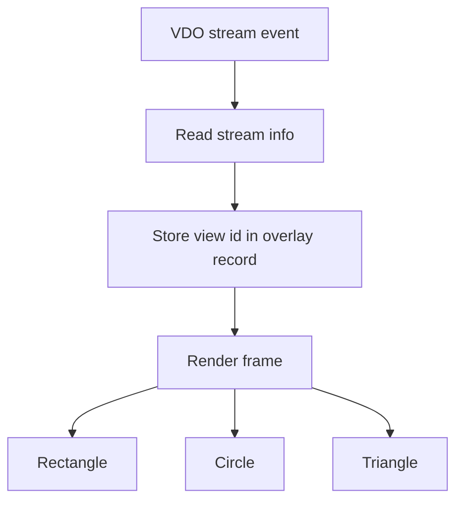

# Overlay2 Draw Views

This example renders different shapes depending on stream metadata. It is the `axoverlay2` equivalent of showing different graphics per view.

## Concept



The sample tries to read `"camera"` from VDO stream info and falls back to the stream id:

```c
unsigned view_id = vdo_map_get_uint32(stream_info, "camera", stream_id);
create_overlay(stream_id, width, height, view_id);
```

The render function chooses a shape:

```c
if ((overlay->view_id % 3) == 1) {
    cairo_rectangle(cr, 0.25, 0.25, 0.5, 0.3);
} else if ((overlay->view_id % 3) == 2) {
    cairo_arc(cr, 0.5, 0.5, 0.25, 0.0, 2.0 * G_PI);
} else {
    cairo_move_to(cr, 0.5, 0.25);
}
```

## Build

```sh
docker build --tag overlay2-draw-views --build-arg ARCH=aarch64 .
docker cp $(docker create overlay2-draw-views):/opt/app ./build
```

## Classroom Exercises

1. Log all VDO stream info with `vdo_map_dump()` while changing streams.
2. Use a different metadata key if your camera exposes view information differently.
3. Add a fourth shape.
