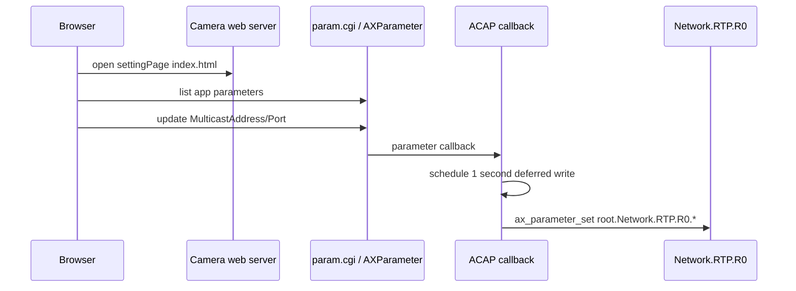

# parameter-custom-interface

This example connects ACAP parameters to a small custom web UI. The user edits
MulticastAddress and MulticastPort in the app page, the values are stored as
application parameters, and C callbacks propagate them to camera RTP settings.

## Architecture



## Manifest Parameters

The parameters are declared in `manifest.json`:

```json
"paramConfig": [
  {
    "name": "MulticastAddress",
    "default": "224.0.0.1",
    "type": "string:maxlen=64"
  },
  {
    "name": "MulticastPort",
    "default": "1024",
    "type": "int:maxlen=5;min=1024;max=65535"
  }
]
```

The manifest also declares:

```json
"settingPage": "index.html"
```

That makes the page available from the camera Apps UI.

## C Callback Flow

The app opens its AXParameter scope:

```c
axparameter = ax_parameter_new(app_name, &error);
```

Then registers callbacks:

```c
ax_parameter_register_callback(axparameter,
                               "MulticastAddress",
                               multicast_address_callback,
                               NULL,
                               &error);
```

The callback schedules a deferred write:

```c
struct message* msg = malloc(sizeof(struct message));
msg->name = strdup("root.Network.RTP.R0.VideoAddress");
msg->value = strdup(value);

g_timeout_add_seconds(1, set_parameter, msg);
```

The delayed function writes the camera RTP parameter:

```c
ax_parameter_set(axparameter, msg->name, msg->value, TRUE, &error);
```

## Why Deferred Write

The callback is triggered by a parameter update. Writing another parameter
immediately from inside the callback can be harder to reason about. The sample
uses a short GLib timeout to let the callback return, then performs the device
parameter write.

## Test With VAPIX

List app parameters:

```bash
curl --anyauth -u root:pass \
  "http://CAMERA_IP/axis-cgi/param.cgi?action=list&group=root.parameter_custom_interface"
```

Update app parameters:

```bash
curl --anyauth -u root:pass \
  "http://CAMERA_IP/axis-cgi/param.cgi?action=update&root.parameter_custom_interface.MulticastAddress=224.0.0.101&root.parameter_custom_interface.MulticastPort=56000"
```

Then inspect:

```text
root.Network.RTP.R0.VideoAddress
root.Network.RTP.R0.VideoPort
```

## What This Teaches

- custom setting pages can edit ACAP parameters
- `param.cgi` and AXParameter operate on the same values
- callbacks can bridge app parameters to other device parameters
- deferred writes avoid doing too much inside the callback

## Build

```bash
docker build --tag parameter-custom-interface --build-arg ARCH=aarch64 .
docker cp $(docker create parameter-custom-interface):/opt/app ./build
```

## Exercises

1. Add a TTL parameter to the manifest and UI.
2. Validate multicast address format before writing RTP settings.
3. Change the timeout from 1 second to 3 seconds and observe logs.
4. Update values through both the UI and `curl`.
