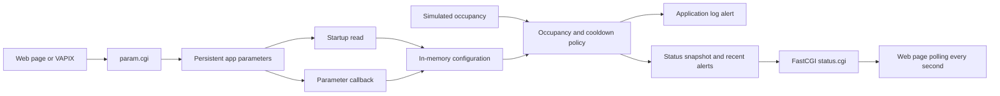
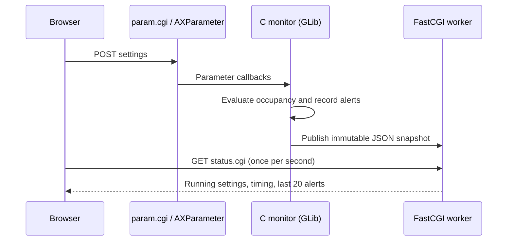

# Loading-bay occupancy monitor

A practical Parameter API example: configure how long a warehouse loading bay
may remain occupied before an application raises an alert, without rebuilding
or restarting the application.

The existing [manifest](../parameter-manifest/), [runtime](../parameter-runtime/),
and [custom interface](../parameter-custom-interface/) examples introduce the API
operations. This example applies those concepts to an industry scenario.

## Industry scenario

A warehouse supervisor wants to identify loading bays that remain occupied too
long. Different sites have different unloading times, and monitoring may need to
be disabled during maintenance. Repeated alerts should be spaced out so the
same parked truck does not generate a message every second.

These are persistent application settings. The current occupancy and elapsed
time are transient state, so they belong in memory rather than parameter storage.

**This is a simulation of the application policy.** It does not analyze video,
detect trucks, publish Axis events, or send notifications. A timer supplies the
occupancy input and alerts appear in the application log and the built-in page. The short defaults
make the behavior observable during a workshop; they are not operational
recommendations for a warehouse.

## What you learn

- Declare fixed configuration in `manifest.json`.
- Read saved values using `ax_parameter_get()` at startup.
- Apply changes through callbacks while the GLib main loop runs.
- Validate values before using them in application logic.
- Keep configuration separate from transient monitoring state.

All parameter names are known at packaging time, so this example uses manifest
parameters. Runtime parameter creation would add no benefit to a single bay.

## Configuration

| Parameter | Default | Allowed values | Effect |
| --- | --- | --- | --- |
| `Enabled` | `yes` | `yes`, `no` | Enable or disable alert evaluation. |
| `MaxOccupancySeconds` | `30` | Integer, 1–86400 | Continuous monitored occupancy before the first alert. |
| `AlertCooldownSeconds` | `20` | Integer, 1–86400 | Minimum interval between repeat alerts during the same occupied period. |

The camera parameter scope is `root.Parameter_loading_bay`, with a capital
`P`. The executable name and `/local/parameter_loading_bay/` URL remain lowercase.
Callbacks dispatch by the final parameter name (for example, `Enabled`) because
the camera's group capitalization differs from the executable name.

The manifest supplies installation defaults. Startup reads the stored values;
it does not overwrite them with defaults. Invalid saved values cause startup to
fail with a log message. Invalid callback values leave the previous running
setting in effect and produce a warning; the callback does not repair storage.

## Application flow



The simulator starts occupied, stays occupied for **90 seconds**, then stays free
for **15 seconds**, repeating until the app stops. It continues while monitoring
is disabled. A one-second GLib timer evaluates the policy using monotonic time,
so wall-clock adjustments do not change elapsed durations.

With the defaults, the first occupied period produces alerts at approximately
30, 50, and 70 seconds. At 90 seconds the bay becomes free and monitoring state
resets. The next occupied period starts at 105 seconds, with its first alert at
approximately 135 seconds. Timer scheduling can shift log times slightly.

Live changes have explicit behavior:

- **Threshold:** keeps the current occupancy start time. Lowering the limit
  below elapsed occupancy allows an alert on the next tick, subject to an
  existing cooldown. Raising it postpones alerts until the new limit is reached.
- **Cooldown:** uses the time of the last alert. A shorter cooldown can allow a
  repeat on the next tick; a longer one delays repeats.
- **Disable:** clears monitoring state and suppresses alerts. Simulator state
  messages continue to appear.
- **Re-enable:** starts a fresh occupancy timer on the next tick if occupied.
- **Bay becomes free:** clears occupancy timing and cooldown history, so a new
  truck gets its own initial alert after the threshold.
- **Restart:** retains configuration, but restarts the simulated cycle and all
  occupancy/cooldown timing. The manifest uses `runMode: never`, matching the
  walkthroughs: start the app manually for the lab.

Callbacks only update configuration. The timer evaluates alerts on the same
GLib main context. A separate HTTP worker reads a serialized JSON snapshot
protected by a short mutex; it never accesses AXParameter or live monitor state.
Blocking HTTP I/O therefore does not delay the simulation or parameter callbacks.

## Build and install

Prerequisites: Docker and an Axis device compatible with the selected SDK,
package architecture, and manifest. The Dockerfile follows the other parameter
examples and defaults to ACAP Native SDK 12.10.0 and `aarch64`.

Run from this directory:

```bash
docker build --tag parameter-loading-bay-monitor --build-arg ARCH=aarch64 .
container_id=$(docker create parameter-loading-bay-monitor)
docker cp "$container_id":/opt/app ./build
docker rm "$container_id"
```

For an appropriate 32-bit device, build with `--build-arg ARCH=armv7hf` instead.
Upload the generated `.eap` from `build/` through the device's Apps page and
start the application. Follow the device's application signing requirements.
Open its application log to observe configuration, simulator, and alert entries.

Example log content (timestamps and syslog prefixes omitted):

```text
Configuration: Enabled=yes
Configuration: MaxOccupancySeconds=30
Configuration: AlertCooldownSeconds=20
Simulation started: 90 seconds occupied, 15 seconds free; alerts appear in logs and the local page
SIMULATOR: bay is OCCUPIED
Monitoring: started timing occupied bay
SIMULATED ALERT: bay occupied for 30 seconds (limit=30, cooldown=20)
```

## Open the visual companion

After starting the app, select its **Settings** button in the camera's Apps page,
or open:

```text
https://CAMERA_IP/local/parameter_loading_bay/index.html
```

Use a camera administrator account. The manifest declares the settings page and
an admin-only FastCGI endpoint. HTML, CSS, and JavaScript are bundled inside the
package; there are no external assets, frontend dependencies, or hosted services.

The page shows:

- **Bay 01:** current occupied/free state, seconds until the simulator changes
  state, monitored occupancy time, threshold progress, and next alert eligibility.
- **Monitoring settings:** enabled, occupancy limit, and cooldown, with explicit
  Save and Use current values buttons. Unsaved edits survive background polling.
- **Recent alerts:** the C monitor's latest 20 alerts, newest first, and its
  total alert count since startup. Times use the camera's clock, displayed in
  the browser's local timezone. Configuration persists; alert history does not.

Try setting the limit to **10** and cooldown to **5**, then save while occupied.
The page waits for the application to report the new settings before confirming
that they were applied. Disable monitoring and watch the timer reset while the
occupancy simulation keeps running. Enable it again to begin a fresh timer.

“Eligible in” is conditional on the bay remaining occupied and monitoring staying
on. It is the greater of the remaining threshold time and cooldown time. If the
bay becomes free first, there will be no alert for that occupied period.

### How the page communicates



`GET /local/parameter_loading_bay/status.cgi` is read-only. Responses disable
caching; other methods receive HTTP 405. Fields include `enabled`, `occupied`,
`tracking`, `maxOccupancySeconds`, `alertCooldownSeconds`, `elapsedSeconds`,
`nextAlertSeconds` (null when inactive), `phaseRemainingSeconds`, `totalAlerts`,
`timestampMs`, and an `alerts` array. Each alert includes its timestamp, elapsed
occupancy, threshold, and cooldown at the moment it fired.

The snapshot updates on each one-second simulation tick. The browser polls after
each request completes, so it never builds a queue of overlapping polls. Changes
normally appear within about two seconds. Failed requests show a disconnected
banner, retain the last values as stale, and disable the form until reconnection.
The page also checks the text returned by `param.cgi`: HTTP 200 alone does not
mean a parameter update succeeded. Updates are still independent per parameter;
a failed request may have changed some values.

The page does not run its own occupancy simulation. Opening multiple tabs does
not create additional bays or alerts. The C monitor continues without any page
open. FastCGI is supporting infrastructure; configuration still uses the same
Parameter API as the walkthroughs. See the separate
[FastCGI examples](../../webserver-fastcgi/) for that API's lessons.

## Try live configuration with VAPIX

Set your camera address and username. The commands prompt for the password.
Use the camera's trusted HTTPS endpoint.

```bash
CAMERA_URL='https://camera.example.com'
CAMERA_USER='root'
```

Read the saved configuration:

```bash
curl --anyauth --user "$CAMERA_USER" --get \
  "$CAMERA_URL/axis-cgi/param.cgi" \
  --data-urlencode 'action=list' \
  --data-urlencode 'group=root.Parameter_loading_bay'
```

Set a shorter threshold and cooldown:

```bash
curl --anyauth --user "$CAMERA_USER" \
  "$CAMERA_URL/axis-cgi/param.cgi" \
  --data-urlencode 'action=update' \
  --data-urlencode 'root.Parameter_loading_bay.MaxOccupancySeconds=10' \
  --data-urlencode 'root.Parameter_loading_bay.AlertCooldownSeconds=5'
```

Watch for configuration callback logs followed by more frequent alerts while
occupied. Each setting is handled independently; the app does not treat this
request as an atomic configuration transaction.

Disable monitoring:

```bash
curl --anyauth --user "$CAMERA_USER" \
  "$CAMERA_URL/axis-cgi/param.cgi" \
  --data-urlencode 'action=update' \
  --data-urlencode 'root.Parameter_loading_bay.Enabled=no'
```

Repeat with `Enabled=yes` to resume. No application restart is required.

## Workshop verification

| Check | Action | Expected result |
| --- | --- | --- |
| Initial alert | Start with defaults and wait about 30 seconds. | First simulated alert appears. |
| Repeat suppression | Continue watching with a 20-second cooldown. | No alert every second; repeats are approximately 20 seconds apart. |
| Live threshold | Set the limit to 120 during an occupied period. | No further alerts: each simulated occupied period lasts only 90 seconds. |
| Disable/resume | Disable, then enable while occupied with a 10-second limit. | Alerts stop; a fresh 10-second monitoring period starts on re-enable. |
| Free bay | Wait for the `FREE` log. | Occupancy timing resets; no alerts while free. |
| Persistence | Save 10/5, stop and start the app, then list parameters. | Startup logs and stored values show 10/5; simulation starts over. |
| Visual status | Open Settings and compare the next alert with the application log. | Occupancy and alerts match the C monitor. |
| Unsaved edits | Type a new limit and wait through several refreshes. | Form keeps the edit; live limit stays unchanged until Save. |
| External update | Change a parameter with curl while the form has no edits. | Both live status and the form reflect the new value. |
| Disconnection | Stop the app with the page open; then start it again. | Page shows stale/disconnected state and disables settings; reconnect restores status and clears old history. |
| Multiple viewers | Open two tabs. | Both display the same monitor and alert history. |
| Validation | Try `MaxOccupancySeconds=0`. | Parameter metadata should reject it; verify the response and stored value. C validation also guards the running configuration. |

Restore `Enabled=yes`, `MaxOccupancySeconds=30`, and `AlertCooldownSeconds=20`
after experimenting if you want to reproduce the default timeline.

## Local checks

Build the Docker image to validate the manifest, compile C with warnings treated
as errors, and create the package. The dependency-free JavaScript interaction
checks can run with Node.js:

```bash
node --test tests/dashboard.test.cjs
```

The callback-name regression check requires Python 3, a host C compiler,
`pkg-config`, and GLib development files:

```bash
python3 tests/callback_names.py
```

It checks the capitalized names returned by the camera, lowercase/local names,
and rejection of invalid values. Set `CC` and `CFLAGS` if your host needs a
specific compiler or SDK path.

The JavaScript checks cover form edits during polling, the save/confirmation flow,
VAPIX errors, disconnect/reconnect behavior, and alert history rendering using a
small DOM test double. They do not replace browser layout checks or device tests.
Use the workshop checklist above on a camera to verify authenticated HTTP,
parameter persistence, and the real FastCGI connection.

## Connecting real analytics later

Replace the occupancy calculation in `simulation_tick()` with a real bay
occupancy signal and pass it to `evaluate_occupancy()`. Keep periodic evaluation
so a stationary truck can trigger a time-based alert even when no new occupancy
transition arrives. If input arrives on another thread, deliver it onto the
GLib main context first.

A production integration would also define handling for missing analytics data,
brief detection dropouts, and application restarts. An Axis event or another
notification mechanism could extend the local log/page alert. Those integrations
belong to later API examples; this exercise focuses on configurable behavior.

## Files and API reference

- [`app/parameter_loading_bay.c`](app/parameter_loading_bay.c): startup, validation, callbacks, simulator, and alert policy.
- [`app/status_server.c`](app/status_server.c): read-only FastCGI worker and snapshot exchange.
- [`app/html/index.html`](app/html/index.html), [`style.css`](app/html/style.css), and [`app.js`](app/html/app.js): camera-hosted visual companion.
- [`app/manifest.json`](app/manifest.json): persistent parameters, settings page, and endpoint access.
- [`tests/dashboard.test.cjs`](tests/dashboard.test.cjs): local page interaction checks.
- [`app/Makefile`](app/Makefile) and [`Dockerfile`](Dockerfile): compilation and packaging.
- [AXParameter API reference](https://www.developer.axis.com/acap/api/src/api/axparameter/html/ax__parameter_8h.html): parameter reads, callbacks, and resource ownership.
