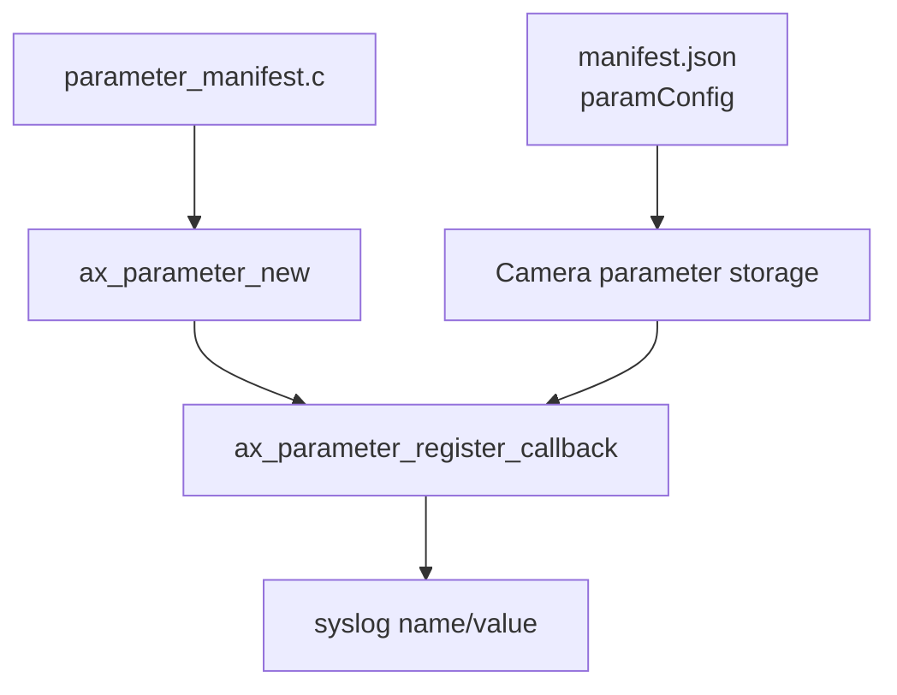

# parameter-manifest

This is the first Parameter API example. It teaches how to declare a parameter
in `manifest.json` and react when it changes.

## Architecture



## Key Code

Create the AXParameter handle:

```c
AXParameter* handle = ax_parameter_new(APP_NAME, &error);
```

Register a callback for the manifest parameter:

```c
ax_parameter_register_callback(handle,
                               "ParameterManifest",
                               acap_parameter_changed,
                               NULL,
                               &error);
```

Callback:

```c
static void acap_parameter_changed(const gchar* name,
                                   const gchar* value,
                                   gpointer user_data) {
    syslog(LOG_INFO, "%s was changed to '%s'", name, value);
}
```

Run a GLib loop so callbacks can be delivered:

```c
GMainLoop* loop = g_main_loop_new(NULL, FALSE);
g_main_loop_run(loop);
```

## What This Teaches

- parameters can be declared before the app starts
- `ax_parameter_new` opens the app parameter scope
- callbacks react to value changes
- a GLib main loop keeps the app alive

## Build

```bash
docker build --tag parameter-manifest --build-arg ARCH=aarch64 .
docker cp $(docker create parameter-manifest):/opt/app ./build
```

## Exercise

Update the parameter through VAPIX:

```bash
curl --anyauth -u root:pass \
  "http://CAMERA_IP/axis-cgi/param.cgi?action=update&root.parameter_manifest.ParameterManifest=yes"
```

Then check the application log for the callback message.
