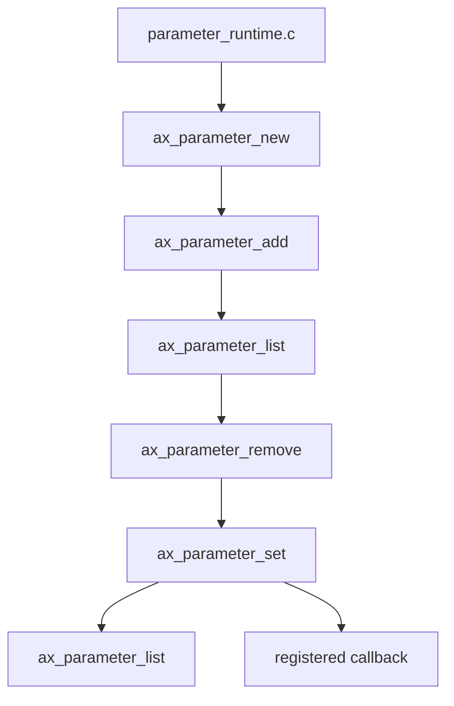

# parameter-runtime

This example teaches how an ACAP app can create and manage parameters at
runtime instead of only declaring them in `manifest.json`.

## Architecture



## Runtime Operations

Add:

```c
ax_parameter_add(handle, "ParameterRuntime", "no", "string", &error);
```

Set:

```c
ax_parameter_set(handle, "ParameterRuntime", "yes", TRUE, &error);
```

List:

```c
GList* list = ax_parameter_list(handle, &error);
```

Remove:

```c
ax_parameter_remove(handle, "ParameterToRemoveRuntime", &error);
```

Register callback:

```c
ax_parameter_register_callback(handle,
                               "ParameterRuntime",
                               acap_parameter_changed,
                               NULL,
                               &error);
```

## Why Runtime Parameters

Use runtime parameters when:

- the app does not know all parameter names at packaging time
- parameters are optional
- parameters are created from discovered device/application state
- a lab needs to demonstrate add/remove/list behavior

For normal product configuration, manifest parameters are usually easier to
document and maintain.

## Build

```bash
docker build --tag parameter-runtime --build-arg ARCH=aarch64 .
docker cp $(docker create parameter-runtime):/opt/app ./build
```

## Exercises

1. Add an integer parameter with min/max metadata.
2. Change `run_callback` in `ax_parameter_set` from `TRUE` to `FALSE`.
3. Remove the second callback registration and observe logs.
4. Use VAPIX `param.cgi?action=list` to inspect the app scope.
