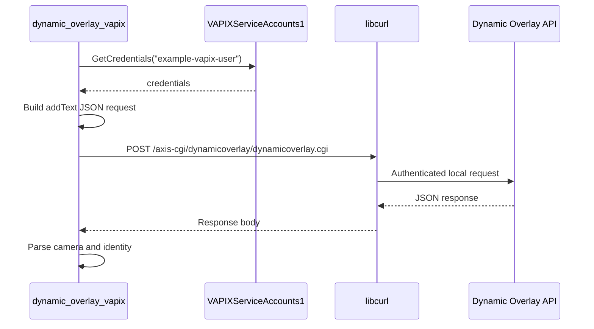

# Dynamic Overlay VAPIX

This example calls the camera Dynamic Overlay VAPIX API from inside an ACAP application. It does not draw with Cairo directly. Instead, it sends a JSON request to the camera web service and lets the camera create the overlay.

## What this example teaches

- How to retrieve VAPIX service account credentials from D-Bus.
- How to send a local HTTP request with libcurl.
- How to build JSON safely with Jansson.
- How to parse the response and extract returned fields.

## Code Flow



## Building The JSON Request

The request is built as structured JSON:

```c
json_t* root = json_object();
json_t* params = json_object();

json_object_set_new(params, "camera", json_integer(1));
json_object_set_new(params, "text", json_string("AXIS TIP Paris workshop - Date: %c"));
json_object_set_new(params, "position", json_string("topLeft"));
json_object_set_new(params, "textColor", json_string("white"));
json_object_set_new(params, "fontSize", json_integer(60));

json_object_set_new(root, "apiVersion", json_string("1.0"));
json_object_set_new(root, "method", json_string("addText"));
json_object_set_new(root, "params", params);
```

Using Jansson avoids manual string concatenation and escaping bugs.

## Sending The Request

The request is posted to the local camera API endpoint:

```c
const char* endpoint = "/axis-cgi/dynamicoverlay/dynamicoverlay.cgi";
char* request = json_dumps(request_obj, JSON_COMPACT);
json_t* response = vapix_post_json(handle, credentials, endpoint, request);
```

`vapix_post_json()` wraps two responsibilities:


## Reading The Response

The response is inspected by reading values from the `"data"` object:

```c
syslog(LOG_INFO, "Camera: %s", response_data(response, "camera"));
syslog(LOG_INFO, "Identity: %s", response_data(response, "identity"));
```

The identity can be used later to update or remove the created overlay.

## Build

```sh
docker build --tag dynamic-overlay-vapix --build-arg ARCH=aarch64 .
docker cp $(docker create dynamic-overlay-vapix):/opt/app ./build
```

## Classroom Exercises

1. Change the text, color, and position fields.
2. Add a second request that updates the same overlay identity.
3. Compare this approach with the `overlay/` examples that draw graphics inside the ACAP process.
