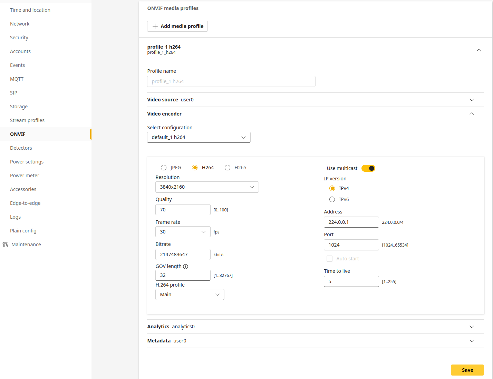

# VAPIX API - ONVIF Request

Configure ONVIF media settings from an ACAP app using SOAP over HTTP.
This sample shows how to:

- Fetch camera credentials for a service account over D-Bus (HTTPConf1/VAPIXServiceAccounts1).
- Build and POST an ONVIF SetVideoEncoderConfiguration SOAP request with libcurl.
- Log and validate the HTTP response.

The code you shared sends a Media2 SetVideoEncoderConfiguration to /vapix/services, updating resolution, FPS, bitrate limits, and multicast settings on the profile token default_1

## What you’ll learn

- How to obtain per-device credentials programmatically (no hard-coded secrets).
- How to compose SOAP XML and post it with proper Content-Type and WS action.
- How to check HTTP status and handle errors robustly in C.

## Folder layout (key files)

- `onvif-request.c` — main program:

    - `retrieve_onvif_credentials()` via D-Bus → "id:password".
    - `onvif_post()` / `onvif_post_xml()` POST the SOAP request with libcurl.
    - `set_onvif_properties()` contains the SOAP body for Media2 SetVideoEncoderConfiguration.

## How it works (annotated)

1) Get credentials over D-Bus

```c

static char *retrieve_onvif_credentials(const char *username) {
    // Calls com.axis.HTTPConf1.VAPIXServiceAccounts1.GetCredentials(username)
    // Returns "id:password"
}
```

- Avoids shipping secrets in your binary.
- Works with service accounts created in the camera UI / VAPIX.

2) Compose the SOAP body

```c

const char *soap_body =
    "<?xml version=\"1.0\" encoding=\"UTF-8\"?>"
    "<soap:Envelope xmlns:soap=\"http://www.w3.org/2003/05/soap-envelope\""
    "               xmlns:wsdl=\"http://www.onvif.org/ver20/media/wsdl\""
    "               xmlns:sch=\"http://www.onvif.org/ver10/schema\">"
    "  <soap:Header/>"
    "  <soap:Body>"
    "    <wsdl:SetVideoEncoderConfiguration>"
    "      <wsdl:Configuration token=\"default_1_h264\" GovLength=\"32\">"
    "        <sch:Name>default_1 h264</sch:Name>"
    "        <sch:UseCount>0</sch:UseCount>"
    "        <sch:Encoding>H264</sch:Encoding>"
    "        <sch:Resolution><sch:Width>3840</sch:Width><sch:Height>2160</sch:Height></sch:Resolution>"
    "        <sch:RateControl ConstantBitRate=\"false\">"
    "          <sch:FrameRateLimit>25</sch:FrameRateLimit>"
    "          <sch:BitrateLimit>2147483647</sch:BitrateLimit>"
    "        </sch:RateControl>"
    "        <sch:Multicast>"
    "          <sch:Address><sch:Type>IPv4</sch:Type><sch:IPv4Address>224.0.0.72</sch:IPv4Address></sch:Address>"
    "          <sch:Port>7072</sch:Port><sch:TTL>5</sch:TTL><sch:AutoStart>false</sch:AutoStart>"
    "        </sch:Multicast>"
    "        <sch:Quality>70</sch:Quality>"
    "      </wsdl:Configuration>"
    "    </wsdl:SetVideoEncoderConfiguration>"
    "  </soap:Body>"
    "</soap:Envelope>";


```

3) POST to the VAPIX endpoint (it will change ONVIF settings in the web interface)

```c

char *url = "http://127.0.0.12/vapix/services";
curl_slist *headers = NULL;
headers = curl_slist_append(headers,
  "Content-Type: application/soap+xml;charset=UTF-8;"
  "action=\"http://www.onvif.org/ver20/media/wsdl/SetVideoEncoderConfiguration\"");

```

- Uses Basic Auth with the credentials from D-Bus.
- Checks for HTTP 200; otherwise logs and aborts.

--- 

## Setting to be changed under ONVIF > ONVIF media profiles > profile_1 h264



## Lab

1. Build and run the application
2. It will automatically update the onvif profile settings with new multicast address an port.Maybe needs a UI refresh.
3. It should enable multicast
4. stop the app
5. Change values and build it again.
6. Uplaod app and run.

## Build

```bash
docker build --tag onvif-request --build-arg ARCH=aarch64 .

```
```bash
docker cp $(docker create onvif-request):/opt/app ./build

```