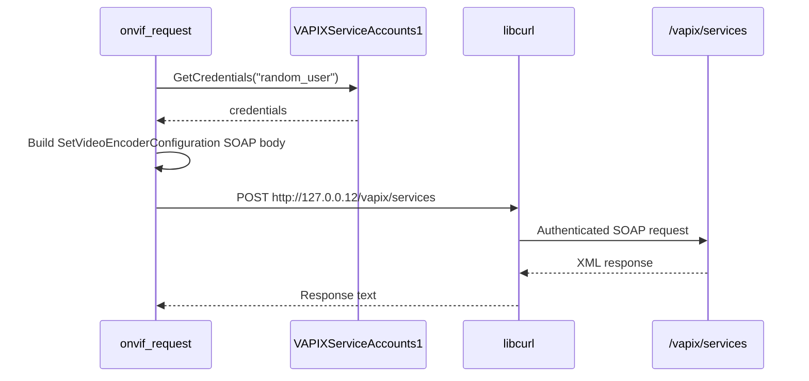

# ONVIF Request

This example sends an ONVIF SOAP request from an ACAP application through the camera service endpoint. It is more advanced than the JSON VAPIX example because the request body is XML and the operation changes video encoder multicast settings.

## What this example teaches

- How an ACAP can call ONVIF services locally.
- How VAPIX service account credentials are reused for authenticated requests.
- How libcurl is configured for SOAP/XML.
- Why camera configuration changes should be made carefully and logged.

## Code Flow


```mermaid
sequenceDiagram
    participant App as onvif_request
    participant DBus as VAPIXServiceAccounts1
    participant Curl as libcurl
    participant ONVIF as /vapix/services

    App->>DBus: GetCredentials("random_user")
    DBus-->>App: credentials
    App->>App: Build SetVideoEncoderConfiguration SOAP body
    App->>Curl: POST http://127.0.0.12/vapix/services
    Curl->>ONVIF: Authenticated SOAP request
    ONVIF-->>Curl: XML response
    Curl-->>App: Response text
```

## Credential Retrieval

The application asks the camera for credentials for a VAPIX service account:

```c
char *credentials = retrieve_onvif_credentials("random_user");
```

Internally that function calls D-Bus:

```c
g_dbus_connection_call_sync(connection,
                            bus_name,
                            object_path,
                            interface_name,
                            "GetCredentials",
                            g_variant_new("(s)", username),
                            NULL,
                            G_DBUS_CALL_FLAGS_NONE,
                            -1,
                            NULL,
                            &error);
```

## SOAP Request

The example builds a `SetVideoEncoderConfiguration` SOAP body. The multicast part is the important configuration payload:

```c
"<sch:Multicast>"
"<sch:Address>"
"<sch:Type>IPv4</sch:Type>"
"<sch:IPv4Address>224.0.0.72</sch:IPv4Address>"
"</sch:Address>"
"<sch:Port>7072</sch:Port>"
"<sch:TTL>5</sch:TTL>"
"<sch:AutoStart>false</sch:AutoStart>"
"</sch:Multicast>"
```

The body is posted with libcurl:

```c
curl_easy_setopt(handle, CURLOPT_URL, "http://127.0.0.12/vapix/services");
curl_easy_setopt(handle, CURLOPT_NOPROXY, "*");
curl_easy_setopt(handle, CURLOPT_USERPWD, credentials);
curl_easy_setopt(handle, CURLOPT_HTTPAUTH, CURLAUTH_BASIC);
curl_easy_setopt(handle, CURLOPT_POSTFIELDS, soap_xml_body);
```

## Response Handling

The response is collected into a `GString` by a write callback:

```c
static size_t append_to_gstring_callback(char *ptr, size_t size,
                                         size_t nmemb, void *userdata)
{
    size_t processed_bytes = size * nmemb;
    g_string_append_len((GString *)userdata, ptr, processed_bytes);
    return processed_bytes;
}
```

The example checks the HTTP status code and fails if it is not `200`.

## Build

```sh
docker build --tag onvif-request --build-arg ARCH=aarch64 .
docker cp $(docker create onvif-request):/opt/app ./build
```

## Classroom Exercises

1. Change the multicast address and port, then inspect the camera configuration.
2. Replace the hard-coded XML with a loaded XML file from `app/initial-info-request/`.
3. Add safer logging that avoids printing credentials.
