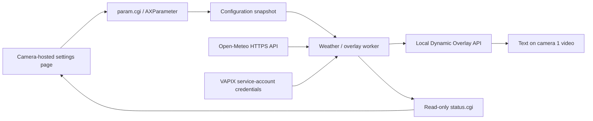

# Weather overlay through VAPIX

Bring external weather context into an outdoor camera's video. An ACAP
application fetches weather for configured coordinates, formats a short caption,
and asks the camera's Dynamic Overlay API to display it.

This is the practical companion to the [VAPIX walkthroughs](../). Unlike the
simulated input in the parameter and event examples, this app consumes a real
external API. It does not measure weather at the camera.

## Scenario

An operator reviewing a logistics yard wants weather context alongside the
video: temperature, wind, and conditions. A typical overlay looks like:

```text
WX-WORKSHOP | 55.7047,13.1910 | 8.5C Wind 24km/h | Rain | 09-24 14:30Z | Open-Meteo.com
```

The timestamp is the provider's weather time in UTC, not the camera's current
time or the time of the last HTTP request. Values describe model-based conditions
near the requested location, not on-site instrumentation. This is a contextual
workshop example, not an operational weather warning system.

## What this teaches

- Consume an external HTTPS JSON API with certificate verification.
- Obtain local VAPIX service credentials at runtime through D-Bus.
- Keep external requests separate from authenticated local camera requests.
- Check HTTP status, JSON structure, units, and VAPIX application errors.
- Create, update, rediscover, and remove the app's overlay.
- Use persistent parameters and callbacks for live configuration.
- Handle unavailable or stale data without presenting it as new information.

## Architecture



Parameter callbacks run on the GLib main context. They validate and copy settings
under a mutex, then wake the worker. Slow HTTP requests never run in a parameter
callback. Another worker serves immutable JSON status snapshots through FastCGI.
The page polls status once per second, without overlapping polls.

The weather worker creates separate libcurl handles for public HTTPS and local
VAPIX operations. Camera credentials are used only with `127.0.0.12`, kept in
memory, and never logged or returned to the browser. Local requests bypass proxy
settings. Requests have connection and total timeouts, bounded response buffers,
and no automatic redirects.

## Prerequisites and provider

- A device compatible with the SDK/package architecture and Dynamic Overlay API
  version 1.0. The app checks `getSupportedVersions` before editing overlays.
- Camera view area/channel **1**, with an available text-overlay slot.
- Camera DNS, outbound HTTPS access to `api.open-meteo.com`, and an accurate clock.
- A camera administrator account for the Settings page.

This version uses Open-Meteo's public forecast endpoint without an API key. Its
free endpoint is intended for **non-commercial use**; review the provider's
terms before adapting this workshop to a commercial deployment. A paid endpoint
and its authentication are not implemented here. Attribution appears on the
page and in the video caption.

See [Open-Meteo documentation](https://open-meteo.com/en/docs),
[provider terms](https://open-meteo.com/en/terms), and
[CC BY 4.0](https://creativecommons.org/licenses/by/4.0/).
Coordinates are sent to the provider whenever enabled weather requests run.

## Configuration

| Parameter | Default | Allowed values | Effect |
| --- | --- | --- | --- |
| `Enabled` | `yes` | `yes`, `no` | Fetch and display weather; disabling removes the app's overlay. |
| `Latitude` | `55.7047` | Decimal, -90 to 90 | Requested latitude. |
| `Longitude` | `13.1910` | Decimal, -180 to 180 | Requested longitude. |
| `RefreshSeconds` | `600` | Integer, 300–3600 | Interval between scheduled weather requests. |

The default location is **Lund, Sweden**. Coordinates are stored as strings and
validated numerically by the application. Startup reads saved values; invalid
saved configuration prevents startup. Invalid live values retain the previous
running value and produce a warning. Such a rejected value can still remain in
parameter storage if its string metadata permits it; correct it before restart.

The camera parameter group is `root.Vapix_weather_overlay` (capital `V`).
The executable name and `/local/vapix_weather_overlay/` URL remain lowercase.

Changes are coalesced for one second. The worker checks for configuration changes
after network requests and discards obsolete weather results. Requests already
in progress finish or time out; changes are not instantaneous. The page confirms
applied configuration separately from weather-fetch and overlay success.
Parameter updates are independent, not an atomic transaction.

- Changing coordinates discards the old location's weather immediately when the
  worker accepts the new configuration.
- Settings changes can schedule an early fetch, with at least 60 seconds between
  weather request starts within a running session.
- Normal and failed weather requests wait the configured refresh interval before
  the next scheduled attempt; there is no rapid retry loop.
- Disabled mode stops new weather requests and removes the tagged overlay.
- Enabling again resumes fetching, subject to the minimum request spacing.
- Restart retains parameters but not the cached weather or last-fetch status.

## Freshness and failure behavior

A validated weather response requires temperature in Celsius, wind in km/h,
a weather code, and a Unix timestamp. Missing/null fields, unexpected units,
invalid values, and provider error responses are rejected.

| Situation | Behavior |
| --- | --- |
| Successful first request | Display formatted weather and provider timestamp. |
| No valid weather yet | Display `Weather unavailable`, with no invented values. |
| Refresh fails after success | Retain the last weather, prefix its timestamp with `STALE`, and show the fetch error. |
| Cached data ages | Mark stale after twice the refresh interval without success. |
| Provider timestamp is old or implausibly future-dated | Mark stale if older than two hours or more than 15 minutes ahead of the camera clock. |
| Location changes | Discard old data; display unavailable until the new location succeeds. |
| VAPIX operation fails | Keep the last confirmed overlay preview, show the error, and retry after 60 seconds. |
| Browser loses camera connection | Disable editing and label the displayed page state as stale. |

The weather and overlay statuses are separate: a successful forecast fetch does
not mean the video was updated. If VAPIX is unavailable, even a `STALE` update may
fail and older text can remain on the actual video. The page makes that failure
visible; the provider timestamp in the caption also remains visible.

## Overlay lifecycle

This app reserves the text prefix **`WX-WORKSHOP | `** on camera 1. Do not reuse
that prefix for another app or a manually created overlay.

Before modifying overlays, it calls `list` and identifies only text overlays
with that prefix on camera 1. It updates the existing overlay with `setText`, or
creates one with `addText` if none exists. Duplicate tagged overlays are removed.
It never deliberately edits unrelated text or image overlays.

This avoids persisting an overlay identity that could change after a camera
reboot. It also allows the next run to reuse an overlay left after an abrupt
termination or an ambiguous add response. Identification is by this reserved
prefix, not a platform-enforced ownership token.

On disable or graceful shutdown, the app attempts to remove its tagged overlays.
Cleanup is best effort: a hard kill, power loss, or unavailable VAPIX can leave
text behind. Restarting the app allows rediscovery and cleanup. If necessary,
remove the clearly tagged overlay manually in the camera interface. Do not assume
uninstalling an abruptly stopped application removes its VAPIX-created overlay.

Default placement is top left, white text on black, font size 24, camera 1. The
settings page is a **text preview**, not a live video player. Check the camera's
live view for actual appearance; long captions can exceed the width of small
streams. Placement/font/channel are intentionally kept in code for this lab.

## Build and install

From this directory:

```bash
docker build --tag vapix-weather-overlay --build-arg ARCH=aarch64 .
container_id=$(docker create vapix-weather-overlay)
docker cp "$container_id":/opt/app ./build
docker rm "$container_id"
```

Use `--build-arg ARCH=armv7hf` for an appropriate 32-bit device. The default SDK
is 12.10.0. The build copies the SDK image's CA certificate bundle into the EAP
and explicitly uses it for provider TLS verification. Refresh the SDK/base image
and rebuild when maintaining certificates; TLS verification is never disabled.

Install the `.eap` in the camera's Apps page, following device signing settings,
then start it manually. Select **Settings**, or visit:

```text
https://CAMERA_IP/local/vapix_weather_overlay/index.html
```

The manifest deliberately uses a dynamically generated application user and
declares the D-Bus credentials method. Do not copy a static/general SDK user
configuration into it; that can prevent service-account credential acquisition.
The app needs no stored camera administrator password.

The page exposes weather values, source time, fetch time, request state, errors,
settings, and the last applied overlay text. Open a separate camera live view to
see the actual caption on video.

## Try VAPIX configuration from a terminal

```bash
curl --anyauth --user root https://CAMERA_IP/axis-cgi/param.cgi \
  --data-urlencode 'action=update' \
  --data-urlencode 'root.Vapix_weather_overlay.Latitude=59.3293' \
  --data-urlencode 'root.Vapix_weather_overlay.Longitude=18.0686' \
  --data-urlencode 'root.Vapix_weather_overlay.RefreshSeconds=600'
```

The command prompts for the password; use the camera's trusted HTTPS endpoint.
Set `root.Vapix_weather_overlay.Enabled=no` to disable and remove the overlay.
Logs distinguish configuration changes, weather fetch results, and overlay
updates/removals. HTTP error bodies and camera credentials are not logged.

## Workshop checks

1. Start with the default location. Confirm weather arrives and the caption is
   visible in camera 1's live view. Check that the page shows VAPIX success.
2. Change coordinates. Confirm old weather is cleared rather than relabeled as
   belonging to the new location. Allow for the 60-second minimum fetch spacing.
3. Save a different refresh interval and restart. Confirm saved values reload.
4. Disable the app through its Enabled setting. Confirm the caption disappears
   while unrelated overlays remain. Enable again to restore it.
5. Temporarily block only the camera's access to the weather provider, leaving
   local camera access working. After the next scheduled request, confirm a
   `STALE` caption and a weather error. Restore access and await the next refresh.
6. Test an invalid coordinate with `param.cgi`; verify rejection in the running
   app, then restore a valid saved value.
7. Stop/start the app and inspect the overlay list: repeated runs should not
   accumulate tagged overlays. Test cleanup with an unrelated overlay present.

If nothing appears, inspect the two error areas separately: weather problems
usually concern DNS, outbound HTTPS, clock, certificate trust, or provider
availability; overlay problems concern service credentials, API support, camera
channel, or available slots.

## Troubleshooting these two independent failures

- **`getSupportedVersions` code 103:** the camera rejected a request parameter.
  Discovery must send only `method` (optionally `context`), without `apiVersion`
  or `params`. This example now follows that schema. A reported version such as
  `1.4` also satisfies the application's 1.0 requirement.
- **`Could not resolve hostname`:** the app cannot resolve `api.open-meteo.com`
  from the camera. Check the camera's DNS servers and default gateway, and that
  its network permits access to the configured DNS resolver and outbound HTTPS.
  Use the resolver approved for your network; do not assume a public DNS server
  is reachable. A successful lookup on your laptop does not verify camera DNS.

If SSH is already enabled on the camera and the utilities are available, run
`nslookup api.open-meteo.com` there. After DNS works, retry the app. Weather
requests normally wait for the configured interval; restarting requests weather
again. The VAPIX correction does not fix the separate DNS/network problem.

## Tests and source map

```bash
node --test tests/dashboard.test.cjs
docker build -f tests/Dockerfile --tag vapix-weather-overlay-tests .
```

C tests cover parameter validation, callback-name capitalization, weather JSON
and units, stale-data rules, caption construction, and overlay matching. Page
checks cover editing during polling, save confirmation, error handling, stale
weather, and disconnects. Fixtures are not a substitute for testing the provider
and camera services together on a device.

- `app/main.c`: parameters, worker scheduling, status, and overlay lifecycle.
- `app/weather.c`: validation, weather parsing, freshness, and caption formatting.
- `app/http.c`: separate HTTPS/local HTTP requests and service credentials.
- `app/status_server.c`: read-only FastCGI transport for the page.
- `app/html/`: dependency-free settings and status page.

References: [Dynamic Overlay API](https://developer.axis.com/vapix/network-video/overlay-api/),
[VAPIX access for ACAP applications](https://www.developer.axis.com/acap/how-to-guides/VAPIX-access-for-ACAP-applications/),
and [Open-Meteo API documentation](https://open-meteo.com/en/docs).
