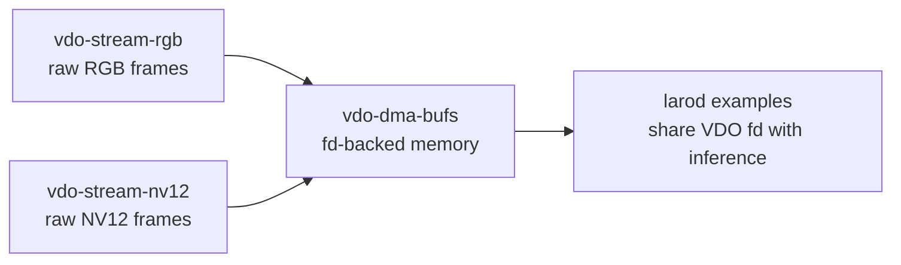
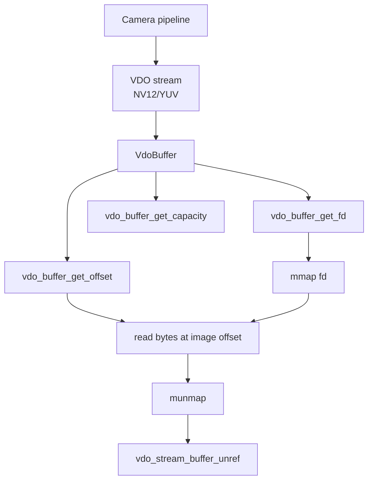
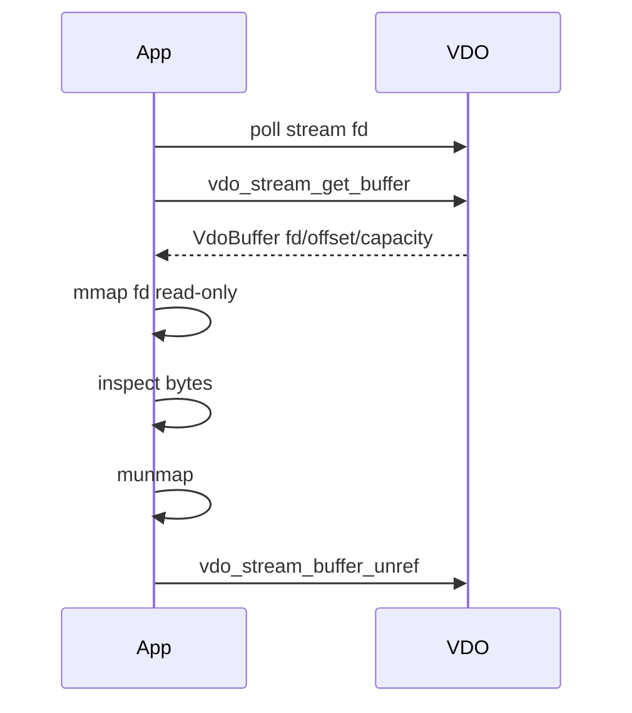

# vdo-dma-bufs

This example teaches how VDO exposes frame memory through file descriptors. It
does not use larod. It only shows how to inspect VDO buffers as fd-backed memory
and how to map the fd with `mmap`.

This is the VDO-only foundation for understanding zero-copy pipelines.

## Where This Fits



The later larod examples use the same concept, but this example deliberately
stops at VDO and `mmap`.

## Learning Goal

By the end of this example, you should be able to explain:

- a VDO frame can be represented by a file descriptor
- the image may start at an offset inside the fd-backed memory
- capacity is the mapped buffer size, not always the visible image size
- `mmap` lets the CPU inspect bytes without copying them
- the VDO buffer must still be returned to VDO after inspection

## Architecture



## Important: This Is Not larod

This sample does not:

- create larod tensors
- track tensors
- run inference
- convert VDO memory into model input

It only proves that a VDO buffer can expose fd-backed memory. That fd can later
be shared with other APIs, but this example keeps the scope to VDO.

## Stream Setup

The app requests YUV frames:

```c
vdo_map_set_uint32(vdo_settings, "channel", channel);
vdo_map_set_uint32(vdo_settings, "format", VDO_FORMAT_YUV);
vdo_map_set_double(vdo_settings, "framerate", framerate);
vdo_map_set_uint32(vdo_settings, "buffer.count", 2);
vdo_map_set_boolean(vdo_settings, "socket.blocking", false);
vdo_map_set_string(vdo_settings, "image.fit", "scale");
```

It also requests a 640 x 640 stream:

```c
VdoPair32u resolution = {
    .w = MODEL_INPUT_W,
    .h = MODEL_INPUT_H,
};
vdo_map_set_pair32u(vdo_settings, "resolution", resolution);
```

The name `MODEL_INPUT_W/H` is historical from ML examples. In this VDO-only
sample it simply means requested stream width and height.

## Read Stream Info

The sample logs stream metadata:

```c
VdoMap* info = vdo_stream_get_info(stream, &error);

vdo_map_get_uint32(info, "width", 0);
vdo_map_get_uint32(info, "height", 0);
vdo_map_get_uint32(info, "pitch", 0);
vdo_map_get_uint32(info, "format", 0);
vdo_map_get_string(info, "buffer.type", NULL, "unknown");
vdo_map_get_uint32(info, "buffer.count", 0);
```

This helps connect the fd to the actual frame layout.

## Non-Blocking Frame Loop

The stream is non-blocking, so the app polls:

```c
int fd = vdo_stream_get_fd(vdo_stream, &vdo_error);

struct pollfd fds = {
    .fd = fd,
    .events = POLL_IN,
};

poll(&fds, 1, -1);
```

Then it fetches a frame:

```c
VdoBuffer* vdo_buf = vdo_stream_get_buffer(vdo_stream, &vdo_error);
```

## Inspect The DMA-BUF

The important function is `inspect_dma_buffer`.

```c
int fd = vdo_buffer_get_fd(buffer);
int64_t offset = vdo_buffer_get_offset(buffer);
size_t capacity = vdo_buffer_get_capacity(buffer);
VdoFrame* frame = vdo_buffer_get_frame(buffer);
size_t frame_size = frame ? vdo_frame_get_size(frame) : 0;
```

Meaning:

| Value | Meaning |
| --- | --- |
| `fd` | file descriptor for the buffer memory |
| `offset` | where image data starts inside the mapped memory |
| `capacity` | total mappable buffer capacity |
| `frame_size` | size of this frame payload |

These are different on purpose. Do not assume the image starts at byte zero or
that frame size equals capacity.

## mmap

The fd is mapped read-only:

```c
void* mapped = mmap(NULL, capacity, PROT_READ, MAP_SHARED, fd, 0);
```

Then the code reads a small bounded byte range at the image offset:

```c
uint8_t* bytes = (uint8_t*)mapped;
size_t start = offset >= 0 ? (size_t)offset : 0u;

for (size_t i = 0; i < bytes_to_dump; i++) {
    snprintf(tmp, sizeof(tmp), "%02X ", bytes[start + i]);
}
```

Finally:

```c
munmap(mapped, capacity);
```

This is inspection only. It is not copying the frame into a new image buffer.

## Buffer Return

After inspection, return the buffer:

```c
vdo_stream_buffer_unref(vdo_stream, &vdo_buf, &vdo_error);
```

This matters even when you mapped and unmapped the fd. `munmap` releases your CPU
mapping. `vdo_stream_buffer_unref` returns the VDO buffer to the stream.



## What I Would Change To Explain DMA-BUF Better

The code has been adjusted to make the lesson clearer:

- logs stream info, including `buffer.type`
- logs fd, offset, capacity, and frame size together
- maps only the capacity returned by VDO
- dumps a small bounded range from the image offset
- uses `vdo_stream_buffer_unref` instead of manually unrefing a `g_autoptr`
- avoids a hardcoded byte range such as `99980..100020`
- avoids unexplained `buffer.access = 2u`

These changes make the sample about concepts, not magic constants.

## What This Teaches

- VDO can expose frame memory as an fd.
- fd-backed memory can be mapped with `mmap`.
- offset and capacity are part of the memory contract.
- mapping memory is not the same as owning the VDO buffer.
- VDO buffer lifecycle still applies.
- zero-copy means sharing memory references, not duplicating image bytes.

## What This Does Not Teach

- larod tensor tracking
- DMA synchronization with hardware accelerators
- writing into VDO buffers
- producer streams
- format conversion

Those should be separate lessons.

## Build

```bash
docker build --tag vdo-dma-bufs --build-arg ARCH=aarch64 .
docker cp $(docker create vdo-dma-bufs):/opt/app ./build
```

## Exercises

1. Compare `capacity` and `frame_size`.
2. Log stream `pitch` and relate it to the first bytes you dump.
3. Change resolution and observe capacity changes.
4. Change format to RGB and compare frame size.
5. Count how often the same fd reappears. VDO reuses a small buffer pool.
