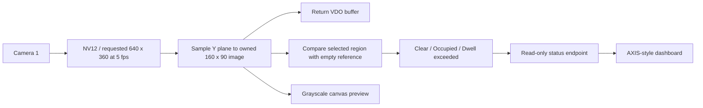

# VDO inspection zone monitor

A fixed camera watches an inspection area. An operator calibrates an empty
reference, places a component inside the region, and sees **Clear → Occupied →
Dwell exceeded**. This example uses real VDO pixels, not a simulated sensor.
A desk and a box are enough for the workshop.

## What students learn

- Request an NV12 stream and inspect its returned width, height, and row pitch.
- Poll a non-blocking stream without waiting inside parameter callbacks.
- Read the brightness (Y) plane respecting padded rows and frame bounds.
- Copy a small image, return the VDO buffer immediately, and analyze owned memory.
- Turn pixel differences into a debounced state with hysteresis and a dwell timer.
- Keep unavailable video distinct from an empty inspection zone.



## Build and install

From this directory, for an aarch64 camera:

```bash
docker build --tag vdo-inspection-zone-monitor --build-arg ARCH=aarch64 .
mkdir -p build
container_id=$(docker create vdo-inspection-zone-monitor)
docker cp "$container_id":/opt/app/VDO_Inspection_Zone_Monitor_1_0_0_aarch64.eap ./build/
docker rm "$container_id"
```

Use the SDK's supported architecture for your device. If selecting `armv7hf`,
change the package filename accordingly. SDK 12.10.0 validates the package's
minimum OS requirement during build. The NV12 convenience API requires AXIS OS
12.8 or later; the built package may require a newer OS due to SDK dependencies.
The camera must support the requested VDO stream and have available resources.

Sign the EAP if required by the device, install it from Apps, and start it.
Open Settings or `/local/vdo_inspection_zone/index.html` on the camera.
The dashboard and its endpoints require a camera administrator login.
The app requests the `video` group for VDO and `admin` for the Parameter API,
following the existing workshop examples.

## First demonstration

1. Fix the camera position and let exposure settle. Frame a flat, evenly lit desk.
2. Open Settings. Confirm that real grayscale frames and the measured FPS appear.
3. Adjust Left, Top, Width, and Height as percentages. The blue dashed rectangle
   previews edits; the yellow rectangle is the running region. Save settings.
4. Clear the region, wait a moment, and click **Calibrate empty zone**. Keep it
   empty for all ten frames (about two seconds at the requested rate).
5. Place a contrasting box in the rectangle. After one second above the change
   threshold, the state becomes Occupied. The dwell timer starts at this point.
6. Leave it for the configured dwell limit to see Dwell exceeded.
7. Remove the box. After a sustained clear result for one second, the state clears.
8. Move the box outside the rectangle: it should not affect the region's score.

The preview is the **same sampled Y-plane image used by the algorithm**, sent
as base64 in the status response twice per second and drawn on a canvas.
It is intentionally low-resolution and grayscale. It is not a separate media.cgi
video stream, so the drawn region matches the pixels being analyzed. The region
is drawn only on this page; it does not alter the camera's video overlay.

## Parameters and calibration

| Parameter | Default | Meaning |
| --- | --- | --- |
| Enabled | yes | Enable monitoring; capture/preview continue when disabled. |
| Zone | 20,20,60,60 | Left, top, width, height in percent; one atomic rectangle string. |
| PixelDelta | 25 | Absolute 0–255 brightness difference required to count a pixel. |
| OccupiedPercent | 10 | Percentage of sampled region pixels required to enter occupied. |
| DwellSeconds | 10 | Seconds after confirmed occupancy before Dwell exceeded. |

The parameter group is `root.Vdo_inspection_zone`. Settings persist through
restarts. Zone must fit inside the image; width is at least 1%, height at least 2%.
Other ranges are 1–255, 1–100, and 1–3600 respectively. Invalid changes are
rejected by the running app and logged; an invalid value stored by the Parameter
API may still require correction before restarting. Saves are not transactional
across different parameters; the page waits for matching running values.

Any settings callback clears calibration and the dwell timer. Wait at least one
second after changes before calibrating. Calibration is an explicit admin POST
to `calibrate.cgi`, requires `X-Zone-Action: calibrate`, and is acknowledged in
status with `calibrationId`. It does not replay automatically after restart.
The reference stays in RAM, is averaged over ten received frames, and is never
adapted while monitoring. Changing camera position, zoom, lighting or exposure
may require a new empty reference even if the stream continues uninterrupted.

## Algorithm and limitations

For each sampled pixel inside the region, compare current luma with the averaged
reference. Count differences of at least PixelDelta, then divide by region pixel
count to obtain the displayed percentage. To enter Occupied, the score must stay
at or above OccupiedPercent for one second. To leave, it must stay below 60% of
that threshold for one second. This hysteresis reduces flicker near the boundary.
Dwell starts when occupancy is confirmed, not at the first changed pixel.

This detects **visual change**, not objects or verified conveyor jams. Shadows,
auto-exposure changes, reflections, vibration and camera motion can trigger it.
Low-contrast or very small objects can be missed; nearest-neighbor sampling is
intentionally simple. Keep the camera fixed and use a contrasting test object.
Clearing a zone depends on matching the original reference, not on understanding
what an empty scene is. No event publication, machine control, larod model, or
Overlay2 integration is included; these are follow-on exercises.

## Failure behavior

- No fresh frames for three seconds, a stream error, or invalid/truncated frame:
  state becomes Unknown, reference and dwell are cleared, and capture retries
  after five seconds. A recovered stream requires manual recalibration.
- Frame capture timestamps are checked against monotonic time. Old frames do not
  silently keep occupancy alive. The displayed FPS measures processed frames.
- Browser failures clear the preview and measurements and disable configuration.
- Stopping releases the VDO stream and shuts down the status worker.
- Resource/stream creation failures appear on the page and in the app log.

## Tests

```bash
node --test tests/dashboard.test.cjs
docker build -f tests/Dockerfile --tag vdo-inspection-zone-monitor-tests .
```

C fixtures cover stride and buffer bounds, calibration averaging, changes outside
the ROI, debounce, hysteresis, dwell and Unknown state. Dashboard tests cover
editing during polling, confirmation of applied settings, invalid rectangles,
calibration acknowledgement and disconnection. The SDK build checks API linkage
and manifest validity. These checks do not replace testing on a camera.

## Source guide

- `app/main.c`: VDO lifecycle, frame ownership, parameter callbacks and status.
- `app/inspection.c`: bounded luma sampling, reference and state machine.
- `app/status_server.c`: snapshot GET and calibration POST via FastCGI.
- `app/html/app.js`: grayscale rendering, region preview and settings controls.

References: [VDO overview](https://developer.axis.com/acap/api/src/api/vdostream/html/index.html),
[NV12 example](https://developer.axis.com/acap/api/src/api/vdostream/html/vdo-example-nv12_8cc-example.html),
[buffer lifetime](https://developer.axis.com/acap/api/src/api/vdostream/html/vdo-buffer_8h.html).
