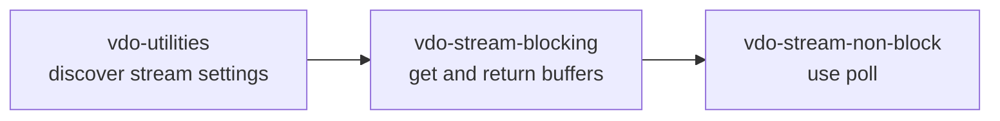
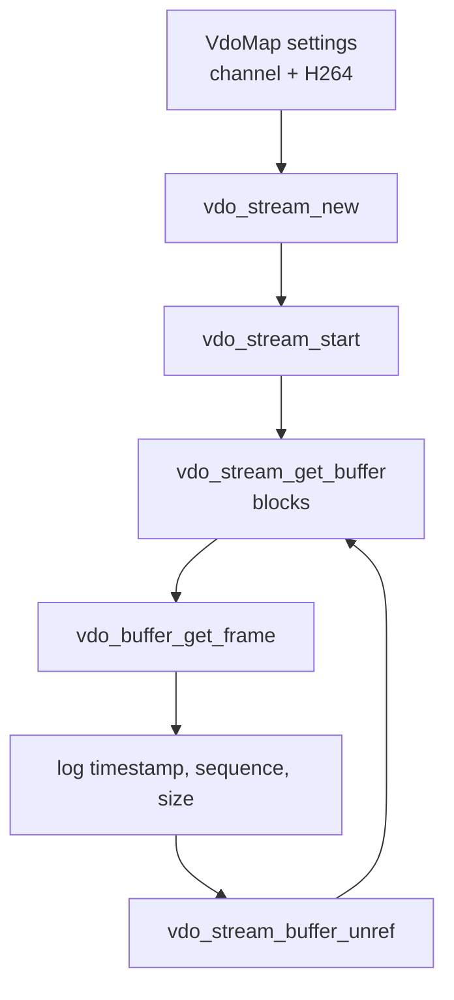
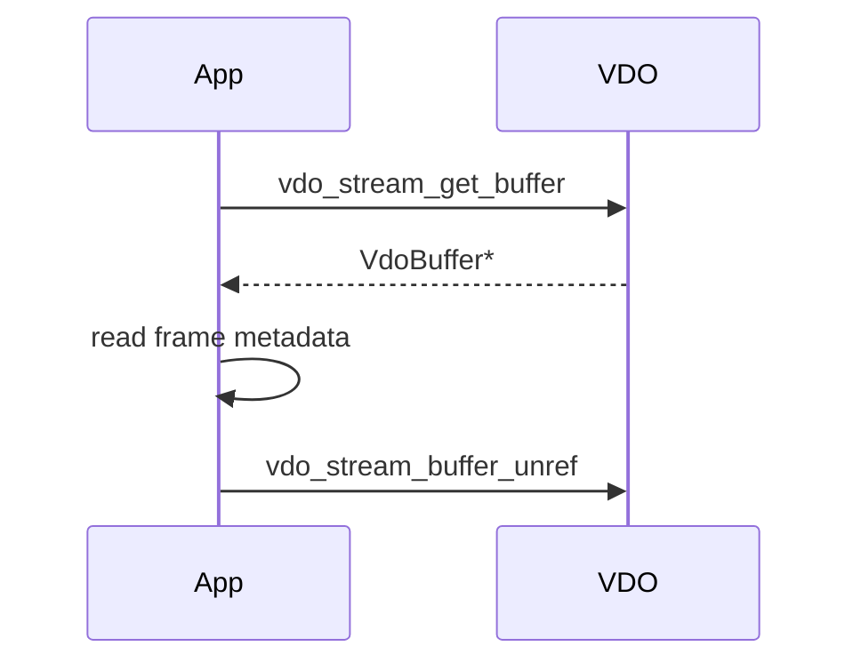

# vdo-stream-blocking

This is the simplest frame-fetching VDO example. It creates an H.264 stream,
starts it, fetches 10 frames, logs frame metadata, and returns each buffer to
VDO.

The key lesson is buffer ownership.

## Where This Fits



## Architecture



## What Blocking Means

In this example, the stream does not set:

```c
vdo_map_set_boolean(settings, "socket.blocking", FALSE);
```

So `vdo_stream_get_buffer` waits until a frame is available:

```c
VdoBuffer* vdo_buf = vdo_stream_get_buffer(stream, &error);
```

This is simple and useful for teaching. It is less flexible than a poll-driven
loop because the thread cannot wait on other events at the same time.

## Step 1: Create Stream Settings

```c
settings = vdo_map_new();

vdo_map_set_uint32(settings, "channel", 1u);
vdo_map_set_uint32(settings, "format", VDO_FORMAT_H264);
```

This requests an encoded H.264 stream from channel 1.

## Step 2: Create And Start The Stream

```c
stream = vdo_stream_new(settings, NULL, &error);

if (!vdo_stream_start(stream, &error)) {
    return handle_vdo_failed(error);
}
```

`vdo_stream_new` creates the stream object. `vdo_stream_start` starts frame
delivery.

## Step 3: Read Stream Info

```c
info = vdo_stream_get_info(stream, &error);

syslog(LOG_INFO,
       "Starting stream resolution: %ux%u, at %u fps",
       vdo_map_get_uint32(info, "width", 0),
       vdo_map_get_uint32(info, "height", 0),
       (unsigned int)(vdo_map_get_double(info, "framerate", 0.0) + 0.5));
```

Always read back stream info. VDO may adjust settings based on product
capabilities.

## Step 4: Fetch A Buffer

```c
VdoBuffer* vdo_buf = vdo_stream_get_buffer(stream, &error);
```

For a blocking stream, this call waits until a frame is ready.

## Step 5: Inspect Frame Metadata

```c
VdoFrame* frame = vdo_buffer_get_frame(vdo_buf);
gint64 pts = vdo_frame_get_timestamp(frame);

syslog(LOG_INFO,
       "Timestamp: %u us - Frame: %u, Size: %zu",
       (unsigned int)pts,
       vdo_frame_get_sequence_nbr(frame),
       vdo_frame_get_size(frame));
```

The example logs metadata only. It does not decode H.264 bytes.

## Step 6: Return The Buffer

```c
vdo_stream_buffer_unref(stream, &vdo_buf, &error);
```

This is mandatory. VDO owns the buffer pool. If the app does not return buffers,
the stream eventually stalls.



## Ownership Rule

```text
Use VdoBuffer only between get_buffer and buffer_unref.
```

Do not keep `VdoFrame*`, raw data pointers, or fd assumptions after returning
the buffer.

## What This Teaches

- create a stream with `VdoMap`
- start a stream
- fetch frames in blocking mode
- inspect `VdoFrame` metadata
- return buffers correctly

## What Comes Next

`vdo-stream-non-block` keeps the same stream idea but adds:

- `socket.blocking = FALSE`
- `vdo_stream_get_fd`
- `poll`
- handling `VDO_ERROR_NO_DATA`

## Build

```bash
docker build --tag vdo-stream-blocking --build-arg ARCH=aarch64 .
docker cp $(docker create vdo-stream-blocking):/opt/app ./build
```
