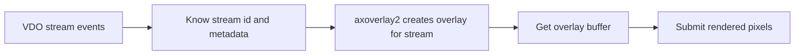

# VDO Stream Events

This example is a bridge between the VDO examples and `overlay2/`. It does not read video frames and it does not use `axoverlay2`. Instead, it teaches how an ACAP application listens for VDO stream lifecycle events.

This is the missing concept needed before learning the new overlay API. `axoverlay2` creates overlays for active VDO streams, so the application must first know when overlay-capable streams appear and disappear.

## What this example teaches

- How to open VDO pseudo-stream `0`.
- How to attach the `"overlay"` stream filter.
- How to get the VDO event file descriptor.
- How to integrate that file descriptor into a GLib main loop.
- How to handle stream `EXISTING`, `CREATED`, and `CLOSED` events.
- How to read basic stream metadata such as width, height, format, camera, and rotation.

## Code Flow

```mermaid
sequenceDiagram
    participant App as vdo_stream_events
    participant VDO
    participant Loop as GLib main loop

    App->>VDO: vdo_stream_get(0)
    App->>VDO: Attach filter=overlay
    App->>VDO: vdo_stream_get_event_fd()
    App->>Loop: g_io_add_watch(event_fd)
    VDO-->>Loop: Stream event available
    Loop->>App: stream_event_callback()
    App->>VDO: vdo_stream_get_event()
    App->>VDO: vdo_stream_get_info(stream_id)
    App->>App: Log stream metadata
```

## Why Stream 0 Is Special

The example opens VDO stream `0`:

```c
event_stream = vdo_stream_get(0, &error);
```

Stream `0` is not a normal video frame stream. It is a pseudo-stream used to receive events about other streams.

## Overlay Filter

The example attaches a filter:

```c
stream_filter = vdo_map_new();
vdo_map_set_string(stream_filter, "filter", "overlay");
vdo_stream_attach(event_stream, stream_filter, &error);
```

This asks VDO for events about streams that can use overlays. That is the same kind of stream discovery used by `axoverlay2` examples.

## Event FD And Main Loop

VDO exposes an event fd:

```c
int event_fd = vdo_stream_get_event_fd(event_stream, &error);
```

The app adds it to the GLib event loop:

```c
channel = g_io_channel_unix_new(event_fd);
watch_id = g_io_add_watch(channel,
                          G_IO_IN | G_IO_PRI | G_IO_ERR | G_IO_HUP,
                          stream_event_callback,
                          NULL);
```

This pattern is useful when an app needs to combine stream events, timers, sockets, web APIs, or overlay updates in one event loop.

## Event Types

The callback reads one event:

```c
event = vdo_stream_get_event(event_stream, &error);
```

Then it checks the event type and stream id:

```c
unsigned event_type = vdo_map_get_uint32(event, "event", 0);
unsigned stream_id = vdo_map_get_uint32(event, "id", 0);
```

The important event types are:

| Event | Meaning | What this example does |
| --- | --- | --- |
| `VDO_STREAM_EVENT_EXISTING` | A stream already existed when the app started | Logs stream metadata |
| `VDO_STREAM_EVENT_CREATED` | A new stream was created | Logs stream metadata |
| `VDO_STREAM_EVENT_CLOSED` | A stream closed | Logs the close event |

## Relationship To axoverlay2



In `overlay2/`, the same stream event pattern is followed by:

```c
axo_match_stream_id(match, stream_id);
axo_create_overlay(props, match, &axo_error);
```

This example stops just before that point so students can learn VDO stream lifecycle separately.

## Build

```sh
docker build --tag vdo-stream-events --build-arg ARCH=aarch64 .
docker cp $(docker create vdo-stream-events):/opt/app ./build
```

Install the generated `.eap` file on the camera and start the app. Then open or close video streams that use overlays and watch the application log.

## Classroom Exercises

1. Remove the `"overlay"` filter and compare which streams are reported.
2. Log additional keys from `stream_info`.
3. Start the app before and after opening a video stream and compare `EXISTING` versus `CREATED`.
4. Add a counter for active streams.
5. Use this example side by side with `overlay2/draw-rectangle` and identify where `overlay2` adds overlay creation.
