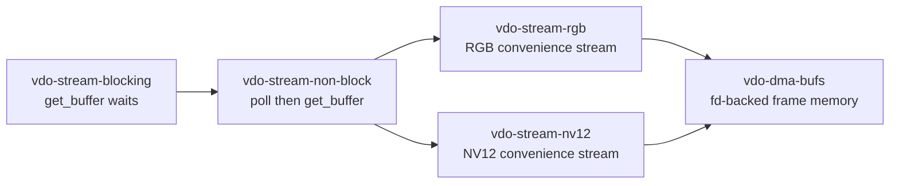
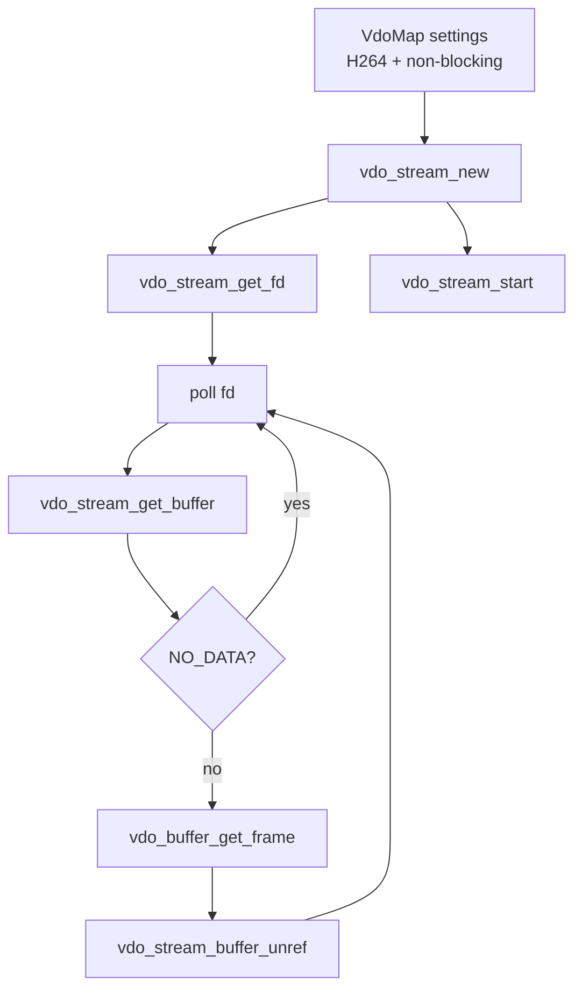
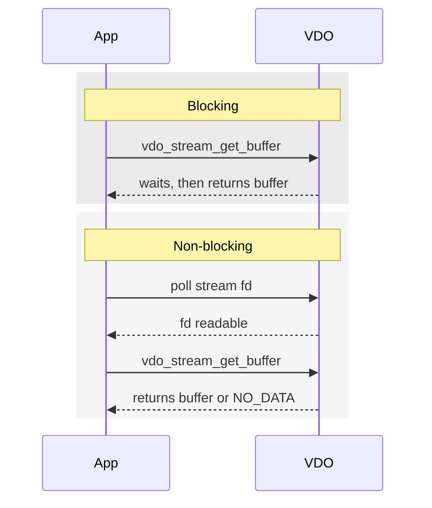

# vdo-stream-non-block

This example adds the VDO stream fd and `poll`. It is the non-blocking version
of `vdo-stream-blocking`.

The important idea is that frame availability becomes an event. The application
waits on the stream fd, then calls `vdo_stream_get_buffer`.

## Where This Fits



## Architecture



## Step 1: Make The Stream Non-Blocking

```c
vdo_map_set_uint32(settings, "channel", 1u);
vdo_map_set_uint32(settings, "format", VDO_FORMAT_H264);
vdo_map_set_boolean(settings, "socket.blocking", FALSE);
```

With this setting, `vdo_stream_get_buffer` should not be used as the wait
mechanism. It may return no data if no frame is ready.

## Step 2: Get The Stream fd

```c
int fd = vdo_stream_get_fd(stream, &error);

struct pollfd fds = {
    .fd = fd,
    .events = POLL_IN,
};
```

This fd becomes readable when VDO has data available.

## Step 3: Poll

```c
int status = 0;
do {
    status = poll(&fds, 1, -1);
} while (status == -1 && errno == EINTR);
```

`EINTR` means a signal interrupted the wait. The sample retries.

## Step 4: Fetch The Buffer

```c
VdoBuffer* vdo_buf = vdo_stream_get_buffer(stream, &error);

if (!vdo_buf && g_error_matches(error, VDO_ERROR, VDO_ERROR_NO_DATA)) {
    g_clear_error(&error);
    continue;
}
```

Even after `poll`, handle `VDO_ERROR_NO_DATA`. It can happen during transient
stream changes or races.

## Step 5: Inspect And Return

```c
VdoFrame* frame = vdo_buffer_get_frame(vdo_buf);
gint64 pts = vdo_frame_get_timestamp(frame);

vdo_stream_buffer_unref(stream, &vdo_buf, &error);
```

The ownership rule stays the same as the blocking example:

```text
get buffer -> use buffer -> return buffer
```

## Blocking vs Non-Blocking



## Why This Pattern Matters

Non-blocking VDO is the pattern used by more realistic applications because the
same event loop can later wait on:

- VDO stream fd
- network sockets
- timers
- IPC
- shutdown signals
- multiple streams

## What This Teaches

- how to enable non-blocking VDO
- how to retrieve the stream fd
- how to use `poll`
- why `NO_DATA` must still be handled
- why buffer ownership is unchanged

## Build

```bash
docker build --tag vdo-stream-non-block --build-arg ARCH=aarch64 .
docker cp $(docker create vdo-stream-non-block):/opt/app ./build
```
