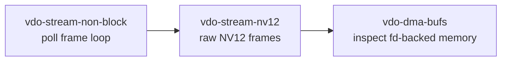
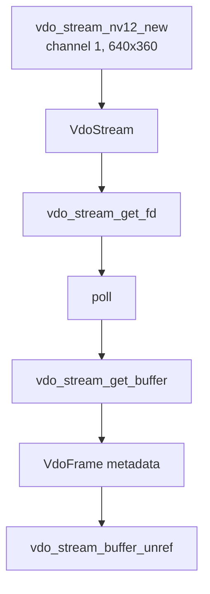
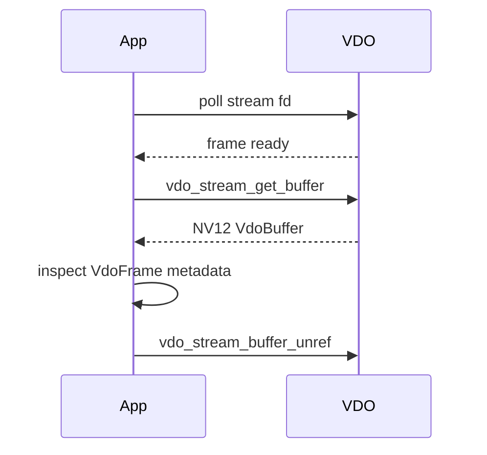

# vdo-stream-nv12

This example requests NV12 frames from VDO using the convenience constructor
`vdo_stream_nv12_new`.

It uses the same non-blocking `poll` pattern as `vdo-stream-rgb`, but the raw
frame layout is YUV/NV12 instead of RGB.

## Where This Fits



## Architecture



## Why NV12

NV12 is a common camera/native YUV format. It is more compact than RGB and is
often what downstream hardware blocks prefer.

NV12 memory layout:

```text
Y plane:
  one byte per pixel
  width x height samples

UV plane:
  interleaved U,V samples
  half vertical resolution
```

Conceptually:

```text
YYYYYYYYYYYYYYYY
YYYYYYYYYYYYYYYY
YYYYYYYYYYYYYYYY
YYYYYYYYYYYYYYYY
UVUVUVUVUVUVUVUV
UVUVUVUVUVUVUVUV
```

The exact pitch/stride can be larger than visible width, so always read stream
info when you need to calculate memory offsets.

## Create The NV12 Stream

```c
stream = vdo_stream_nv12_new(NULL,
                             1u,
                             (VdoResolution){ .width = 640u, .height = 360u },
                             &error);
```

This helper is roughly equivalent to:

```c
vdo_map_set_uint32(settings, "channel", 1u);
vdo_map_set_uint32(settings, "format", VDO_FORMAT_YUV);
vdo_map_set_string(settings, "subformat", "NV12");
vdo_map_set_pair32u(settings, "resolution", resolution);
```

## Poll And Fetch

```c
int fd = vdo_stream_get_fd(stream, &error);
struct pollfd fds = {
    .fd = fd,
    .events = POLL_IN,
};

poll(&fds, 1, -1);
VdoBuffer* vdo_buf = vdo_stream_get_buffer(stream, &error);
```

The loop is the same as RGB. Only the frame format changes.

## Read Stream Info

```c
VdoMap* info = vdo_stream_get_info(stream, &error);

syslog(LOG_INFO,
       "Starting stream format NV12 - resolution: %ux%u, at %u fps",
       vdo_map_get_uint32(info, "width", 0),
       vdo_map_get_uint32(info, "height", 0),
       (unsigned int)(vdo_map_get_double(info, "framerate", 0.0) + 0.5));
```

Useful fields to log in experiments:

```c
vdo_map_get_uint32(info, "width", 0);
vdo_map_get_uint32(info, "height", 0);
vdo_map_get_uint32(info, "pitch", 0);
vdo_map_get_uint32(info, "format", 0);
```

## Buffer Lifecycle



## NV12 vs RGB

| Aspect | NV12 | RGB |
| --- | --- | --- |
| Color model | YUV | RGB |
| Approx bytes per pixel | 1.5 | 3 |
| Common source | camera pipeline | CPU/model-friendly |
| Conversion needed for many models | yes | often no |

## What This Teaches

- how to request NV12 frames
- how raw camera formats differ from RGB
- why pitch/stride matters
- why later preprocessing examples often convert NV12 to RGB

## Build

```bash
docker build --tag vdo-stream-nv12 --build-arg ARCH=aarch64 .
docker cp $(docker create vdo-stream-nv12):/opt/app ./build
```

## Exercises

1. Log `vdo_frame_get_size` and compare to `width * height * 3 / 2`.
2. Log pitch and explain why it may differ from width.
3. Capture bytes to a file and inspect with:

```bash
ffplay -f rawvideo -pixel_format nv12 -video_size 640x360 /tmp/out.nv12
```
