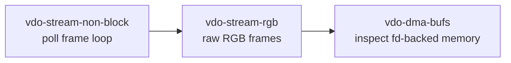
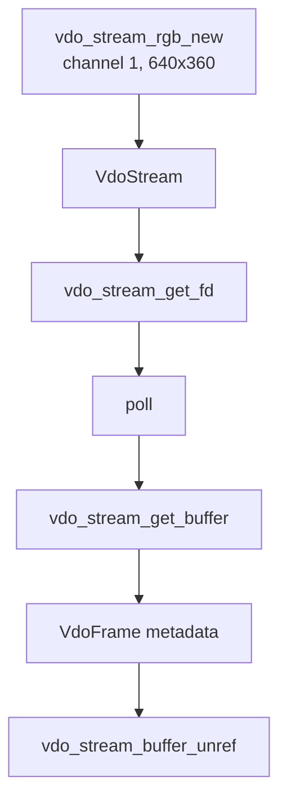
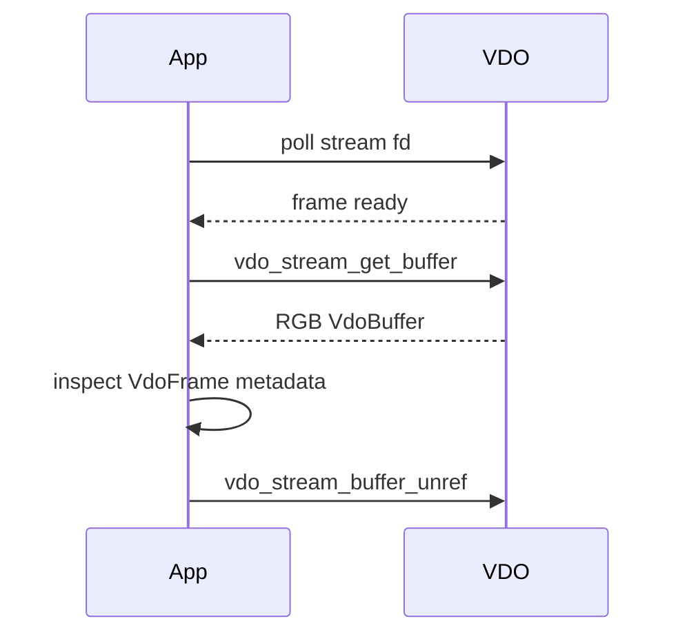

# vdo-stream-rgb

This example requests RGB frames from VDO using the convenience constructor
`vdo_stream_rgb_new`.

It keeps the non-blocking `poll` pattern from `vdo-stream-non-block`, but changes
the stream format from encoded H.264 to raw RGB pixels.

## Where This Fits



## Architecture



## Why RGB

RGB is easy to reason about:

```text
R G B R G B R G B ...
```

It is often convenient for CPU image processing and some ML models. It is larger
than NV12 because it usually uses 3 bytes per pixel.

## Create The RGB Stream

```c
stream = vdo_stream_rgb_new(NULL,
                            1u,
                            (VdoResolution){ .width = 640u, .height = 360u },
                            &error);
```

This convenience API is roughly equivalent to building a `VdoMap` with:

```c
vdo_map_set_uint32(settings, "channel", 1u);
vdo_map_set_uint32(settings, "format", VDO_FORMAT_RGB);
vdo_map_set_pair32u(settings, "resolution", resolution);
```

The helper keeps the example focused on format behavior instead of map setup.

## Poll And Fetch

The loop is the same non-blocking pattern:

```c
int fd = vdo_stream_get_fd(stream, &error);
struct pollfd fds = {
    .fd = fd,
    .events = POLL_IN,
};

poll(&fds, 1, -1);
VdoBuffer* vdo_buf = vdo_stream_get_buffer(stream, &error);
```

## Read Stream Info

```c
VdoMap* info = vdo_stream_get_info(stream, &error);

syslog(LOG_INFO,
       "Starting stream format RGB - resolution: %ux%u, at %u fps",
       vdo_map_get_uint32(info, "width", 0),
       vdo_map_get_uint32(info, "height", 0),
       (unsigned int)(vdo_map_get_double(info, "framerate", 0.0) + 0.5));
```

The stream info tells you what VDO actually created.

## Buffer Lifecycle



## RGB vs Encoded H.264

| Aspect | H.264 stream | RGB stream |
| --- | --- | --- |
| Data | compressed video bytes | raw pixels |
| Size | smaller | larger |
| CPU readability | needs decoding | direct pixel values |
| Useful for | streaming/recording | image processing/ML input |

## What This Teaches

- how to request RGB frames
- how convenience constructors simplify stream creation
- how the non-blocking frame loop stays the same across formats
- why raw format choice affects memory size and downstream processing

## Build

```bash
docker build --tag vdo-stream-rgb --build-arg ARCH=aarch64 .
docker cp $(docker create vdo-stream-rgb):/opt/app ./build
```

## Exercises

1. Change the resolution and compare `vdo_frame_get_size`.
2. Log stream pitch from `vdo_stream_get_info`.
3. Compare this output size with `vdo-stream-nv12` at the same resolution.
