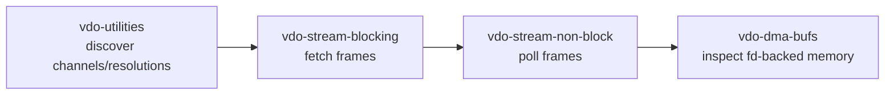
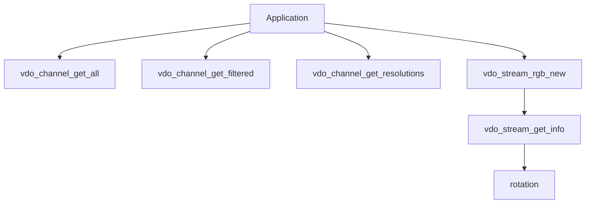
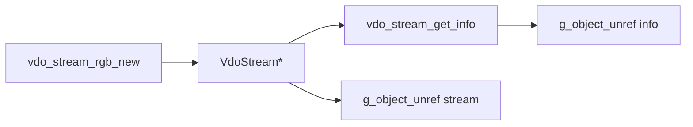

# vdo-utilities

This is the discovery example for VDO. It does not fetch frames. It shows how to
ask the camera what video channels exist, which resolutions are supported, and
what stream metadata such as rotation looks like.

Use this before choosing hardcoded stream settings in later examples.

## Where This Fits



## Concepts



VDO has two related APIs:

- channel API: discover what camera/video pipelines are available
- stream API: create a stream from one channel and requested settings

## What The App Does

1. Lists available video channels.
2. Lists filtered input channels.
3. Lists supported resolutions for channel 1.
4. Creates an RGB stream at 640 x 360.
5. Reads stream rotation from `vdo_stream_get_info`.
6. Releases the stream.

## Channel Discovery

```c
GList* channels = vdo_channel_get_all(&error);

for (GList* list = channels; list; list = list->next) {
    VdoChannel* channel = list->data;
    guint id = vdo_channel_get_id(channel);
    syslog(LOG_INFO, "Channel id: %u", id);
}
```

Channels are logical video pipelines. Most examples in this repo use channel 1,
but real products may expose more.

## Filtered Channels

```c
VdoMap* filter = vdo_map_new();
vdo_map_set_string(filter, "key", "input");

GList* filtered_channels = vdo_channel_get_filtered(filter, &error);
```

Filtering is useful when you want only camera input channels rather than every
VDO channel type.

## Supported Resolutions

```c
VdoChannel* channel = vdo_channel_get(1u, &error);

VdoMap* map = vdo_map_new();
vdo_map_set_string(map, "aspect_ratio", "native");

VdoResolutionSet* set = vdo_channel_get_resolutions(channel, map, &error);
```

The app logs each resolution:

```c
for (size_t i = 0; i < set->count; ++i) {
    VdoResolution* res = &set->resolutions[i];
    syslog(LOG_INFO, "[%zu] %ux%u", i, res->width, res->height);
}
```

Use this list when selecting width and height in later examples.

## Create A Stream Only To Inspect Info

The app creates a stream but does not start it:

```c
vdo_stream = vdo_stream_rgb_new(NULL,
                                1u,
                                (VdoResolution){ .width = 640, .height = 360 },
                                &error);
```

Then it reads stream info:

```c
VdoMap* info = vdo_stream_get_info(stream, &error);
syslog(LOG_INFO, "Current stream rotation: %u",
       vdo_map_get_uint32(info, "rotation", 0));
```

You can inspect metadata before fetching frames.

## Ownership



Anything returned as a GLib object must be unreferenced when done.

## What This Teaches

- how to discover VDO channels
- how to list valid resolutions
- how to create a stream object
- how to read stream metadata
- why later examples should read back actual stream info

## Build

```bash
docker build --tag vdo-utilities --build-arg ARCH=aarch64 .
docker cp $(docker create vdo-utilities):/opt/app ./build
```

## Exercises

1. Change the channel id from `1u` to another discovered channel.
2. Remove the native aspect ratio filter and compare resolution output.
3. Log width, height, format, pitch, and framerate from stream info.
4. Create an NV12 stream instead of RGB and compare stream info.
