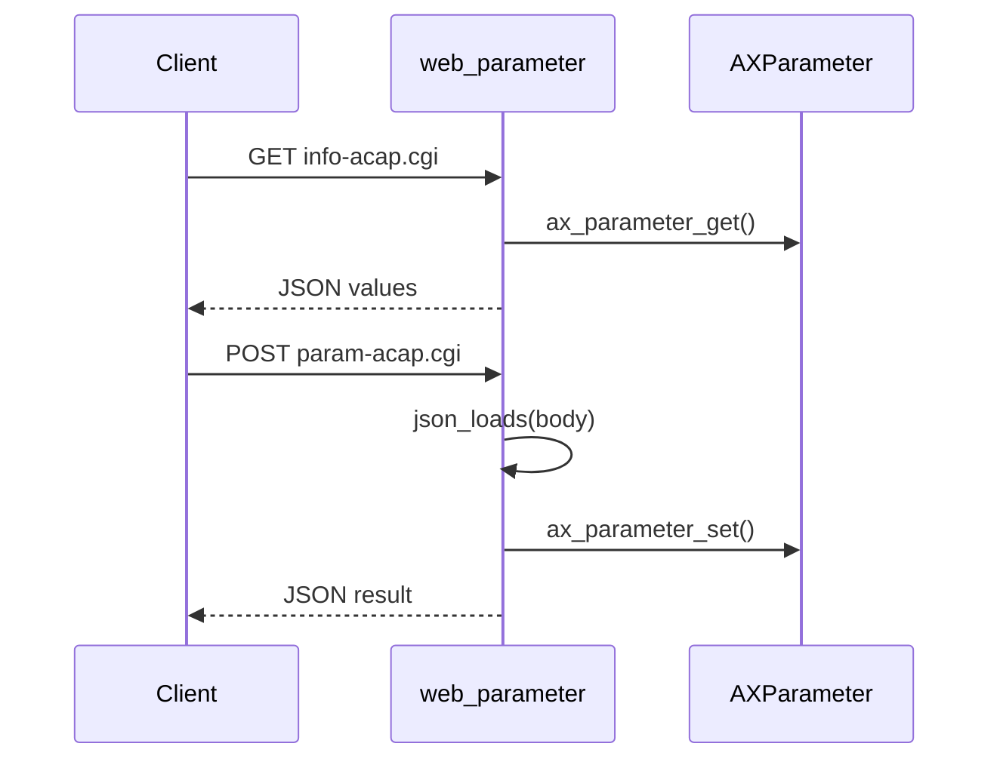

# Web Parameter

This example exposes a small FastCGI API that reads and writes AXParameter values. It is the minimal webserver example: one process, one FastCGI accept loop, two JSON endpoints.

## Endpoints

| Method | Path | Meaning |
| --- | --- | --- |
| `GET` | `/local/web_parameter/info-acap.cgi` | Read current `MulticastAddress` and `MulticastPort` |
| `POST` | `/local/web_parameter/param-acap.cgi` | Update one or both values from a JSON body |

## Code Flow



## Routing

The router uses `SCRIPT_NAME` and `REQUEST_METHOD` supplied by FastCGI:

```c
const char* script = FCGX_GetParam("SCRIPT_NAME", req->envp);
const char* method = FCGX_GetParam("REQUEST_METHOD", req->envp);

if (strcmp(script, "/local/web_parameter/info-acap.cgi") == 0 &&
    strcmp(method, "GET") == 0) {
    handle_info(req, h);
}
```

## Reading JSON

The request body is bounded to avoid reading untrusted large input:

```c
long len = strtol(content_length, NULL, 10);
if (len <= 0 || len > 1<<20)
    return NULL;
```

Then Jansson parses the body:

```c
json_t* root = json_loads(body, 0, &jerr);
```

## Parameter Access

The GET endpoint reads values:

```c
param_get_string(handle, "MulticastAddress", &addr);
param_get_string(handle, "MulticastPort", &port);
```

The POST endpoint writes values:

```c
param_set_string(h, "MulticastAddress", s);
param_set_string(h, "MulticastPort", s);
```

## Build

```sh
docker build --tag web-parameter --build-arg ARCH=aarch64 .
docker cp $(docker create web-parameter):/opt/app ./build
```

## Classroom Exercises

1. Add validation for multicast address format.
2. Add a new parameter and expose it in both endpoints.
3. Return `405 Method Not Allowed` for known paths with the wrong method.
