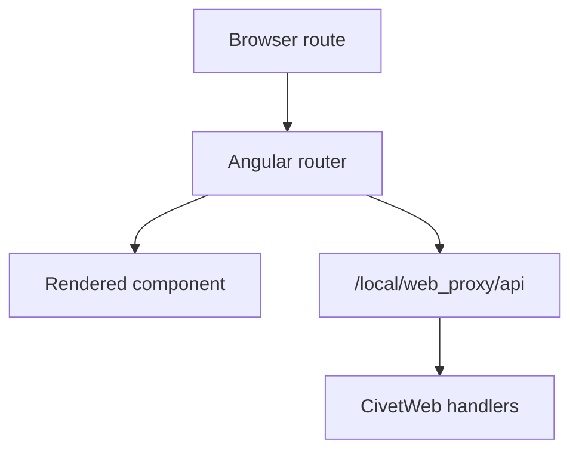

# Web Proxy Angular Route

This example is the Angular proxy example with client-side routing. It teaches what changes when the browser owns navigation paths while the ACAP backend still serves the packaged application and API.

## Routing Concept



The API remains separate from frontend routes. Angular routes change what the browser renders; API routes still call the ACAP backend.

## Backend Pattern

The C backend is intentionally close to `web-proxy-angular`:

```c
mg_set_request_handler(ctx, "/", RootHandler, NULL);
mg_set_request_handler(ctx, "/local/web_proxy/api/info", InfoHandler, NULL);
mg_set_request_handler(ctx, "/local/web_proxy/api/param", ParamHandler, NULL);
```

The important teaching point is packaging: the browser app is built first, then the generated files are included in `app/html/`.

## Frontend API Client

```ts
private readonly BASE = '/local/web_proxy/api';

setParam(body: { MulticastAddress: string; MulticastPort: string }) {
  return this.http.post(`${this.BASE}/param`, body, {
    headers: { 'Content-Type': 'application/json' },
    withCredentials: true,
  });
}
```

## Build

```sh
docker build --tag web-proxy-angular-route --build-arg ARCH=aarch64 .
docker cp $(docker create web-proxy-angular-route):/opt/app ./build
```

## Classroom Exercises

1. Add a second Angular route that only reads current settings.
2. Confirm that API calls still use `/local/web_proxy/api`.
3. Discuss when a routed frontend is useful for an ACAP configuration UI.
