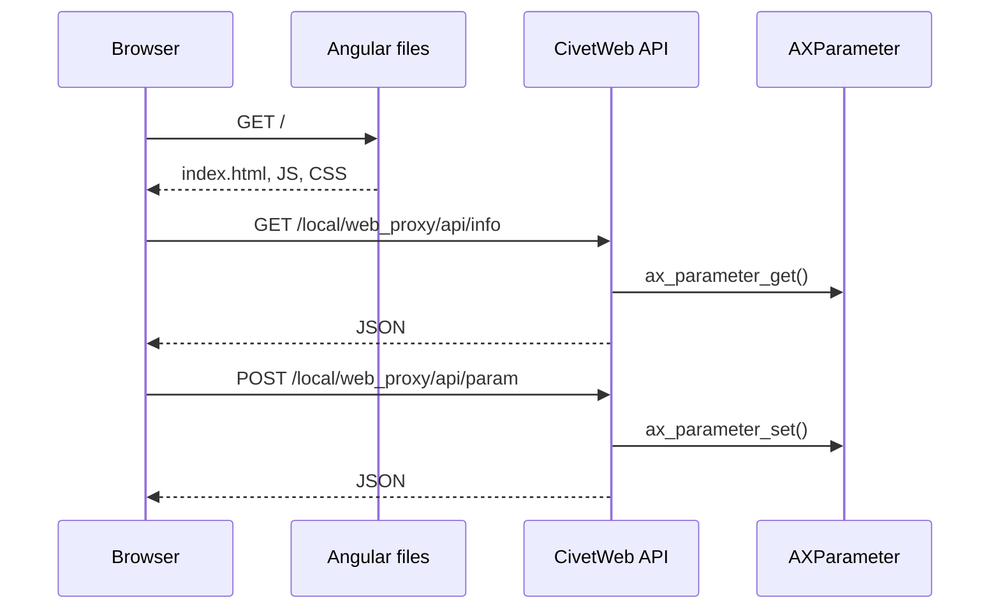

# Web Proxy Angular

This example packages an Angular frontend with a CivetWeb ACAP backend. It is the bridge from C-only web examples to a browser UI that calls ACAP JSON endpoints.

## Architecture



## Frontend API Client

The Angular service calls the same endpoints as `web-proxy`:

```ts
private readonly BASE = '/local/web_proxy/api';

getInfo(): Observable<InfoResponse> {
  return this.http.get<InfoResponse>(`${this.BASE}/info`, {
    headers: { 'Cache-Control': 'no-cache' },
    withCredentials: true,
  });
}
```

The backend serves static files from `app/html/` and registers JSON handlers:

```c
mg_set_request_handler(ctx, "/", RootHandler, NULL);
mg_set_request_handler(ctx, "/local/web_proxy/api/info", InfoHandler, NULL);
mg_set_request_handler(ctx, "/local/web_proxy/api/param", ParamHandler, NULL);
```

## Build

```sh
docker build --tag web-proxy-angular --build-arg ARCH=aarch64 .
docker cp $(docker create web-proxy-angular):/opt/app ./build
```

## Updating The Angular Assets

The Angular source lives in `../acap-angular-ui/`. After changing it, build the frontend and copy the generated files into this example's `app/html/` directory before building the ACAP package.

## Classroom Exercises

1. Add a visible "last saved" status in the Angular UI.
2. Add validation before sending the POST request.
3. Compare static file serving in C with API request handling in C.
