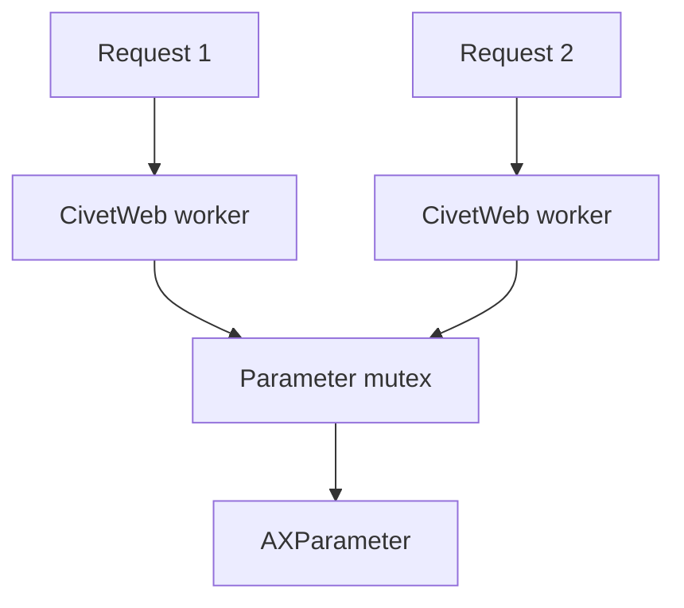

# Web Proxy Thread

This example builds on `web-proxy` by running CivetWeb with multiple worker threads and protecting shared parameter access with a mutex.

## Threaded Architecture



The server is configured with multiple threads:

```c
const char* opts[] = {
    "listening_ports", PORT,
    "request_timeout_ms", "10000",
    "num_threads", "4",
    0
};
```

## Shared State

The global parameter handle is protected:

```c
static AXParameter* g_param = NULL;
static pthread_mutex_t g_param_mtx = PTHREAD_MUTEX_INITIALIZER;
```

Read and write handlers lock before using AXParameter:

```c
pthread_mutex_lock(&g_param_mtx);
char* addr = get_param_dup("MulticastAddress");
char* port = get_param_dup("MulticastPort");
pthread_mutex_unlock(&g_param_mtx);
```

## Runtime Defaults

The example adds parameters if missing:

```c
add_if_missing("MulticastAddress", "224.0.0.1", "string");
add_if_missing("MulticastPort", "1024", "string");
```

This makes the application self-contained for teaching and testing.

## Build

```sh
docker build --tag web-proxy-thread --build-arg ARCH=aarch64 .
docker cp $(docker create web-proxy-thread):/opt/app ./build
```

## Classroom Exercises

1. Increase `num_threads` and send parallel requests.
2. Add request logging with method and URI.
3. Explain which data needs a mutex and which data is local to a request.
